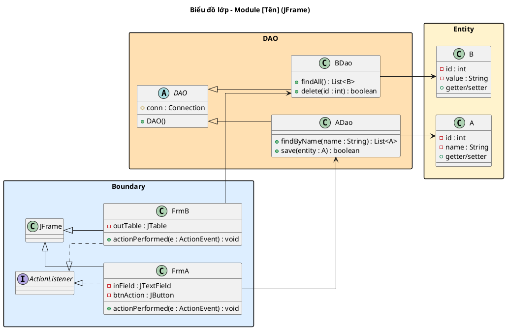
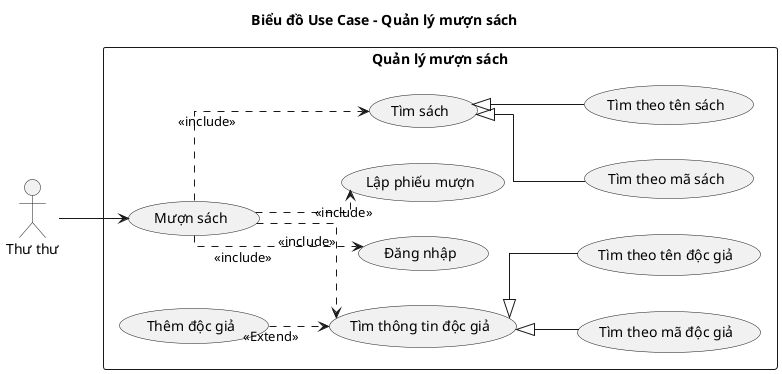

# UP Documentation Skill

Tạo tài liệu triển khai dự án phần mềm chuẩn **Unified Process (UP)** theo giáo trình
**Nhập môn Công nghệ Phần mềm**. 100% tiếng Việt. Biểu đồ UML dùng PlantUML.

---

## Nguyên tắc cốt lõi (BẮT BUỘC tuân thủ)

1. **Hướng Use-case:** Mọi phân tích, thiết kế đều xuất phát từ Use-case.
2. **BCE:** Luôn phân rã theo Boundary – Control – Entity.
3. **Phân biệt ngôn ngữ theo pha (NGHIÊM NGẶT):**
   - **Pha Phân tích:** Arrow labels trong PlantUML = tiếng Anh ngắn gọn (`click btnSearch`, `display room list`). Kịch bản phiên bản 2 text = tiếng Việt tự nhiên.
   - **Pha Thiết kế:** Arrow labels = tên hàm tiếng Anh đầy đủ + kiểu dữ liệu (`searchFreeRoom(checkin: Date, checkout: Date): List<Room>`, `actionPerformed(e: ActionEvent)`).
   - **Tên class và tên bảng DB từ pha II trở đi:** BẮT BUỘC tiếng Anh PascalCase (`Client`, `Employee`, `tblClient`). Tên tiếng Việt chỉ dùng trong văn xuôi phân tích, không dùng làm tên class/bảng.
   - **Tên attribute:** Nhất quán tiếng Anh xuyên suốt II→III. Đã dùng `fullName` ở II.2 thì giữ `fullName` ở III.1, không đổi thành `hoTen`.
4. **Văn bản:** 100% tiếng Việt (trừ tên hàm/biến/class/bảng).
5. **UML:** PlantUML trong code block plantuml.
6. **Công nghệ giao diện:** Hỏi người dùng chọn JFrame (Java Swing) hoặc HTML (React) ngay từ BƯỚC 0 PLAN. Toàn bộ Boundary classes, wireframe, và sequence diagram phải thống nhất theo lựa chọn này.
7. **Diễn giải tuần tự (BẮT BUỘC cho II.4 và III.4):** Bên cạnh biểu đồ sequence diagram, PHẢI viết block diễn giải tuần tự dạng danh sách đánh số trong callout:
   - **II.4 (Phân tích):** Kịch bản phiên bản 2 — tiếng Việt tự nhiên, **đánh số (1,2,3…)** (khớp giáo trình UP), mô tả Actor ↔ Boundary ↔ Entity. Xem `references/ii.4_tuantu_phantich.md`.
   - **III.4 (Thiết kế):** Kịch bản phiên bản 3 — có tên hàm Java + kiểu dữ liệu, **danh sách đánh số**, mô tả Actor ↔ Boundary ↔ Controller ↔ Entity. Xem `references/iii.4_tuantu_thietke.md`.
8. **Sequence diagram: TOÀN BỘ tiếng Anh trong `@startuml…@enduml`** — bao gồm `title`, actor display name (`actor "Staff" as Actor`), và arrow labels. KHÔNG có tiếng Việt bên trong block PlantUML. Kịch bản phiên bản 2/3 text bên ngoài PlantUML giữ tiếng Việt bình thường.
   - **Quy tắc arrow label (BẮT BUỘC):**

   | Tình huống | Label | Ví dụ |
   |-----------|-------|-------|
   | Actor → Boundary hành động | short English | `1: click btnManage`, `3: input keyword + click btnSearch` |
   | Boundary/Controller kích hoạt | `call` | `2: call`, `4: call` |
   | Boundary/Controller gọi Entity method | `methodName()` | `5: list()`, `5: searchX()`, `6: save(order)` |
   | Entity/Controller trả về | `return` | `6: return`, `7: return` |
   | Boundary hiển thị | `display` / `showMessage()` | `7: display`, `8: showMessage("saved")` |

   Pha phân tích: `methodName()` không tham số. Pha thiết kế: `methodName(param: Type)` đầy đủ.

9. **Mỗi mũi tên = 1 bước đánh số** — kể cả return arrow `-->`. Tổng N bước ghi trong `(N bước)` ở heading, title PlantUML, và bold kịch bản PHẢI khớp chính xác số mũi tên trong sơ đồ.
10. **Không dùng `alt` trong sequence diagram** — cả pha phân tích lẫn thiết kế chỉ vẽ luồng chính. Ngoại lệ xử lý bằng block text "Ngoại lệ" đặt sau biểu đồ (không nhúng vào PlantUML).

---

## Lựa chọn công nghệ giao diện

Ngay từ **BƯỚC 0 PLAN**, hỏi người dùng:

> **Bạn muốn thiết kế giao diện theo công nghệ nào?**
> 1. **JFrame (Java Swing)** — Desktop app, Boundary extends JFrame, dùng JButton/JTextField/JTable...
> 2. **HTML (React)** — Web app, Boundary là React component, dùng HTML form/input/table...

Lựa chọn này ảnh hưởng đến:
- **Mục 4 (Lớp BCE):** Tên và kiểu các thành phần giao diện
- **Mục 8 (Wireframe + Lớp TK):** Kiểu wireframe (ASCII desktop vs HTML layout) + class diagram chi tiết
- **Mục 9 (Tuần tự TK):** Cách bắt sự kiện (ActionListener vs onClick/handleSubmit)

---

## Luồng tổng thể

```
GIAI ĐOẠN 1 – Requirements TOÀN HỆ THỐNG
     → Bảng thuật ngữ
     → Mô hình nghiệp vụ bằng ngôn ngữ tự nhiên (2.1 → 2.6)
     → Mô hình nghiệp vụ bằng UML (3.1 → 3.3)
     ↓
GIAI ĐOẠN 2 – Đề xuất phân chia MODULE → chờ xác nhận
     ↓
GIAI ĐOẠN 3 – Với mỗi module (theo yêu cầu người dùng):
     Pha I – Requirements:   I.1  Mô hình nghiệp vụ bằng UML
     Pha II – Analysis:      II.1 Mô hình hóa chức năng
                              II.2 Mô hình hóa lớp
                              II.3 Sơ đồ lớp phân tích
                              II.4 Biểu đồ tuần tự phân tích
     Pha III – Design:       III.1  Thiết kế lớp thực thể
                              III.2  Thiết kế CSDL
                              III.3.1 Thiết kế giao diện
                              III.3.2 Sơ đồ lớp thiết kế
                              III.4  Biểu đồ tuần tự thiết kế
     Pha IV – Test:          IV   Cài đặt & Kiểm thử
```

---

## Hướng dẫn thực thi

### BƯỚC 0 – PLAN (BẮT BUỘC, luôn làm trước mọi thứ)

**Trước khi viết bất kỳ nội dung tài liệu nào**, phân tích yêu cầu của người dùng và sinh một **plan dưới dạng file `.md`** để user review và xác nhận.

Plan phải:
- **Xác định scope** dựa trên yêu cầu: toàn hệ thống, một module cụ thể, hay chỉ một vài mục.
- **Liệt kê từng mục sẽ viết** kèm thông tin quan trọng nhất đã suy luận được (không viết nội dung thật, chỉ tóm tắt những gì sẽ có).
- **Đặt câu hỏi làm rõ** nếu còn thiếu thông tin đầu vào quan trọng.

**Cấu trúc file plan:**

```markdown
# Plan tài liệu – [Tên hệ thống / Module / Phạm vi]

## Phạm vi
[Mô tả ngắn: viết toàn bộ / module X / chỉ mục Y, Z]

## Thông tin đầu vào đã có
- Tên hệ thống: ...
- Actor xác định được: ...
- Module / chức năng: ...
- Ngôn ngữ lập trình dự kiến (ảnh hưởng kiểu dữ liệu ở mục 6, 7): ...

## Câu hỏi cần làm rõ (nếu có)
- [ ] ...

## Danh sách mục sẽ viết

### Pha I – Requirements
| Mục | Tên | Nội dung chính sẽ có |
|-----|-----|----------------------|
| I.1 | Mô hình nghiệp vụ bằng UML | Actor: [A, B]; UC chính: [X]; UC con include: [a, b]; UC extend: [c] |

### Pha II – Analysis
| Mục | Tên | Nội dung chính sẽ có |
|-----|-----|----------------------|
| II.1 | Mô hình hóa chức năng | UC [X]: [N] bước, ngoại lệ tại bước [3, 10, 24] |
| II.2 | Mô hình hóa lớp | Lớp dự kiến: [A, B, C, D]; quan hệ n-n: [A–B] |
| II.3 | Sơ đồ lớp phân tích | Boundary: [XxxView, YyyView]; Entity: [A, B, C] |
| II.4 | Biểu đồ tuần tự phân tích | [N] biểu đồ cho [N] UC |

### Pha III – Design
| Mục | Tên | Nội dung chính sẽ có |
|-----|-----|----------------------|
| III.1 | Thiết kế lớp thực thể | Bổ sung kiểu dữ liệu Java; PK/FK; composition/aggregation |
| III.2 | Thiết kế CSDL | [N] bảng; bảng trung gian: [...] |
| III.3.1 | Thiết kế giao diện | [N] màn hình wireframe |
| III.3.2 | Sơ đồ lớp thiết kế | DAO cho: [A, B, C]; Boundary + Entity |
| III.4 | Biểu đồ tuần tự thiết kế | [N] biểu đồ |

### Pha IV – Test
| Mục | Tên | Nội dung chính sẽ có |
|-----|-----|----------------------|
| IV | Cài đặt & Kiểm thử | [N] TC; CSDL mẫu: [N] bảng |
```

Sau khi sinh plan, **chờ user xác nhận hoặc điều chỉnh** trước khi viết bất kỳ nội dung thật nào. Nếu user chỉ muốn làm một vài mục, chỉ giữ lại những mục đó trong plan rồi xác nhận lại.

**Khi hệ thống có ≥ 2 module**, plan PHẢI bao gồm thêm **Bảng entity chuẩn toàn hệ thống** (xác lập trước khi viết bất kỳ module nào):

```markdown
## Bảng entity chuẩn toàn hệ thống

| Khái niệm | Tên class (EN) | Tên bảng DB | Xuất hiện ở module |
|-----------|---------------|------------|-------------------|
| Khách hàng | Client | tblClient | booking, services, core |
| Nhân viên | Employee | tblEmployee | account, booking, core |
| Hạng hội viên | MembershipTier | tblMembershipTier | account, core |
| ...       | ...           | ...        | ...               |
```

Mọi module PHẢI tham chiếu bảng này. Không được tự đặt tên khác cho cùng một khái niệm giữa các module.

---

### Giai đoạn 1 – Requirements toàn hệ thống
Đọc `references/requirements-system.md` và thực hiện đầy đủ.

Sau khi hoàn thành, **BẮT BUỘC** sinh đề xuất phân module theo mẫu:

```
Dựa trên các use-case đã xác định, mình đề xuất chia hệ thống thành [N] module:

| STT | Tên module | Phụ trách Use-case | Mô tả ngắn |
|-----|-----------|-------------------|------------|
| 1   | [Tên]     | UC01, UC02, ...   | ...        |
| 2   | [Tên]     | UC03, UC04, ...   | ...        |

Bạn có đồng ý với cách phân chia này không? Hay muốn điều chỉnh?
```

Chỉ tiếp tục khi người dùng xác nhận.

### Giai đoạn 3 – Triển khai từng module
Hỏi người dùng muốn bắt đầu với module nào.
Đọc `references/table_of_contents.md` để biết danh sách 11 mục theo 4 pha, sau đó đọc từng file tương ứng:
- **Pha I:** `references/i.1_mohinh_nghiepvu.md`
- **Pha II:** `references/ii.1_mohinh_hoa_chucnang.md`, `ii.2_mohinh_hoa_lop.md`, `ii.3_sodo_lop_phantich.md`, `ii.4_tuantu_phantich.md`
- **Pha III:** `references/iii.1_thietke_lop_thucthe.md`, `iii.2_thietke_coso_dulieu.md`, `iii.3.1_thietke_giaodien.md`, `iii.3.2_sodo_lop_thietke.md`, `iii.4_tuantu_thietke.md`
- **Pha IV:** `references/iv_kiemthu.md`

Thực hiện đúng các mục đã được xác nhận trong plan.
Sau mỗi pha, hỏi: *"Pha [X] đã hoàn thành. Bạn có muốn điều chỉnh gì không trước khi sang pha tiếp theo?"*

---

## Định dạng đầu ra chung

- Tiêu đề mỗi mục: `## [Pha].[Số]. [Tên mục]` (VD: `## II.3. Sơ đồ lớp phân tích`)
- Bảng Markdown chuẩn, có header rõ ràng.
- PlantUML đặt trong code block plantuml.
- Wireframe dùng ASCII box diagram (xem ví dụ trong `references/module-phases.md`).
- **Test case PHẢI có CSDL trước/sau** — liệt kê dữ liệu mẫu cụ thể cho MỌI bảng DB liên quan. Kết quả mong đợi PHẢI liệt kê TOÀN BỘ UI elements khi sang giao diện mới. Xem `references/iv_kiemthu.md`.

### Quy tắc Columns (BẮT BUỘC cho Notion output)

<callout icon="🔑" color="purple">
**Nguyên tắc cứng:** Tối đa 4 columns. Nếu BẤT KỲ bước nào chứa bảng (markdown table hoặc HTML table), tối đa chỉ được 2 columns.
</callout>

| Tình huống | Số cột | Cách nhóm |
|------------|--------|-----------|
| Quy trình 2–3 bước, không có bảng | 2–3 cột | Mỗi bước 1 cột |
| Quy trình 4 bước, không có bảng | 4 cột (nếu ngắn) hoặc 2 cột (2 bước/cột) | Nhóm từng đôi |
| Quy trình 4–5 bước, CÓ BẢNG | **2 cột** | Nhóm bước lại, mỗi cột 2–3 bước |
| Quy trình 5+ bước | **2 cột** | Bắt buộc nhóm, không quá 4 |

### Quy tắc Callout Pairs (BẮT BUỘC)

Khi có 2 callout liên quan (VD: "Mục tiêu" + "Đầu vào"), LUÔN đặt trong 2 columns với heading tiêu đề:

```html
<columns>
<column>

### Mục tiêu
<callout icon="🎯" color="blue">
Nội dung mục tiêu...
</callout>

</column>
<column>

### Đầu vào
<callout icon="📝" color="gray">
Nội dung đầu vào...
</callout>

</column>
</columns>
```

---

## Markdown Formatting Rules (BẮT BUỘC)

### Bold
Dùng `**text**` cho:
- Tên class (Boundary, Control, Entity): `**OrderController**`, `**MenuItem**`
- Tên hàm trong phân tích chữ ký: `createOrder()` in backtick
- Tiêu đề con: `**1. Tầng giao diện (Boundary)**`

### Backtick
Dùng `` `text` `` cho:
- Tên biến, tên tham số, tên type: `roomId`, `String`, `OrderStatus`
- Giá trị enum: `PENDING`, `PREPARING`
- Tên hàm: `createOrder()`, `getAll()`

### Bảng
- Luôn có header row + separator row (`|------|`)
- Tối đa 4 cột
- Nếu bước chứa bảng → tối đa 2 cột trong Notion

### Heading hierarchy

Cấp bậc cứng — KHÔNG tự ý thêm cấp:

| Pattern | Heading | Ví dụ |
|---------|---------|-------|
| `N.` | `##` (H2) | `## II.3. Sơ đồ lớp phân tích` |
| `N.N.` | `###` (H3) | `### II.3.1. Boundary` |
| `N.N.N.` | `####` (H4) | `#### II.3.1.1. LoginView` |
| `a) b) c)` | `**bold paragraph**` (KHÔNG phải heading) | `**a) Tầng giao diện**` |
| ý con | `- bullet` | `- Mô tả chi tiết` |

### PlantUML
- Luôn dùng code block `plantuml`, KHÔNG dùng `javascript`
- Class diagram: 3 cột Boundary | Control | Entity
- **Đồng nhất 1 sơ đồ cho toàn module** (không tách theo chức năng)

---

## Nhất quán Analysis ↔ Design (BẮT BUỘC)

### Entity class: phải khớp 1:1 giữa pha II và pha III

Bộ Entity class trong **III.3.2** (gói `<<Entity>>`) PHẢI khớp hoàn toàn với bộ lớp thực thể xác định ở **II.2**:
- **Không thừa:** Không được thêm Entity class trong thiết kế mà analysis không có.
- **Không thiếu:** Không được bỏ sót Entity class đã xác định ở analysis.

Nếu phát hiện không khớp → phải sửa II.2 hoặc III.3.2 trước khi tiếp tục.

### Naming convention Boundary theo pha

| Pha | Variant | Suffix | Ví dụ |
|-----|---------|--------|-------|
| II.3 / II.4 (Phân tích) | Chung | `...View` | `LoginView`, `SearchRoomView` |
| III.3.2 / III.4 (Thiết kế) | JFrame | `...Frm` (tiếng Anh) | `LoginFrm`, `SearchRoomFrm`, `EditRoomFrm` |
| III.3.2 / III.4 (Thiết kế) | React | `...Page` | `LoginPage`, `SearchRoomPage`, `CreateOrderPage` |

### Gọi liên module (cross-module API)

Khi một module gọi method hoặc dùng dữ liệu từ module khác → khai báo rõ bằng comment trong PlantUML:
```plantuml
' [cross-module] BookingModule.getBookingHistory(clientId)
```
và ghi chú trong II.1 hoặc III.4 phần mô tả actor/precondition.

---

## PlantUML Style Rules (BẮT BUỘC)

### Tổng quan layout

Mọi biểu đồ UML **PHẢI** tuân thủ style sau:

```plantuml
@startuml
left to right direction
skinparam linetype ortho
skinparam packageStyle rectangle
@enduml
```

- **`left to right direction`** — layout ngang từ trái sang phải
- **`skinparam linetype ortho`** — đường thẳng gấp khúc, KHÔNG cong
- **`skinparam packageStyle rectangle`** — package dạng hình chữ nhật

### Biểu đồ lớp (Class Diagram)

**Quy tắc chung:**
- Lớp xếp theo chiều ngang, chia rõ 3 zone: Boundary | DAO/Control | Entity
- Đường nối thẳng, gấp khúc (`linetype ortho`)
- Package dọc theo chiều ngang (trái → phải)
- **KHÔNG xếp dọc** — classes trong mỗi package phải dàn ngang, không chồng chất

**Cách tránh xếp dọc (BẮT BUỘC):**
- Dùng `together { }` để nhóm classes nằm ngang trong cùng package
- Nếu nhiều classes, chia thành nhiều package nhỏ thay vì 1 package lớn
- Dùng hidden links `hidden` để kéo classes ra xa nhau theo chiều ngang
- `skinparam packageMaxWidth 800` nếu cần mở rộng package

**Boundary classes — Theo lựa chọn công nghệ:**

**Option A: JFrame (Java Swing)**

| Field type | Kiểu | Ví dụ |
|------------|------|-------|
| Frame | `JFrame` extends... | Giao diện chính |
| Button | `JButton` | Nút bấm |
| TextField | `JTextField` | Ô nhập text |
| PasswordField | `JPasswordField` | Ô nhập mật khẩu |
| Table | `JTable` | Bảng hiển thị |
| ComboBox | `JComboBox` | Dropdown chọn |
| Label | `JLabel` | Nhãn hiển thị |

- Mỗi Boundary class implements `ActionListener`
- Method: `actionPerformed(e: ActionEvent): void`

**Option B: HTML (React)**

| Field type | Kiểu | Ví dụ |
|------------|------|-------|
| Page | `Component` (React) | Giao diện chính |
| Button | `<button>` / `onClick` | Nút bấm |
| Input | `<input type="text">` | Ô nhập text |
| Password | `<input type="password">` | Ô nhập mật khẩu |
| Table | `<table>` / map array | Bảng hiển thị |
| Select | `<select>` / dropdown | Dropdown chọn |
| Label | `<label>` / `<span>` | Nhãn hiển thị |

- Mỗi Boundary class là React functional component
- Event handler: `handleSubmit`, `onClick`, `onChange` (không cần interface)
- **Tên class:** dùng tiếng Anh + hậu tố loại component (xem bảng dưới). KHÔNG dùng `Page[Name]` cho tất cả.

| Hậu tố | Loại component | Ví dụ |
|--------|---------------|-------|
| `Page` | Trang gắn URL/Router | `RoomPage`, `OrderPage` |
| `Card` | Ô thông tin nhỏ trong danh sách | `RoomCard`, `ProductCard` |
| `Panel` | Vùng nội dung lớn trên trang | `SessionDetailPanel` |
| `Modal` | Hộp thoại bật lên | `ExtendTimeModal` |
| `Form` | Vùng nhập liệu | `OrderForm`, `AddClientForm` |
| `Table` | Bảng dữ liệu | `RoomListTable` |

**DAO classes:**
- Abstract class `DAO` có `#conn: Connection` + `+DAO()`
- Mỗi entity có class DAO kế thừa `DAO`
- Methods rõ ràng tên tiếng Anh + tham số kiểu

**Entity classes:**
- Thuộc tính private với kiểu Java cụ thể
- `+getter/setter` (không cần hiện chi tiết)

### Ví dụ template — JFrame (Java Swing)



### Ví dụ template — HTML (React + Spring Boot MVC)

Tham khảo: `docs/tabs/section-3.2-mvc.md` — module Dịch vụ & Sản phẩm.
Google Docs: https://docs.google.com/document/d/1H0pFNhmbX9yDMObxERGsZ0RqKjpX9Je6N60n4tYrB6s (tab "Dịch vụ & Sản phẩm", mục 3.2)

```plantuml
@startuml
left to right direction
skinparam linetype ortho
skinparam packageStyle rectangle
skinparam packageMaxWidth 800
title Biểu đồ lớp – Module Dịch vụ & Sản phẩm (React MVC)

package "<<Boundary>>" #E3F2FD {
  together {
    class OrderPage { +render() }
    class RoomSelector { +render() }
    class ProductSearchForm { +render() }
    class ProductTable { +render() }
    class OrderCartPanel { +render() }
    class ConfirmOrderModal { +render() }
  }
  together {
    class OrderManagement { +render() }
    class StatusFilterTabs { +render() }
    class OrderCard { +render() }
    class StatusUpdateModal { +render() }
  }
  together {
    class MenuManagement { +render() }
    class CategoryFilter { +render() }
    class MenuItemTable { +render() }
    class MenuItemForm { +render() }
  }
  together {
    class InventoryPage { +render() }
    class StockTable { +render() }
    class StockUpdateForm { +render() }
  }
}

package "<<Control>>" #E8F5E9 {
  class OrderController {
    +createOrder(roomId, items) : OrderResponse
    +getOrders(status) : List<OrderResponse>
    +updateStatus(id, status) : OrderResponse
  }
  class MenuItemController {
    +getAll(category) : List<MenuItem>
    +getById(id) : MenuItem
    +create(item) : MenuItem
    +update(id, item) : MenuItem
    +delete(id) : void
  }
  class InvoiceController {
    +generate(bookingId) : Invoice
  }
}

package "<<Entity>>" #FFF3E0 {
  class ServiceOrder {
    -id : String
    -orderedAt : DateTime
    -status : OrderStatus
  }
  class ServiceOrderItem {
    -quantity : int
    -unitPrice : double
  }
  class MenuItem {
    -id : String
    -name : String
    -category : String
    -price : double
    -stock : int
    -image : String
    -active : boolean
  }
  enum OrderStatus {
    PENDING
    PREPARING
    SERVED
    CANCELLED
  }
  class Room {
    -id : String
    -name : String
    -branch : String
  }
  class Invoice {
    -id : String
    -roomTotal : double
    -serviceTotal : double
    -discount : double
    -grandTotal : double
    -paidAt : DateTime
  }
}

' Boundary -> Control
OrderPage --> OrderController
RoomSelector --> OrderController
ProductSearchForm --> OrderController
ProductTable --> OrderController
OrderCartPanel --> OrderController
ConfirmOrderModal --> OrderController
OrderManagement --> OrderController
StatusFilterTabs --> OrderController
OrderCard --> OrderController
StatusUpdateModal --> OrderController
MenuManagement --> MenuItemController
CategoryFilter --> MenuItemController
MenuItemTable --> MenuItemController
MenuItemForm --> MenuItemController
InventoryPage --> MenuItemController
StockTable --> MenuItemController
StockUpdateForm --> MenuItemController

' Control -> Entity
OrderController --> ServiceOrder
OrderController --> MenuItem
MenuItemController --> MenuItem
InvoiceController --> Invoice

' Entity relationships
ServiceOrder "1" --> "*" ServiceOrderItem
ServiceOrder "*" --> "1" Room
ServiceOrderItem "*" --> "1" MenuItem
ServiceOrder --> OrderStatus
Invoice --> ServiceOrder
@enduml
```

**Quy tắc React MVC (BẮT BUỘC):**
- **Boundary:** React components, mỗi class chỉ có `+render()`. Tên class tiếng Anh + hậu tố (`Page`, `Form`, `Table`, `Panel`, `Modal`, `Card`).
- **Control:** Spring Boot Controllers, methods theo RESTful CRUD (`getAll`, `getById`, `create`, `update`, `delete`). KHÔNG dùng DAO pattern.
- **Entity:** JPA Entities, attributes private (`-`) với kiểu Java cụ thể. Relationships: `ManyToOne`, `OneToMany`.
- **Package colors:** Boundary `#E3F2FD`, Control `#E8F5E9`, Entity `#FFF3E0` (không dùng BCE colors cũ cho React MVC).
- **Entity naming:** Tên entity tiếng Anh, bảng DB dùng `tbl` + tên (VD: `tblOrder`, `tblProduct`, `tblRoom`). Quan hệ n-n qua bảng trung gian (VD: `Order_detail`, `Damage_detail`).

### Biểu đồ Tuần tự (Sequence Diagram)

- Participants xếp theo thứ tự: Actor → Boundary → [Control/DAO] → Entity
- Thông điệp đánh số liên tục — mỗi mũi tên (kể cả return `-->`) = 1 bước
- **Không dùng `alt`** — chỉ vẽ luồng chính; ngoại lệ → block text sau biểu đồ
- Arrow labels: tiếng Anh ngắn trong `@startuml` (cả phân tích lẫn thiết kế) — xem nguyên tắc #8 để biết quy tắc `call`/`return`/`methodName()`
- **Boundary & Entity PHẢI dùng ký hiệu tròn gạch** (circle notation): dùng `boundary "Name"`, `entity "Name"`, `control "Name"` khi khai báo participant. KHÔNG dùng `participant "Name"` (sẽ hiển thị khung).
- **Activation bar màu xanh:** `skinparam SequenceLifeLineBackgroundColor #7AD2FF`

### Biểu đồ UC (Use Case)

- `left to right direction`
- Actors bên trái, use cases bên phải trong package
- `<<include>>` và `<<extend>>` dùng mũi tên đứt nét
- **Generalization:** UC con kế thừa UC cha — mũi tên tam giác rỗng hướng lên UC cha. VD: "Tìm sách" là cha, "Tìm theo tên sách" và "Tìm theo mã sách" là con
- **Extension points:** Hiển thị trong UC cha, ghi rõ UC extend nào mở rộng tại điểm nào
- **Layout ngang:** Sắp xếp UC theo chiều rộng, tránh chồng chất theo chiều dọc. UC chính ở giữa, các UC include/extend/generalization tỏa ra hai bên

**Cấu trúc UC phân rã chuẩn:**
```
Actor (trái) → UC chính (giữa) → UC include (phải)
                                  ↘ UC extend (dưới phải)
UC cha (trên) ← UC con generalization (dưới)
```

**Ví dụ PlantUML UC với generalization:**

