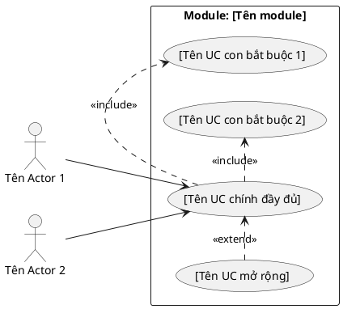

<!-- Pha I – Requirements, Section 1 -->

## I.1. Mô hình nghiệp vụ bằng UML

**Hai bảng BẮT BUỘC trình bày TRƯỚC biểu đồ PlantUML:**

**Bảng UC chính thức (R01):**

| Mã UC | Tên UC | Actor | Mô tả ngắn |
|-------|--------|-------|-----------|
| UC01 | [Tên UC đầy đủ] | [Actor chính] | [1–2 câu mô tả mục đích] |
| UC02 | ... | ... | ... |

**Bảng quan hệ Include/Extend (R03):**

| UC | Quan hệ | UC liên quan | Ghi chú |
|----|---------|-------------|---------|
| UC01 | `<<include>>` | UC02 | UC02 bắt buộc mỗi lần thực hiện UC01 |
| UC03 | `<<extend>>` | UC01 | UC03 chỉ kích hoạt khi [điều kiện X] |
| UC04 | generalization | UC01 | UC04 là trường hợp riêng của UC01 |

Nếu không có quan hệ include/extend → ghi rõ "Không có" thay vì bỏ trống bảng.

---

**Quy trình 4 bước (BẮT BUỘC thực hiện và trình bày):**

- **Bước 1:** Copy các UC + actor liên quan từ UC tổng quan của hệ thống vào phạm vi module.
- **Bước 2:** Mỗi giao diện chính trong module → đề xuất thành 1 UC con.
- **Bước 3:** Xác định mối quan hệ giữa từng UC con với UC chính:
  - `<<include>>` nếu UC con là bước BẮT BUỘC trong UC chính.
  - `<<extend>>` nếu UC con chỉ xảy ra trong một số điều kiện nhất định.
  - **Generalization** (tổng quát hóa): nếu có nhiều UC con tương tự nhau, gộp thành 1 UC trừu tượng làm cha chung.
- **Bước 4:** Gộp một số UC con tương tự thành một UC tổng quát hơn nếu cần thiết. VD: "Tìm theo tên" và "Tìm theo mã" → gộp thành UC cha "Tìm kiếm", hai UC con kế thừa (generalization).

**Lưu ý về tác nhân trừu tượng và tác nhân gián tiếp:**
- **Tác nhân trừu tượng:** Khi nhiều actor có đặc điểm chung (VD: Lễ tân, Nhân viên bán hàng đều là nhân viên), đề xuất actor trừu tượng chung rồi dùng generalization.
- **Tác nhân gián tiếp:** Xem xét người dùng gián tiếp có thể khởi phát chức năng nào (VD: Khách hàng gián tiếp kích hoạt UC "Đặt phòng").

**Kèm mô tả từng UC bằng văn xuôi** (ví dụ: "UC 'Tìm kiếm khách hàng': UC này cho phép UC [chính] tìm khách hàng")

**Lưu ý:** Mã UC (UC01, UC02...) PHẢI khớp chính xác với bảng UC tổng quan ở giai đoạn 1. Khi copy UC sang biểu đồ chi tiết module, giữ nguyên mã, không đổi alias.

Mô tả các UC của module:
1. "[Tên UC]": UC này cho phép UC [chính] [mô tả ngắn]
2. ...
