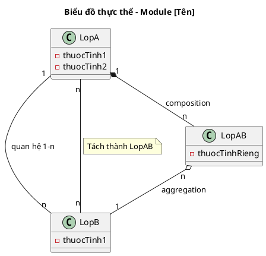

<!-- Pha II – Analysis, Section 2 -->

## II.2. Mô hình hóa lớp

> ⚠️ Thông điệp trong sequence diagram PHẢI bằng tiếng Việt tự nhiên. Chưa có kiểu dữ liệu cụ thể, chưa có tên hàm tiếng Anh.

**Quy trình 5 bước (BẮT BUỘC trình bày từng bước):**

**Bước 1 – Mô tả chức năng bằng một đoạn văn xuôi**
Viết lại toàn bộ luồng hoạt động của module thành một đoạn văn liên tục, tự nhiên.

**Bước 2 + 3 – Trích các danh từ và đánh giá (giữ lại / loại bỏ)**
Liệt kê từng danh từ xuất hiện trong đoạn văn, đánh giá và phân loại:
- **Loại** (với lý do): "hệ thống" → quá chung; "danh sách" → không phải thực thể; "giao diện" → là Boundary, không phải Entity...
- **Giữ lại thành lớp Entity**: ghi tên lớp + thuộc tính sơ bộ
- **Giữ lại thành thuộc tính**: ghi rõ là thuộc tính của lớp nào

Ví dụ trình bày:
```
▪ Hệ thống → loại: quá chung
▪ Danh sách → loại: không phải thực thể
▪ Khách hàng → lớp KhachHang: tên, cccd, địa chỉ, sdt, email, ghi chú
▪ Tên/CCCD/... → thuộc tính của KhachHang
▪ Hợp đồng → lớp HopDong: ngày ký, tổng tiền, thời hạn vay
```

**Bước 4 – Xác định quan hệ số lượng giữa các thực thể**

Quy tắc cardinality:
- **1-1:** Giữ nguyên hoặc gộp hai lớp thành một nếu hợp lý.
- **1-n:** Giữ nguyên. VD: 1 Hotel có nhiều Room → Hotel – Room: 1-n.
- **n-n:** Cần chia thành ít nhất 2 mối quan hệ 1-n bằng cách đề xuất lớp trung gian. VD: Client – Room là n-n → đề xuất lớp Booking ở giữa.

```
▪ 1 [A] có nhiều [B] → A – B: 1 – n
▪ 1 [C] có trong nhiều [D] và ngược lại → C – D: n – n → đề xuất lớp trung gian [CD]
▪ [E] tách thành 1 lớp riêng [TênLớp] vì ...
```

**Bước 5 – Bổ sung quan hệ (chỉ bổ sung nếu có quan hệ mới phát sinh)**
Mô tả bằng văn xuôi các quan hệ bổ sung (composition, aggregation...).

Lưu ý về **kế thừa cho lớp thống kê:** Nếu lớp thống kê tái sử dụng thuộc tính của lớp thực thể tương ứng (VD: RoomStat có cùng thuộc tính với Room), dùng kế thừa (inheritance). Nếu không tái sử dụng thuộc tính nào, lớp thống kê chỉ phụ thuộc (dependency) vào lớp liên quan.

**Biểu đồ thực thể (chỉ có tên lớp, thuộc tính, quan hệ — CHƯA có phương thức, CHƯA có kiểu dữ liệu):**


