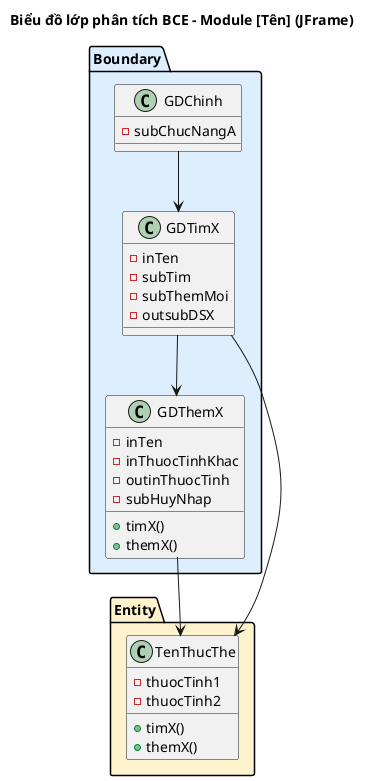
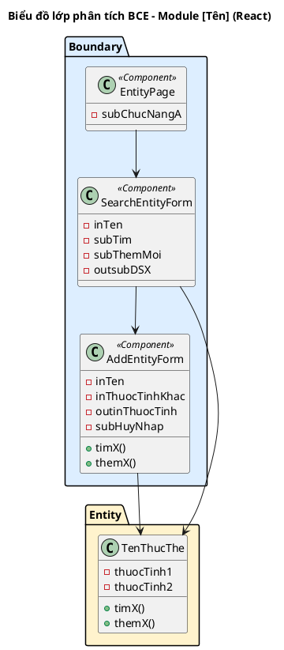

<!-- Pha II – Analysis, Section 3 -->

## II.3. Sơ đồ lớp phân tích

**Quy trình 4 bước (BẮT BUỘC trình bày):**

- **Bước 1:** Mỗi giao diện chính trong module → đề xuất thành 1 **lớp Boundary**.
  - **JFrame:** đặt tên dạng `GD[TênMànHình]` (VD: `GDTimPhong`, `GDThemKH`).
  - **React:** đặt tên theo hậu tố loại component (xem bảng quy ước dưới). Ngoài ra, các thành phần con quan trọng (Modal, Form, Panel...) cũng có thể là lớp Boundary riêng nếu có tương tác phức tạp.
  - **Loại trừ:** Thông báo đơn giản (`alert`), hộp thoại xác nhận (`confirm`) không cần tách riêng.

  **Quy ước đặt tên Boundary class — React:**

  | Hậu tố | Loại component | Khi nào dùng | Ví dụ |
  |--------|---------------|---------------|-------|
  | `Page` | Trang gắn URL/Router | Màn hình hoàn chỉnh, điều hướng chính | `RoomPage`, `OrderPage`, `DashboardPage` |
  | `Card` | Ô thông tin nhỏ | Hiển thị trạng thái nhanh trong danh sách | `RoomCard`, `ProductCard`, `BookingCard` |
  | `Panel` | Vùng nội dung lớn | Gom nhóm thông tin liên quan trên trang | `SessionDetailPanel`, `ServiceSummaryPanel` |
  | `Modal` | Hộp thoại bật lên | Tương tác đè lên trang khi nhấn nút | `ExtendTimeModal`, `DamageReportModal` |
  | `Form` | Vùng nhập liệu | Chứa input để điền dữ liệu | `OrderForm`, `ImportStockForm`, `AddClientForm` |
  | `Table` | Bảng dữ liệu | Hiển thị danh sách dạng bảng | `RoomListTable`, `OrderHistoryTable` |

  **Lưu ý:** Tên class React dùng tiếng Anh (không phải tiếng Việt). Thuộc tính bên trong vẫn dùng tiền tố `in/out/sub/outsub/inout` + tiếng Việt.
- **Bước 2:** Xem xét các thành phần trong mỗi giao diện, đặt tên với tiền tố loại:
  - `in`: thành phần nhập liệu (ô nhập văn bản, ngày tháng...)
  - `out`: thành phần hiển thị (bảng, nội dung...)
  - `sub`: thành phần gửi dữ liệu (nút bấm, liên kết...)
  - Kết hợp: `outsub` = bảng có thể nhấn chọn; `inout` = ô vừa hiển thị vừa sửa
- **Bước 3:** Với mỗi chức năng cần thực hiện dưới lớp giao diện, trả lời 4 câu hỏi:
  1. **Tên phương thức?** — đặt theo quy ước mã nguồn
  2. **Tham số đầu vào?**
  3. **Tham số đầu ra?**
  4. **Gán cho lớp nào?**
     - Nếu đầu ra là một lớp thực thể → gán cho lớp đó
     - Nếu không, xét đầu vào: nếu chỉ gồm 1 lớp thực thể → gán cho lớp đó
     - Nếu đầu vào gồm nhiều lớp thực thể → gán cho lớp nào có thể chứa tất cả tham số
- **Bước 4:** Xây dựng sơ đồ lớp BCE cho module.

Với mỗi lớp Boundary, trình bày:
```
[Số]. Giao diện [tên] → lớp [GDTênLớp]
Phương thức: [tênHàm()]   ← tên tiếng Việt, ngôn ngữ tự nhiên
Input: [liệt kê]
Output: [liệt kê]
Lớp chủ thể: [TênEntityLớpLiênQuan]
```

**Lưu ý:** Ở pha phân tích, tên phương thức vẫn dùng tiếng Việt (VD: `timKH()`, `luuHopDong()`).

**Variant JFrame:**



**Variant React:**


