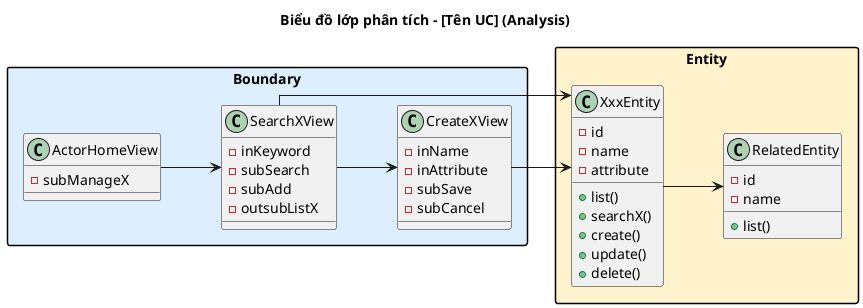
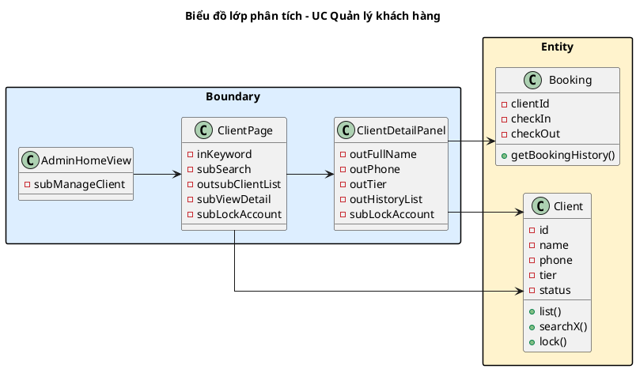

<!-- Pha II – Analysis, Section 3 -->

## II.3. Sơ đồ lớp phân tích (BCE)

**Input:** Mô hình hóa lớp (II.2) + Danh sách UC và kịch bản (II.1).

Phân tích rã lớp theo mô hình **Boundary – Entity** (pha phân tích không có Control).
**Mỗi UC → 1 BCE diagram riêng** — không gộp nhiều UC vào chung 1 diagram.

---

### Quy tắc 4 bước phân tích BCE (BẮT BUỘC trình bày)

**Bước 1:** Một giao diện người dùng — ngoại trừ cảnh báo/thông báo, hộp thoại xác nhận — tạo một **lớp Boundary** (`XxxView`).

**Bước 2:** Xem xét các thành phần cần thiết trong mỗi giao diện, đặt tên thành phần với tiền tố:

| Tiền tố | Loại thành phần | Ví dụ |
|---------|----------------|-------|
| `in_` | Ô nhập liệu (text input, dropdown filter) | `-inKeyword`, `-inFullName`, `-inThreshold` |
| `out_` | Chỉ hiển thị (bảng, nhãn không tương tác) | `-outClientList`, `-outRoomList`, `-outTierName` |
| `sub_` | Nút hành động (Submit, Save, Search) | `-subSearch`, `-subEdit`, `-subSave` |
| `outsub_` | Bảng hiển thị + có thể click/chọn | `-outsubListSession`, `-outsubRoomList` |
| `inout_` | Vừa hiển thị vừa cho sửa inline | `-inoutScheduleTable` |

**Bước 3:** Xem xét các hành động/chức năng cần thiết dưới lớp Boundary. Với mỗi chức năng, trả lời:
- Tên phương thức là gì? (tiếng Anh + `()`, không tham số ở phân tích)
- Tham số đầu vào là gì? Tham số đầu ra là gì?
- Phương thức nên gán vào Entity nào?
  - Nếu output là một Entity type → gán cho Entity đó
  - Nếu không, xem input: Entity nào chứa đủ các tham số → gán cho Entity đó

**Bước 4:** Xây dựng sơ đồ lớp cho module (1 diagram/UC).

---

### Diễn giải narrative (BẮT BUỘC cho mỗi UC)

Narrative PHẢI bắt đầu từ giao diện **HomeView** của actor, không nhảy thẳng vào giao diện chức năng.

```
**Phân tích chi tiết chức năng [Tên UC]:**

- Sau khi đăng nhập, hệ thống hiển thị giao diện chính → đề xuất lớp [ActorHomeView],
  có ít nhất nút [-subXxx] để điều hướng vào chức năng này.
- [Actor] click → giao diện [XxxView] hiện lên → đề xuất lớp [XxxView],
  có [-inKeyword], [-subSearch], [-outsubListX]...
- [Actor] nhập keyword + click Search → hệ thống tìm kiếm → cần chức năng [searchX()] của đối tượng [Entity].
  (lớp [Entity] sở hữu các thuộc tính [-id], [-name], [-status] → có thể thực hiện searchX())
- Sau khi tìm thấy kết quả, hệ thống tải lại danh sách thông qua [listX()] và quay về [XxxView].
```

**Quy tắc narrative:**
- Dùng bullet points (`-`), KHÔNG dùng code block
- Bắt đầu từ HomeView → màn hình chức năng
- Liệt kê **đầy đủ** attributes (không bỏ sót `in_/out_/sub_`)
- Giải thích TẠI SAO method thuộc Entity nào (entity đó sở hữu thuộc tính gì)
- Kết thúc flow: "hệ thống thông báo thành công, tải lại [outXxx] thông qua [listX()] và quay về [XxxView]"
- Tên method: tiếng Anh + `()` — `list()`, `create()`, `searchX()`, `getBookingHistory()`

---

### PlantUML template

**Lưu ý:** Entity class PHẢI có cả attributes lẫn methods. Dùng `boundary`, `entity` cho participant.



---

### Ví dụ áp dụng: UC Quản lý khách hàng (Admin)

**Bước 2 — Attributes:**
- `AdminHomeView`: `-subManageClient`
- `ClientPage`: `-inKeyword`, `-subSearch`, `-outsubClientList`, `-subViewDetail`, `-subLockAccount`
- `ClientDetailPanel`: `-outFullName`, `-outPhone`, `-outTier`, `-outHistoryList`, `-subLockAccount`

**Bước 3 — Methods & lý do chọn Entity:**
- `list()` → Entity `Client` (Client sở hữu `-id`, `-name`, `-phone`, `-tier`)
- `searchX(keyword)` → Entity `Client` (output là List<Client>)
- `lock()` → Entity `Client` (Client sở hữu `-status`, cần update status → "Locked")
- `getBookingHistory()` → Entity `Booking` (output là List<Booking>; Booking sở hữu `-clientId`, `-checkIn`, `-checkOut`)

**Diagram:**

