<!-- Pha II – Analysis, Section 4 -->

## II.4. Biểu đồ tuần tự phân tích

Vẽ **đầy đủ cho MỌI UC** trong module — không bỏ sót UC nào. Mỗi UC một biểu đồ riêng.
Luồng chuẩn: `Actor → Boundary → [Control] → Entity`.
Arrow labels trong `@startuml` **PHẢI tiếng Anh ngắn gọn** (`click btnSearch`, `display results`, `enter keyword`). Kịch bản phiên bản 2 text bên ngoài PlantUML giữ tiếng Việt.
**Biểu đồ chỉ thể hiện luồng chính. Không dùng `alt`.** Ngoại lệ → viết block text riêng sau biểu đồ.

### Diễn giải tuần tự (Kịch bản phiên bản 2) — BẮT BUỘC

Bên cạnh biểu đồ PlantUML, PHẢI viết thêm **block diễn giải tuần tự** dạng **danh sách đánh số (1,2,3…)**, theo format "Kịch bản phiên bản 2". Block này mô tả chi tiết từng bước tương tác giữa Actor, Boundary và Entity bằng tiếng Việt tự nhiên.

**Format:**

```
**Kịch bản phiên bản 2 – UC [Tên UC]**

1. [Actor] [hành động] để [mục đích].
2. [Actor] chọn chức năng [tên chức năng] trên giao diện [BoundaryName].
3. Lớp [BoundaryName] gọi lớp [NextBoundary].
4. Lớp [NextBoundary] hiển thị giao diện cho [Actor].
5. [Actor] hỏi [thông tin] từ [đối tượng].
6. [đối tượng] trả lời [thông tin].
7. [Actor] nhập [thông tin] và nhấn nút [hành động].
8. Lớp [Boundary] gọi lớp [Entity] để xử lý.
9. Lớp [Entity] gọi phương thức [simpleMethodName].
10. Lớp [Entity] trả kết quả về cho lớp [Boundary].
11. Lớp [Boundary] hiển thị kết quả cho [Actor].
...

**Ngoại lệ: [tên ngoại lệ]**
- Lớp [Entity] trả về [danh sách rỗng / kết quả thất bại].
- Lớp [Boundary] hiển thị [thông báo lỗi / nút thay thế].
```

**Quy tắc kịch bản phiên bản 2 (text):**
- Dùng **danh sách đánh số (1,2,3…)** — khớp giáo trình UP
- Mỗi bước là một câu hoàn chỉnh bằng tiếng Việt
- Tên class giữ nguyên tiếng Anh, hậu tố `View` (LoginView, SearchRoomView, SearchXView, CreateXView...)
- Tên hàm trong mô tả dùng tiếng Anh + `()`: `searchFreeRoom()`, `list()`, `create()` — KHÔNG có tham số/kiểu dữ liệu ở pha phân tích
- Mô tả cả Actor ↔ Boundary interaction (hỏi khách, nhập thông tin, nhấn nút)
- Mỗi nhánh ngoại lệ từ II.1 → một block "Ngoại lệ" riêng ở cuối (text only, không PlantUML)
- Số bước phải khớp chính xác với số mũi tên trong biểu đồ PlantUML (kể cả return `-->`)

**Quy tắc arrow label trong PlantUML (BẮT BUỘC):**

| Tình huống | Label | Ví dụ |
|-----------|-------|-------|
| Actor → Boundary hành động | short English | `1: click btnManage`, `3: input keyword + click btnSearch` |
| Boundary kích hoạt Boundary | `call` | `2: call` |
| Boundary gọi Entity method | `methodName()` | `4: searchX()`, `4: list()` |
| Entity trả về | `return` | `5: return` |
| Boundary hiển thị cho Actor | `display` / `showMessage()` | `6: display`, `6: showMessage("msg")` |

```plantuml
@startuml
' --- Main flow only — no alt blocks ---
skinparam shadowing false
skinparam SequenceMessageAlign left

skinparam SequenceLifeLineBackgroundColor #7AD2FF
skinparam SequenceLifeLineBorderColor #000000

<style>
sequenceDiagram {
  Shadowing 0
  RoundCorner 0
  FontName "Arial"
  FontSize 10
  FontColor #000000

  participant {
    BackgroundColor #7AD2FF
    LineColor #000000
    LineThickness 1
  }

  actor {
    BackgroundColor transparent
    LineColor #000000
  }
  boundary {
    BackgroundColor #7AD2FF
    LineColor #000000
  }
  control {
    BackgroundColor #7AD2FF
    LineColor #000000
  }
  entity {
    BackgroundColor #7AD2FF
    LineColor #000000
  }

  lifeline {
    LineColor #000000
    LineStyle 5-5
  }

  arrow {
    LineColor #000000
    LineThickness 1
    FontSize 10
  }
}
</style>

title [UC Name] – Analysis Sequence ([N] steps)

actor "Actor Name" as Actor
boundary LoginView
boundary SearchRoomView
entity TenThucThe

Actor -> LoginView : 1: click btnX
activate LoginView
LoginView -> SearchRoomView : 2: call
activate SearchRoomView
Actor -> SearchRoomView : 3: input keyword + click btnSearch
SearchRoomView -> TenThucThe : 4: searchX()
activate TenThucThe
TenThucThe --> SearchRoomView : 5: return
deactivate TenThucThe
SearchRoomView --> Actor : 6: display
deactivate SearchRoomView
deactivate LoginView
@enduml
```



**Ngoại lệ: searchX() không tìm thấy kết quả**
- Lớp `TenThucThe` trả về danh sách rỗng cho `SearchRoomView`.
- `SearchRoomView` hiển thị thông báo "Không tìm thấy kết quả".
- Actor nhập lại từ khóa khác (quay về bước 3).
