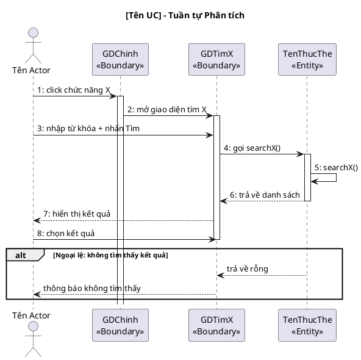

<!-- Pha II – Analysis, Section 4 -->

## II.4. Biểu đồ tuần tự phân tích

Vẽ **đầy đủ cho MỌI UC** trong module — không bỏ sót UC nào. Mỗi UC một biểu đồ riêng.
Luồng chuẩn: `Actor → Boundary → [Control] → Entity`.
Thông điệp **PHẢI bằng tiếng Việt tự nhiên**, đánh số thứ tự liên tục trong mỗi biểu đồ.
Phải thể hiện cả nhánh `alt` cho các kịch bản ngoại lệ đã viết ở II.1.

### Diễn giải tuần tự (Kịch bản phiên bản 2) — BẮT BUỘC

Bên cạnh biểu đồ PlantUML, PHẢI viết thêm **block diễn giải tuần tự** dưới dạng danh sách đánh số, theo format "Kịch bản phiên bản 2". Block này mô tả chi tiết từng bước tương tác giữa Actor, Boundary và Entity bằng tiếng Việt tự nhiên.

**Format:**

```
**Kịch bản phiên bản 2 – UC [Tên UC]**

1. [Actor] [hành động] để [mục đích].
2. [Actor] chọn chức năng [tên chức năng] trên giao diện [BoundaryName].
3. Lớp [BoundaryName] gọi lớp [NextBoundary].
4. Lớp [NextBoundary] hiển thị giao diện cho [Actor].
5. [Actor] hỏi [thông tin] từ [đối tượng].
6. [đối tượng] trả lời [thông tin].
7. [Actor] nhập [thông tin] và nhấn nút [hành động].
8. Lớp [Boundary] gọi lớp [Entity] để xử lý.
9. Lớp [Entity] gọi phương thức [simpleMethodName].
10. Lớp [Entity] trả kết quả về cho lớp [Boundary].
11. Lớp [Boundary] hiển thị kết quả cho [Actor].
...

**Ngoại lệ: [tên ngoại lệ]**
- Lớp [Entity] trả về [danh sách rỗng / kết quả thất bại].
- Lớp [Boundary] hiển thị [thông báo lỗi / nút thay thế].
```

**Quy tắc:**
- Mỗi bước là một câu hoàn chỉnh bằng tiếng Việt
- Tên class giữ nguyên tiếng Việt (GDTimPhongTrong, GDTimKH, GDXacNhanDat...)
- Tên hàm trong mô tả và biểu đồ PHẢI dùng tiếng Anh đơn giản (searchFreeRoom, checkLogin, addBooking...) — KHÔNG dùng tên tiếng Việt, KHÔNG có tham số/kiểu dữ liệu
- Mô tả cả Actor ↔ Boundary interaction (hỏi khách, nhập thông tin, nhấn nút)
- Mỗi nhánh ngoại lệ từ II.1 → một block "Ngoại lệ" riêng ở cuối
- Số bước phải khớp chính xác với các mũi tên trong biểu đồ PlantUML


