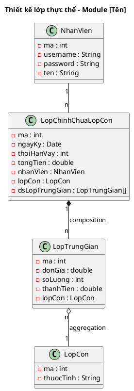

<!-- Pha III – Design, Section 1 -->

## III.1. Thiết kế lớp thực thể

**Input:** Biểu đồ thực thể pha phân tích (II.2).

**Quy trình 4 bước (BẮT BUỘC trình bày):**

- **Bước 1:** Bổ sung thuộc tính `id` (kiểu `int`) cho các lớp **không kế thừa** từ lớp khác.
- **Bước 2:** Bổ sung **kiểu dữ liệu** cho tất cả thuộc tính theo kiểu ngôn ngữ lập trình đang dùng (Java: `String`, `int`, `double`, `Date`, `boolean`...).
- **Bước 3:** Chuyển đổi quan hệ `association` sang `aggregation` hoặc `composition` khi phù hợp:
  - `composition` (◆): đối tượng con không tồn tại độc lập (VD: KyThanhToan không tồn tại nếu không có HopDong).
  - `aggregation` (◇): đối tượng con có thể tồn tại độc lập.
  - Với quan hệ n-n qua lớp trung gian: lớp "cha" `composition` với lớp trung gian; lớp trung gian `aggregation` với lớp "con".
- **Bước 4:** Bổ sung **thuộc tính kiểu đối tượng** vào các lớp (VD: `HopDong` chứa `nhanVien : NhanVien`, `khachHang : KhachHang`...).

### Ví dụ áp dụng: Module quản lý đặt phòng (Hotel)

**Bước 1 – Thêm id:** Room, Client, Bill, Booking, BookedRoom, User, Service, UsedService (các lớp không kế thừa) đều được thêm `id : int`.

**Bước 2 – Thêm kiểu dữ liệu:**
- `Room`: id: int, name: String, type: String, price: double, description: String
- `Client`: id: int, name: String, idCard: String, address: String, phone: String, email: String
- `Booking`: id: int, checkin: Date, checkout: Date, client: Client, user: User

**Bước 3 – Chuyển association → composition/aggregation:**
- Room + Booking → BookedRoom: `Booking "1" *-- "n" BookedRoom` (composition), `BookedRoom "n" o-- "1" Room` (aggregation)
- BookedRoom + Service → UsedService: `BookedRoom "1" *-- "n" UsedService` (composition), `UsedService "n" o-- "1" Service` (aggregation)

**Bước 4 – Thuộc tính kiểu đối tượng:**
- `Booking` chứa: `client: Client`, `user: User`, `dsBookedRoom: BookedRoom[]`
- `BookedRoom` chứa: `room: Room`, `dsUsedService: UsedService[]`
- `Bill` chứa: `booking: Booking`, `user: User`
