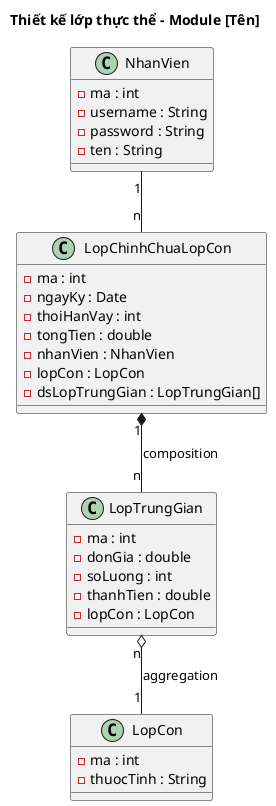

<!-- Pha III – Design, Section 1 -->

## III.1. Thiết kế lớp thực thể

**Input:** Biểu đồ thực thể pha phân tích (II.2).

> **Lưu ý tên attribute:** Tên attribute PHẢI giữ nguyên tiếng Anh từ pha phân tích (II.2). Đã dùng `fullName`, `orderTime`, `loyaltyPoints` ở II.2 thì giữ nguyên ở III.1 — không đổi thành `hoTen`, `thoiGianDat`, `diemTichLuy`.

**Quy trình 4 bước (BẮT BUỘC trình bày đầy đủ — mỗi bước ghi rõ thay đổi cụ thể):**

- **Bước 1 – Bổ sung thuộc tính `id`:** Thêm `id: int` cho các lớp **không kế thừa** từ lớp khác.
  - VD: `Room`: thêm `id: int`, `Client`: thêm `id: int`, `Booking`: thêm `id: int`
- **Bước 2 – Bổ sung kiểu dữ liệu:** Gán kiểu Java cho tất cả thuộc tính (`String`, `int`, `double`, `Date`, `boolean`...).
  - VD: `Room`: `id: int`, `name: String`, `type: String`, `price: double`, `description: String`
  - VD: `Client`: `id: int`, `name: String`, `phone: String`, `email: String`, `idCard: String`
- **Bước 3 – Chuyển association → composition/aggregation:**
  - `composition` (◆): đối tượng con không tồn tại độc lập (VD: `BookedRoom` không tồn tại nếu không có `Booking`).
  - `aggregation` (◇): đối tượng con có thể tồn tại độc lập (VD: `Room` tồn tại độc lập với `BookedRoom`).
  - Với quan hệ n-n qua lớp trung gian: lớp "cha" `composition` (◆) với lớp trung gian; lớp trung gian `aggregation` (◇) với lớp "con".
  - VD: `Booking "1" *-- "n" BookedRoom` (composition), `BookedRoom "n" o-- "1" Room` (aggregation)
- **Bước 4 – Bổ sung thuộc tính kiểu đối tượng:** Thêm attribute kiểu class vào các lớp container.
  - VD: `Booking` chứa: `client: Client`, `user: User`, `dsBookedRoom: BookedRoom[]`
  - VD: `BookedRoom` chứa: `room: Room`

### Ví dụ áp dụng: Module quản lý đặt phòng (Hotel)

**Bước 1 – Thêm id:** Room, Client, Bill, Booking, BookedRoom, User, Service, UsedService (các lớp không kế thừa) đều được thêm `id : int`.

**Bước 2 – Thêm kiểu dữ liệu:**
- `Room`: id: int, name: String, type: String, price: double, description: String
- `Client`: id: int, name: String, idCard: String, address: String, phone: String, email: String
- `Booking`: id: int, checkin: Date, checkout: Date, client: Client, user: User

**Bước 3 – Chuyển association → composition/aggregation:**
- Room + Booking → BookedRoom: `Booking "1" *-- "n" BookedRoom` (composition), `BookedRoom "n" o-- "1" Room` (aggregation)
- BookedRoom + Service → UsedService: `BookedRoom "1" *-- "n" UsedService` (composition), `UsedService "n" o-- "1" Service` (aggregation)

**Bước 4 – Thuộc tính kiểu đối tượng:**
- `Booking` chứa: `client: Client`, `user: User`, `dsBookedRoom: BookedRoom[]`
- `BookedRoom` chứa: `room: Room`, `dsUsedService: UsedService[]`
- `Bill` chứa: `booking: Booking`, `user: User`
