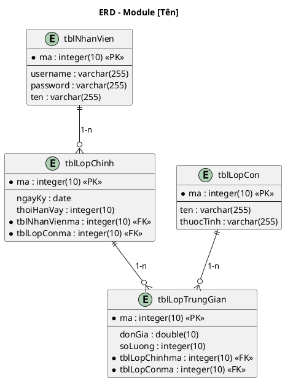

<!-- Pha III – Design, Section 2 -->

## III.2. Thiết kế CSDL

**Input:** Thiết kế lớp thực thể (III.1).

**Quy trình 5 bước (BẮT BUỘC trình bày):**

- **Bước 1:** Với mỗi lớp thực thể → đề xuất 1 bảng dữ liệu tương ứng (đặt tên dạng `tbl[TênLớp]`).
- **Bước 2:** Với mỗi lớp, **bỏ qua thuộc tính kiểu đối tượng**, chỉ lấy thuộc tính kiểu cơ bản đưa sang làm cột; chuyển đổi kiểu dữ liệu sang SQL (`String` → `varchar(255)`, `int` → `integer(10)`, `double` → `double(10)`, `Date` → `date`...).
- **Bước 3:** Quan hệ số lượng giữa 2 lớp = quan hệ số lượng giữa 2 bảng tương ứng:
  - **1-1:** Hai bảng liên quan nên gộp lại thành một (trừ trường hợp đặc biệt cần giữ riêng).
  - **1-n:** Hai bảng tách riêng.
  - **n-n:** Cần tạo bảng trung gian để tách thành 2 quan hệ 1-n. Quay lại pha phân tích nếu chưa có lớp trung gian.
- **Bước 4:** Bổ sung khóa:
  - **Khóa chính (PK):** Bảng nào có thuộc tính `id`/`ma` → thiết lập làm PK.
  - **Khóa ngoại (FK):** Nếu `tblA` – `tblB` là 1-n (1 A có n B) → `tblB` thêm cột FK tham chiếu PK của `tblA`. Đặt tên FK theo quy tắc: `tbl[TênBảngCha]ma` (VD: `tblNhanVienma`, `tblHopDongma`).
- **Bước 5:** Loại bỏ thuộc tính gây dư thừa dữ liệu:
  - **Thuộc tính trùng lặp:** cùng một thông tin xuất hiện ở 2 bảng khác nhau (không phải FK).
  - **Thuộc tính dẫn xuất:** có thể tính toán từ các thuộc tính khác (VD: `thanhTien = donGia × soLuong`, `tongTien` tính được từ các kỳ thanh toán → cân nhắc bỏ).
  - **Bảng trống:** Sau khi loại bỏ thuộc tính dư thừa, nếu bảng nào chỉ còn lại 1 khóa ngoại mà không có thuộc tính riêng → **loại bỏ luôn bảng đó** (quan hệ đã thể hiện qua FK ở bảng còn lại).

