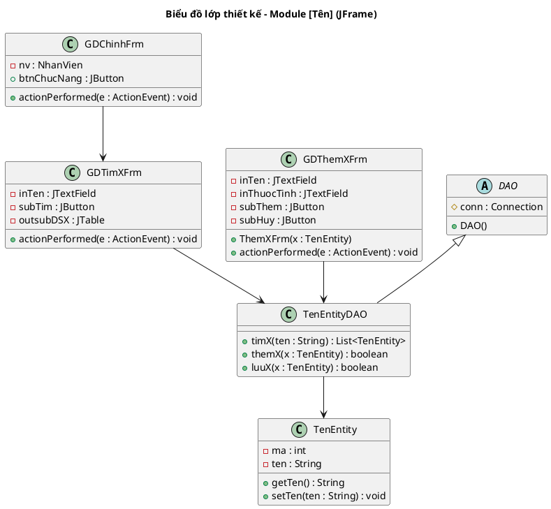
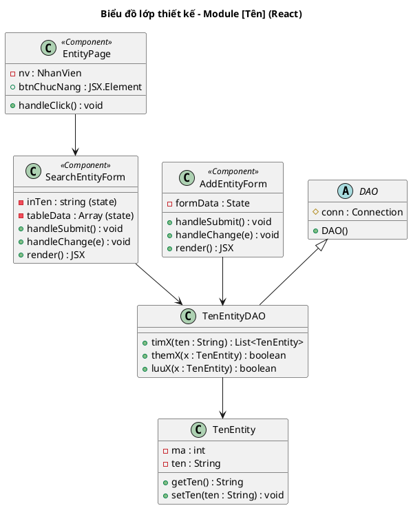

<!-- Pha III – Design, Section 3.2 -->

## III.3.2. Sơ đồ lớp thiết kế

**Kiến trúc DAO (BẮT BUỘC áp dụng):**
- Lớp **Boundary** (Form/Frame hoặc React Component): xử lý giao diện.
  - **JFrame:** bắt sự kiện `actionPerformed()`.
  - **React:** bắt sự kiện `handleSubmit()`, `onClick()`, `onChange()`.
- Lớp **DAO** (Data Access Object): thực hiện truy vấn CSDL. Đặt tên `[TênEntity]DAO`.
- Lớp **DAO** kế thừa từ lớp `DAO` chung (có `conn: Connection` và constructor `DAO()`).
- Lớp **Entity**: chỉ chứa thuộc tính + getter/setter, không chứa logic CSDL.

**Quy trình xác định chữ ký hàm (BẮT BUỘC trình bày reasoning):**

Với mỗi phương thức trong DAO, trình bày:
```
[Tên chức năng] => [tênHàmTiếngAnh()]
- Input: [liệt kê]
- Output: [liệt kê]
- Ứng viên tham số vào:
  [tênHàm](param1: KiểuDữLiệu, param2: KiểuDữLiệu)  → loại vì không hướng đối tượng
  [tênHàm](obj: TênLớp)                               → chọn (hướng đối tượng)
- Ứng viên tham số ra:
  [tênHàm](): void
  [tênHàm](): boolean                                  → chọn (cần biết thành công/thất bại)
  [tênHàm](): List<TênLớp>                             → chọn (trả về danh sách)
```

**Variant JFrame:**



**Variant React:**

**Quy ước đặt tên:** Tên class React dùng tiếng Anh + hậu tố loại component (`Page`, `Card`, `Panel`, `Modal`, `Form`, `Table`). Xem bảng quy ước chi tiết ở II.3.


