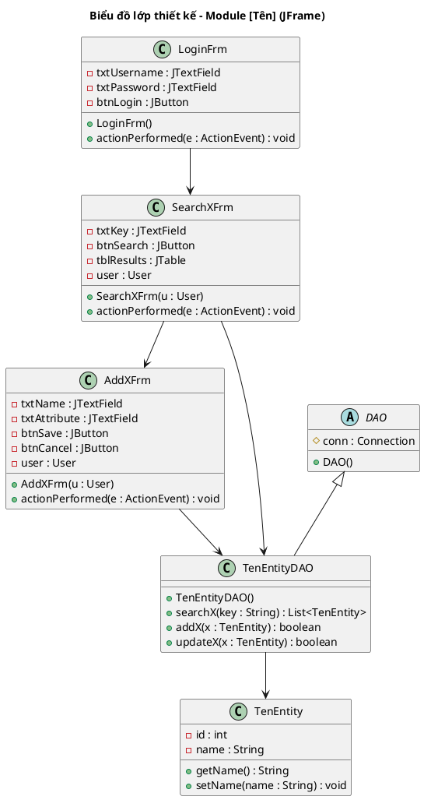
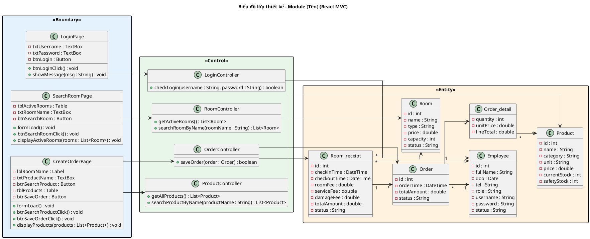

<!-- Pha III – Design, Section 3.2 -->

## III.3.2. Sơ đồ lớp thiết kế

> **Kiểm tra nhất quán trước khi vẽ:** Bộ Entity class trong gói `<<Entity>>` PHẢI khớp 1:1 với lớp thực thể đã xác định ở II.2 — không thừa (class không có trong analysis), không thiếu (class có trong analysis bị bỏ). Nếu phát hiện lệch → sửa II.2 hoặc điều chỉnh trước khi tiếp tục.

### Kiến trúc React MVC (BẮT BUỘC cho React + Spring Boot)

3 tầng: **Boundary** (React) → **Control** (Spring Boot) → **Entity** (JPA)

---

### Quy tắc đặt tên (BẮT BUỘC)

**Boundary — React Components:**

| Quy tắc | Mẫu | Ví dụ |
|---------|-----|-------|
| Tên lớp | `[Chức năng]Page` | `LoginPage`, `SearchRoomPage`, `CreateOrderPage`, `MenuPage` |
| Thuộc tính ô nhập | `- txt[Tên] : TextBox` | `- txtUsername : TextBox`, `- txtRoomName : TextBox` |
| Thuộc tính nút | `- btn[Tên] : Button` | `- btnLogin : Button`, `- btnSave : Button` |
| Thuộc tính bảng | `- tbl[Tên] : Table` | `- tblActiveRooms : Table`, `- tblProducts : Table` |
| Thuộc tính nhãn | `- lbl[Tên] : Label` | `- lblRoomName : Label`, `- lblMessage : Label` |
| Phương thức khởi tạo | `+ formLoad() : void` | Tự động chạy khi giao diện load |
| Phương thức nút bấm | `+ btn[Tên]Click() : void` | `+ btnLoginClick()`, `+ btnSaveClick()` |
| Phương thức bảng click | `+ tbl[Tên]Click(id : int) : void` | `+ tblProductsClick(productId : int)` |
| Phương thức hiển thị | `+ display[Dữ liệu](data : List<Entity>) : void` | `+ displayActiveRooms(rooms : List<Room>)` |
| Phương thức thông báo | `+ showMessage(msg : String) : void` | Hiển thị popup thông báo |

**Control — Spring Boot Controllers:**

| Quy tắc | Mẫu | Ví dụ |
|---------|-----|-------|
| Tên lớp | `[Entity]Controller` | `LoginController`, `RoomController`, `ProductController`, `OrderController` |
| Đăng nhập | `+ checkLogin(username, password) : boolean` | Kiểm tra tài khoản |
| Lấy tất cả | `+ getAll[Tên]() : List<Entity>` | `+ getAllProducts() : List<Product>` |
| Tìm kiếm | `+ search[Tên](keyword : String) : List<Entity>` | `+ searchProduct(keyword) : List<Product>` |
| Tìm theo tên | `+ search[Tên]ByName(name : String) : List<Entity>` | `+ searchRoomByName(roomName) : List<Room>` |
| Lấy theo ID | `+ get[Tên]ById(id : int) : Entity` | `+ getProductById(id) : Product` |
| Lưu mới | `+ save[Tên](entity : Entity) : boolean` | `+ saveOrder(order : Order) : boolean` |
| Cập nhật | `+ update[Tên](entity : Entity) : boolean` | `+ updateProduct(product) : boolean` |
| Xóa | `+ delete[Tên](id : int) : boolean` | `+ deleteProduct(id) : boolean` |

**Entity — JPA Entities:**

| Quy tắc | Mẫu | Ví dụ |
|---------|-----|-------|
| Tên lớp | PascalCase tiếng Anh | `Employee`, `Room`, `Order`, `Product`, `Room_receipt` |
| Bảng DB | `tbl` + tên entity | `tblEmployee`, `tblRoom`, `tblOrder`, `tblProduct` |
| Thuộc tính | `- tênCamelCase : KiểuJava` | `- fullName : String`, `- orderTime : DateTime`, `- currentStock : int` |
| Cột DB | snake_case | `full_name`, `order_time`, `current_stock`, `safety_stock` |
| Quan hệ n-n | Bảng trung gian `[A]_[B]` | `Order_detail`, `Damage_detail`, `Import_detail` |

**Package colors:**
- Boundary: `<<Boundary>>` `#E3F2FD`
- Control: `<<Control>>` `#E8F5E9`
- Entity: `<<Entity>>` `#FFF3E0`

---

### Quy trình xác định chữ ký hàm (BẮT BUỘC trình bày reasoning)

Với mỗi phương thức trong Control, trình bày:
```
[Tên chức năng] => [tênHàmTiếngAnh()]
- Input: [liệt kê]
- Output: [liệt kê]
- Ứng viên tham số vào:
  [tênHàm](param1: KiểuDữLiệu, param2: KiểuDữLiệu)  → loại vì không hướng đối tượng
  [tênHàm](obj: TênLớp)                               → chọn (hướng đối tượng)
- Ứng viên tham số ra:
  [tênHàm](): void
  [tênHàm](): boolean                                  → chọn (cần biết thành công/thất bại)
  [tênHàm](): List<TênLớp>                             → chọn (trả về danh sách)
```

---

### Variant JFrame (dự án JFrame)

**Quy tắc Boundary JFrame:**

| Quy tắc | Mẫu | Ví dụ |
|---------|-----|-------|
| Tên lớp | `[EnglishName]Frm` | `LoginFrm`, `SearchRoomFrm`, `EditRoomFrm`, `AddClientFrm` |
| Extends | `JFrame implements ActionListener` | Mọi Frm đều kế thừa JFrame |
| Attribute UI | `- txt[Name] : JTextField`, `- btn[Name] : JButton`, `- tbl[Name] : JTable` | `- txtKey : JTextField`, `- btnSearch : JButton` |
| Attribute user | `- user : User` | Lưu user đăng nhập — mọi Frm cần phân quyền đều có |
| Constructor | `+ FrmName(u : User)` hoặc `+ FrmName(u : User, obj : DomainObj)` | `+ SearchRoomFrm(u : User)`, `+ EditRoomFrm(u : User, r : Room)` |
| Event handler | `+ actionPerformed(e : ActionEvent) : void` | Mọi Frm đều implement |



---

### Variant React MVC

**Ví dụ: Module Dịch vụ & Sản phẩm — Chức năng Tạo order**

Boundary classes:
| Lớp | Thuộc tính | Phương thức |
|-----|-----------|------------|
| LoginPage | -txtUsername: TextBox, -txtPassword: TextBox, -btnLogin: Button | +btnLoginClick(), +showMessage(msg) |
| StaffHomePage | -btnManageOrder: Button | +btnManageOrderClick() |
| SearchRoomPage | -tblActiveRooms: Table, -txtRoomName: TextBox, -btnSearchRoom: Button, -btnCreateOrder: Button | +formLoad(), +btnSearchRoomClick(), +displayActiveRooms(rooms), +tblEmptyRoomsClick(selectedRow), +showMessage(msg) |
| CreateOrderPage | -lblRoomName: Label, -txtProductName: TextBox, -btnSearchProduct: Button, -tblProducts: Table, -tblOrderDetails: Table, -btnSaveOrder: Button | +formLoad(), +btnSearchProductClick(), +btnAddClick(), +btnSaveOrderClick(), +displayProducts(products), +displayOrderCart(orderDetails), +showMessage(msg) |
| ConfirmOrderPage | -lblMessage: Label, -btnConfirm: Button | +btnConfirmClick() |

Control methods:
| Lớp | Phương thức | Chức năng |
|-----|------------|----------|
| LoginController | +checkLogin(username, password) | Kiểm tra đăng nhập |
| RoomController | +getActiveRooms() : List\<Room\> | Lấy danh sách phòng đang hoạt động |
| RoomController | +searchRoomByName(roomName) : List\<Room\> | Tìm phòng theo tên |
| ProductController | +getAllProducts() : List\<Product\> | Lấy toàn bộ sản phẩm |
| ProductController | +searchProductByName(productName) : List\<Product\> | Tìm sản phẩm theo tên |
| OrderController | +saveOrder(order : Order) : boolean | Lưu order vào CSDL |

Entity: Employee, Room, Order, Order_detail, Product, Room_receipt.

---

### PlantUML template — React MVC


