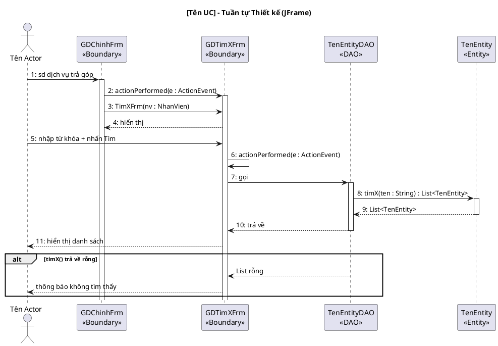
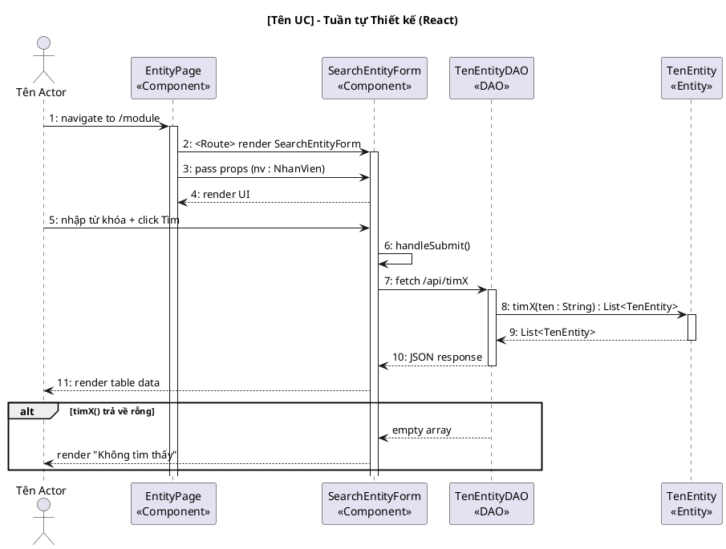

<!-- Pha III – Design, Section 4 -->

## III.4. Biểu đồ tuần tự thiết kế

**Input:** Biểu đồ tuần tự phân tích (II.4) + Sơ đồ lớp thiết kế (III.3.2).

Nâng cấp từ II.4:
- Thêm lớp DAO vào luồng (giữa Boundary và Entity).
- Thay **toàn bộ** thông điệp tiếng Việt thành **tên hàm tiếng Anh chính xác** (khớp với chữ ký đã định nghĩa ở III.3.2).
- Bắt sự kiện giao diện:
  - **JFrame:** `actionPerformed(e: ActionEvent)`
  - **React:** `handleSubmit()`, `onClick()`
- Đánh số thứ tự liên tục.

### Diễn giải tuần tự (Kịch bản phiên bản 3) — BẮT BUỘC

Bên cạnh biểu đồ PlantUML, PHẢI viết thêm **block diễn giải tuần tự** dưới dạng danh sách đánh số, theo format "Kịch bản phiên bản 3". Block này mô tả chi tiết từng bước tương tác giữa Actor, Boundary, DAO và Entity, có sử dụng tên hàm Java + kiểu dữ liệu.

**Format:**

```
**Kịch bản phiên bản 3 – UC [Tên UC]**

1. [Actor] [hành động] trên giao diện [BoundaryFrm].
2. Phương thức actionPerformed của lớp [BoundaryFrm] được gọi.
3. Phương thức actionPerformed gọi lớp [NextBoundaryFrm].
4. Hàm khởi tạo [NextBoundaryFrm] được gọi.
5. Giao diện [NextBoundaryFrm] được hiển thị cho [Actor].
...
N. Phương thức actionPerformed gọi phương thức [methodName] của lớp [EntityDAO].
N+1. Phương thức [methodName] thực thi.
N+2. Phương thức [methodName] gọi lớp [Entity] để đóng gói kết quả.
N+3. Lớp [Entity] đóng gói từng đối tượng [Entity].
N+4. Lớp [Entity] trả về đối tượng cho phương thức [methodName].
N+5. Phương thức [methodName] trả về kết quả cho phương thức actionPerformed.
...

**Ngoại lệ: [tên ngoại lệ]**
- Phương thức [methodName] trả về [giá trị rỗng/false].
- Phương thức actionPerformed hiển thị thông báo [thông báo lỗi].
```

**Quy tắc:**
- Mỗi bước là một câu hoàn chỉnh bằng tiếng Việt
- Tên phương thức/class giữ nguyên tiếng Anh (khớp với III.3.2)
- Tham số kiểu ghi rõ: `searchFreeRoom(checkin: Date, checkout: Date)`
- Mô tả cả Actor ↔ Boundary interaction (hỏi khách, nhập thông tin, nhấn nút)
- Mỗi nhánh ngoại lệ từ II.1 → một block "Ngoại lệ" riêng ở cuối

**Variant JFrame:**



**Variant React:**

**Lưu ý:** Tên participant dùng hậu tố loại component (`Page`, `Form`, `Modal`, `Panel`, `Card`, `Table`) theo quy ước ở II.3.


