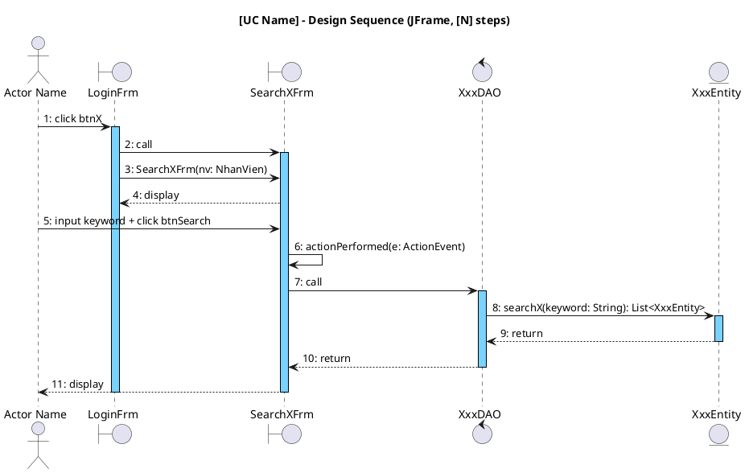
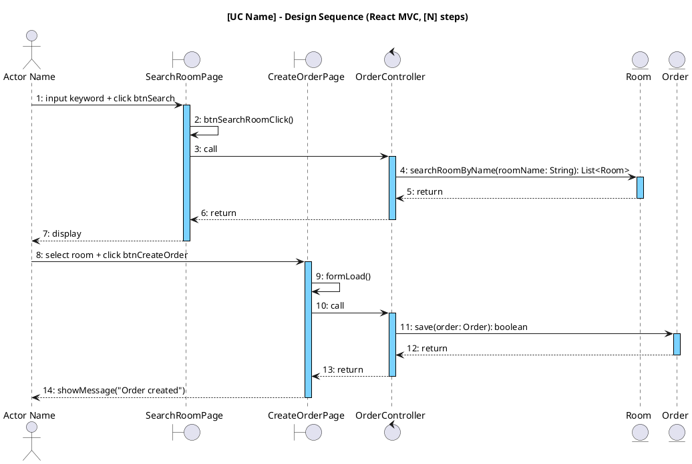

<!-- Pha III – Design, Section 4 -->

## III.4. Biểu đồ tuần tự thiết kế

**Input:** Biểu đồ tuần tự phân tích (II.4) + Sơ đồ lớp thiết kế (III.3.2).

Nâng cấp từ II.4:
- **JFrame:** Thêm lớp **DAO** vào luồng (giữa Boundary và Entity).
- **React MVC:** Thêm lớp **Controller** vào luồng (giữa Boundary và Entity).
- Thay **toàn bộ** thông điệp thành **tên hàm tiếng Anh chính xác** + kiểu dữ liệu (khớp với chữ ký đã định nghĩa ở III.3.2).
- Bắt sự kiện giao diện:
  - **JFrame:** `actionPerformed(e: ActionEvent)`
  - **React:** `btnTênClick()`, `formLoad()`, `showMessage()`
- Đánh số thứ tự liên tục. **KHÔNG dùng `alt`** — chỉ vẽ luồng chính.

Arrow labels theo quy tắc (giống II.4 nhưng có tham số+kiểu ở thiết kế):

| Tình huống | Label | Ví dụ |
|-----------|-------|-------|
| Actor → Boundary hành động | short English | `1: click btnManage`, `3: input info + click btnSave` |
| Boundary kích hoạt Boundary/Controller | `call` | `2: call`, `4: call` |
| Controller/DAO → Entity method | `methodName(param: Type)` | `5: list(branchId)`, `6: save(order: Order)` |
| Entity trả về | `return` | `7: return` |
| Controller/DAO → Boundary trả | `return` | `8: return` |
| Boundary → Actor hiển thị | `display` / `showMessage()` | `9: display`, `9: showMessage("saved")` |

### Diễn giải tuần tự (Kịch bản phiên bản 3) — BẮT BUỘC

Bên cạnh biểu đồ PlantUML, PHẢI viết thêm **block diễn giải tuần tự** dưới dạng danh sách đánh số, theo format "Kịch bản phiên bản 3". Block này mô tả chi tiết từng bước tương tác giữa Actor, Boundary, DAO/Controller và Entity, có sử dụng tên hàm Java + kiểu dữ liệu.

**Format:**

```
**Kịch bản phiên bản 3 – UC [Tên UC]**

1. [Actor] [hành động] trên giao diện [TênFrm/Page].
2. Lớp [TênFrm/Page] gọi phương thức [btnTênClick()/actionPerformed()].
3. Phương thức [btnTênClick()] gọi lớp [XxxDAO/XxxController].
4. Lớp [XxxDAO/XxxController] gọi phương thức [methodName(param: Type)] của lớp [Entity].
5. Lớp [Entity] thực thi [methodName()].
6. Lớp [Entity] trả kết quả về cho lớp [XxxDAO/XxxController].
7. Lớp [XxxDAO/XxxController] trả kết quả về cho lớp [TênFrm/Page].
8. Lớp [TênFrm/Page] hiển thị kết quả cho [Actor].
...
N. Phương thức [btnTênClick()] gọi phương thức [methodName] của lớp [XxxDAO/XxxController].
N+1. Phương thức [methodName] gọi lớp [Entity] để đóng gói kết quả.
N+2. Lớp [Entity] đóng gói từng đối tượng [Entity].
N+3. Lớp [Entity] trả về đối tượng cho phương thức [methodName].
N+4. Phương thức [methodName] trả về kết quả cho phương thức [btnTênClick()].
...

**Ngoại lệ: [tên ngoại lệ]**
- Phương thức [methodName] trả về [giá trị rỗng/false].
- Phương thức [btnTênClick()/actionPerformed] hiển thị thông báo [thông báo lỗi].
```

**Quy tắc:**
- Mỗi bước là một câu hoàn chỉnh bằng tiếng Việt
- Tên phương thức/class giữ nguyên tiếng Anh (khớp với III.3.2)
- Tham số kiểu ghi rõ: `searchFreeRoom(checkin: Date, checkout: Date)`
- Mô tả cả Actor ↔ Boundary interaction (hỏi khách, nhập thông tin, nhấn nút)
- Mỗi nhánh ngoại lệ từ II.1 → một block "Ngoại lệ" riêng ở cuối

### Naming convention participant

**Lưu ý:** Dùng `boundary`, `control`, `entity` khi khai báo participant (không dùng `participant`).

- **JFrame:** Boundary = `[EnglishName]Frm` (VD: `LoginFrm`, `SearchRoomFrm`), Control = `[Entity]DAO`
- **React:** Boundary = `[EnglishName]Page` (VD: `SearchRoomPage`, `CreateOrderPage`), Control = `[Entity]Controller`

---

**Variant JFrame:**



---

**Variant React MVC:**


