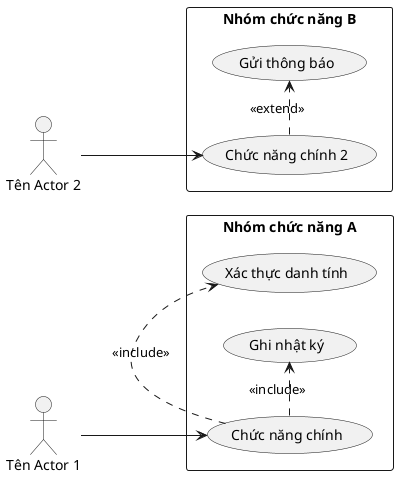

# Requirements Workflow – Toàn hệ thống

Bố cục chuẩn gồm 3 phần lớn. Sinh đầy đủ theo thứ tự dưới đây.

---

## 1. Bảng thuật ngữ

| STT | Thuật ngữ | Định nghĩa / Giải thích |
|-----|-----------|------------------------|
| 1   | ...       | ...                    |

---

## 2. Mô hình nghiệp vụ bằng ngôn ngữ tự nhiên

### 2.1. Mục tiêu và phạm vi hệ thống
Mô tả bằng văn xuôi:
- Hệ thống được xây dựng để làm gì?
- Giải quyết vấn đề gì?
- Phạm vi áp dụng (ai dùng, ở đâu)?

### 2.2. Ai có thể sử dụng phần mềm?
Liệt kê tất cả các nhóm người dùng (Actor) bằng văn xuôi tự nhiên, giải thích vai trò của từng nhóm.

### 2.3. Người dùng có những chức năng gì?
Với mỗi Actor, mô tả bằng ngôn ngữ tự nhiên họ có thể làm gì trong hệ thống.

### 2.4. Mỗi chức năng hoạt động như thế nào?
Với **từng chức năng chính**, liệt kê luồng hoạt động dạng các bước nối nhau bằng mũi tên `→`. Mỗi bước là một hành động hoặc phản hồi cụ thể, ngắn gọn.

Định dạng bắt buộc:
```
Chức năng "[Tên chức năng]":
[Bước 1] → [Bước 2] → [Bước 3] → ... → [Kết quả cuối]
```

Ví dụ:
```
Chức năng "Tìm kiếm khách hàng":
Nhập từ khóa tìm kiếm → Hệ thống truy vấn CSDL → Hiển thị danh sách kết quả → Người dùng chọn một dòng → Hiển thị chi tiết khách hàng

Chức năng "Thêm mới khách hàng":
Nhấn nút Thêm mới → Hiển thị form nhập liệu → Người dùng nhập thông tin → Nhấn Lưu → Hệ thống kiểm tra dữ liệu hợp lệ → Lưu vào CSDL → Thông báo thành công
```

**Yêu cầu:** Phải tách rõ hành động của người dùng và phản hồi của hệ thống. Nếu chức năng có nhánh (điều kiện thành công / thất bại), ghi rõ cả hai nhánh.

### 2.5. Những thông tin / đối tượng mà hệ thống cần xử lý
Liệt kê và mô tả các thực thể dữ liệu chính (VD: Người dùng, Đơn hàng, Sản phẩm...).

### 2.6. Quan hệ giữa các đối tượng
**Liệt kê TẤT CẢ các quan hệ** có thể nghĩ tới giữa các đối tượng, kể cả quan hệ gián tiếp, quan hệ phát sinh từ quy tắc nghiệp vụ, và quan hệ n-n qua đối tượng trung gian. Mỗi quan hệ mô tả rõ số lượng (1-1, 1-n, n-n) và ngữ cảnh nghiệp vụ.

Định dạng bắt buộc — mỗi quan hệ một dòng:
```
- Một [Đối tượng A] có nhiều [Đối tượng B]  (1-n)
- Một [Đối tượng C] liên quan đến nhiều [Đối tượng D] và ngược lại  (n-n)
- Một [Đối tượng E] thuộc về [Đối tượng F]  (n-1)
```

**Yêu cầu bắt buộc khi suy nghĩ:**
- Duyệt từng đối tượng trong mục 2.5, lần lượt xét quan hệ với MỌI đối tượng còn lại.
- Không bỏ sót quan hệ n-n (cần đề xuất đối tượng trung gian nếu có).
- Ghi rõ cả quan hệ dẫn xuất / thời gian nếu có (VD: "Một giảng viên có thể dạy nhiều môn học trong mỗi kì học").
- Ghi rõ ràng ràng buộc nghiệp vụ nếu có (VD: "Mỗi buổi học chỉ có một giảng viên dạy").

---

## 3. Mô hình nghiệp vụ bằng UML

### 3.1. Danh sách Actor

| STT | Tên Actor | Mô tả |
|-----|-----------|-------|
| 1   | ...       | ...   |

### 3.2. Các Use Case cho từng Actor

Với mỗi Actor, liệt kê đầy đủ use-case:

| Mã UC | Actor | Use case |
|-------|-------|----------|
| UC01  | ...   | ...      |

### 3.3. Biểu đồ Use Case tổng quan và phân rã

**Lưu ý khi vẽ:**
- Thể hiện đầy đủ quan hệ `<<include>>` (bắt buộc) và `<<extend>>` (tùy chọn).
- Phân rã sâu vào nghiệp vụ, không chỉ liệt kê chức năng bề mặt.
- Gộp các use-case theo nhóm chức năng (package) nếu hệ thống lớn.

**Quy tắc style biểu đồ (BẮT BUỘC cho mọi biểu đồ UC):**

1. **Dàn module trên nhiều dòng:** Khi hệ thống có nhiều module, xếp các package module theo chiều dọc (top-to-bottom) hoặc dạng lưới (grid) để tối ưu không gian hiển thị. KHÔNG đặt tất cả module trên một hàng ngang. Các module phải được xác định trong plan từ đầu khi người dùng yêu cầu làm requirements.

2. **Không viết tắt tên UC, giữ mã UC xuyên suốt:**
   - Tên UC trong biểu đồ tổng quan PHẢI đầy đủ, KHÔNG viết tắt (VD: `usecase "Quản lý khách hàng"`, KHÔNG dùng `usecase "QL KH"`).
   - Mã UC trong biểu đồ tổng quan PHẢI đánh số UC01, UC02... khớp chính xác với bảng ở mục 3.2.
   - Khi mang UC sang biểu đồ chi tiết (module), giữ nguyên mã UC01, UC02... không thay đổi.

3. **Mũi tên thẳng, UC dàn đều:**
   - Tất cả mũi tên PHẢI thẳng (dùng `-->`, `.<...>>`), KHÔNG dùng mũi tên chéo.
   - Dàn đều các UC trong mỗi package block, không để UC chồng chéo hoặc quá gần nhau.
   - Dùng `top to right direction` hoặc `left to right direction` để điều hướng mũi tên cho phù hợp.



---

## Ánh xạ sang tài liệu module

Sau khi hoàn thành requirements toàn hệ thống, tài liệu từng module sẽ dùng kết quả từ đây:
- **Mục 3.3** (Biểu đồ UC tổng quan) → dùng làm input cho **I.1. Mô hình nghiệp vụ bằng UML** (copy UC + actor vào phạm vi module)
- **Mục 2.4** (Chức năng hoạt động) → dùng làm input cho **II.1. Mô hình hóa chức năng** (viết kịch bản chi tiết)
