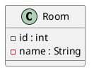

# Notion Enhanced Markdown Formatting Guide

Hướng dẫn chọn bố cục và syntax markdown chuẩn theo **Notion Enhanced Markdown**
(nguồn: `developers.notion.com/guides/data-apis/enhanced-markdown`).

> **Lưu ý quan trọng:** Enhanced markdown (`<callout>`, `<columns>`, `<details>`) chỉ hoạt động khi push qua **Notion API**. File import (drag-and-drop) chỉ hỗ trợ standard markdown.

---

## 1. Khung quyết định chọn bố cục

> Chọn đúng element cho đúng nội dung — không dùng table cho mọi thứ, không dùng callout tràn lan.

| Tình huống | Dùng | Lý do |
|------------|------|-------|
| Quy tắc, luật, mục tiêu cần nhớ | **Callout** | Nổi bật, dễ thấy khi scan |
| Cảnh báo, lưu ý, mẹo | **Callout** | Phân biệt bằng icon + color |
| Quy trình nhiều bước cùng cấp | **Columns** | Trình bày song song, tiết kiệm không gian |
| So sánh Đúng/Sai, Trước/Sau | **Columns** + Callout | Mỗi cột 1 phiên bản, dùng callout để phân biệt |
| Bảng dữ liệu thật sự (mapping, thuộc tính, so sánh nhiều cột) | **Table** | Markdown table render tốt trong Notion |
| Bảng có thuộc tính riêng (color, header column) | **HTML `<table>`** | Hỗ trợ `fit-page-width`, `header-row`, color |
| Nội dung dài mở rộng (biểu đồ UML full, dữ liệu mẫu CSDL) | **Toggle** (`<details>`) | Thu gọn, người đọc tự mở khi cần |
| Code UML + hình ảnh | **Columns** (code | image) | Song song code và visual |
| Heading cần color | Heading + `{color="X"}` | Phân biệt trực quan các section |
| Đoạn trích dẫn, nhận xét | **Quote** (`>`) | Có thể thêm `{color="gray"}` |
| Danh mục cần đánh dấu màu | **List** + `{color="X"}` | Phân biệt mức độ quan trọng |

---

## 2. Khung quyết định Columns — Khi nào và bao nhiêu cột

### Quy tắc chính

**Dùng columns khi có ≥2 phần nội dung cùng cấp, song song, hoặc cần so sánh.**

### Quyết định số cột

<callout icon="🔑" color="purple">
**Nguyên tắc cứng:** Tối đa 4 columns. Nếu BẤT KỲ bước nào chứa bảng (markdown table hoặc HTML table), tối đa chỉ được 2 columns.
</callout>

| Số bước/phần | Số cột | Ghi chú |
|--------------|--------|---------|
| 2 | 2 cột | So sánh Đúng/Sai, 2 bước, code + image |
| 3 | 3 cột | Quy trình 3 bước, 3 phần cùng cấp |
| 4 (không có bảng) | 2×2 hoặc 4 cột | 4 bước ngắn → 4 cột; nội dung dài → 2 cột (2 bước/cột) |
| 4 (có bảng) | 2 cột | Mỗi cột 2 bước, nhồi bảng vào trong cột |
| 5+ | 2 cột | Nhóm bước lại, mỗi cột 2–3 bước. KHÔNG BAO GIỜ >4 columns |

### Quy tắc Callout Pairs

<callout icon="🔑" color="purple">
Khi có 2 callout liên quan nhau (VD: "Mục tiêu" + "Đầu vào", "Đúng" + "Sai"), LUÔN LUÔN đặt trong 2 columns, mỗi callout 1 cột, có tiêu đề heading ở trên mỗi callout.
</callout>

```html
<columns>
<column>

### Mục tiêu
<callout icon="🎯" color="blue">
Nội dung mục tiêu...
</callout>

</column>
<column>

### Đầu vào
<callout icon="📝" color="gray">
Nội dung đầu vào...
</callout>

</column>
</columns>
```

### Khi NÀO dùng columns

| Tình huống | Dùng columns? | Ví dụ |
|------------|---------------|-------|
| Quy trình 2–5 bước, mỗi bước cùng mức quan trọng | **Có** | Bước 1, 2, 3 của UC |
| So sánh 2 phiên bản (Đúng/Sai, Trước/Sau) | **Có** | Phân tích vs Thiết kế |
| Code + hình ảnh song song | **Có** | PlantUML code bên trái, image bên phải |
| 2–4 phần nội dung ngắn, cùng cấp | **Có** | Danh sách actor + chức năng |
| Nội dung dài (>10 dòng mỗi phần) | **Không** | Dùng table hoặc sections riêng |
| Bảng dữ liệu nhiều cột | **Không** | Dùng markdown table |
| Callout đơn lẻ | **Không** | Dùng callout standalone |
| Nội dung có thứ tự phụ thuộc (Bước 2 cần kết quả Bước 1) | **Không** | Dùng list đánh số |

### Khi KHÔNG dùng columns

- Nội dung quá dài mỗi cột (>15 dòng) → dùng sections riêng
- Bảng dữ liệu nhiều cột → dùng markdown table
- Callout đơn lẻ → dùng callout standalone
- Nội dung có tính tuần tự chặt chẽ → dùng list đánh số

---

## 3. PlantUML Image Pattern

### PlantUML Style Rules (BẮT BUỘC)

Mọi diagram PlantUML **PHẢI** có:

```plantuml
@startuml
left to right direction
skinparam linetype ortho
skinparam packageStyle rectangle
@enduml
```

- **`left to right direction`** — layout ngang từ trái sang phải
- **`skinparam linetype ortho`** — đường thẳng gấp khúc, KHÔNG cong
- **`skinparam packageStyle rectangle`** — package dạng hình chữ nhật

**Class diagram:**
- Lớp xếp theo chiều ngang, chia rõ Boundary | DAO | Entity
- Boundary dùng Java Swing: `JFrame`, `JButton`, `JTextField`, `JTable`, `JComboBox`, `JLabel`, `JPasswordField`
- Mỗi Boundary implements `ActionListener`, có `actionPerformed(e: ActionEvent): void`
- Abstract DAO có `#conn: Connection`
- Entity có `-id : int` + kiểu cụ thể + `+getter/setter`

### Quy trình

1. Viết code PlantUML trong file markdown (code block `plantuml`)
2. Dùng MCP `generate_plantuml_diagram` để sinh ảnh PNG/SVG
3. Lưu ảnh vào thư mục `assets/plantuml/`
4. Trong Notion: đặt code và image cạnh nhau bằng columns

### Cấu trúc columns cho PlantUML

```html
<columns>
<column>



</column>
<column>


</column>
</columns>
```

### Quy tắc

- **Luôn sinh ảnh** cho mọi diagram PlantUML trong tài liệu Notion
- **Đặt code bên trái, image bên phải** (2 cột)
- Nếu diagram quá phức tạp → dùng toggle chứa cả code + image
- Đặt tên ảnh rõ ràng: `uc-datphong.png`, `class-datphong.png`, `erd-datphong.png`

---

## 4. Syntax Reference

### 4.1 Callout

```html
<callout icon="💡" color="yellow">
Nội dung callout ở đây. Có thể chứa **bold**, `code`, links.
</callout>
```

**Icon phổ biến:**
- ℹ️ (note/blue) — thông tin chung
- 💡 (tip/yellow) — mẹo, gợi ý
- ⚠️ (warning/orange) — cảnh báo
- 🚫 (danger/red) — lỗi, cấm
- ✅ (success/green) — đúng, hoàn thành
- 🔑 (important/purple) — quy tắc bắt buộc
- 🎯 (target/blue) — mục tiêu
- 📝 (note/gray) — ghi chú

**Color hợp lệ:** `default`, `gray`, `brown`, `orange`, `yellow`, `green`, `blue`, `purple`, `pink`, `red`
**Background color:** thêm `_bg` (vd: `blue_bg`, `yellow_bg`)

---

### 4.2 Columns

```html
<columns>
<column>

### Cột trái
Nội dung cột trái...

</column>
<column>

### Cột phải
Nội dung cột phải...

</column>
</columns>
```

**Quy tắc:**
- Tối thiểu 2 column
- Mỗi column phải có ≥1 child block
- Dùng empty line giữa content và tag `</column>` để tránh lỗi parse
- 3–4 cột: nội dung ngắn, mỗi cột <10 dòng
- 5+ cột: tránh dùng, chỉ khi thật sự cần

---

### 4.3 Table

**Markdown table** (đơn giản, nhanh):
```markdown
| Cột A | Cột B | Cột C |
|-------|-------|-------|
| Giá trị 1 | Giá trị 2 | Giá trị 3 |
```

**HTML table** (có thuộc tính nâng cao):
```html
<table fit-page-width="true" header-row="true" header-column="true">
<tr>
<th>Cột A</th><th>Cột B</th><th>Cột C</th>
</tr>
<tr>
<td>Giá trị 1</td><td>Giá trị 2</td><td>Giá trị 3</td>
</tr>
</table>
```

**Thuộc tính:**
- `fit-page-width="true"` — bảng rộng hết trang
- `header-row="true"` — hàng đầu là header
- `header-column="true"` — cột đầu là header
- `<td color="blue">` — color cho từng ô

---

### 4.4 Toggle (Collapsible)

```html
<details>
<summary>Tiêu đề toggle</summary>
Nội dung ẩn bên trong...
</details>
```

**Toggle heading** (heading có thể mở rộng):
```markdown
## Section Title {toggle="true"}
Nội dung ẩn bên trong...
```

---

### 4.5 Heading

```markdown
# Heading 1
## Heading 2
### Heading 3
#### Heading 4
```

**Với color:**
```markdown
## Section Title {color="blue"}
```

> **Lưu ý:** Hỗ trợ tối đa H4. H5, H6 sẽ chuyển thành H4.

---

### 4.6 Rich Text

- `**bold**` hoặc `__bold__`
- `*italic*` hoặc `_italic_`
- `` `code inline` ``
- `~~strikethrough~~`
- `[link text](url)`
- `<span color="red">text có màu</span>`

---

### 4.7 Lists

```markdown
- Bullet item {color="blue"}
- [ ] Unchecked task
- [x] Checked task

1. Numbered item {color="green"}
2. Second item
```

---

### 4.8 Quote

```markdown
> Đoạn trích dẫn {color="gray"}
> Dòng tiếp theo trong cùng quote
```

---

### 4.9 Code Block

````
```python
def hello():
    print("Hello")
```
````

Hỗ trợ Mermaid:
````

````

---

### 4.10 Divider

```markdown
---
```

---

### 4.11 Empty Line

Khi cần dòng trống thực sự (không bị strip):
```html
<empty-block/>
```

---

## 5. Case Studies — Khi nào dùng gì

### Case 1: Quy trình 2 bước → 2 columns

```html
<columns>
<column>

**Bước 1 – Xác định Boundary**
Mỗi giao diện chính → 1 lớp Boundary.

</column>
<column>

**Bước 2 – Xác định phương thức**
Mỗi thao tác vào/ra dữ liệu → 1 phương thức.

</column>
</columns>
```

### Case 2: Quy trình 3 bước → 3 columns

```html
<columns>
<column>

**Bước 1 – Copy UC**
Copy UC02 + Actor Seller từ biểu đồ tổng quan.

</column>
<column>

**Bước 2 – Đề xuất UC con**
Mỗi giao diện chính → 1 UC con.

</column>
<column>

**Bước 3 – Xác định quan hệ**
- `<<include>>`: bắt buộc
- `<<extend>>`: tùy chọn

</column>
</columns>
```

### Case 3: Quy trình 4–5 bước → 2 columns (nhóm bước)

```html
<columns>
<column>

**Bước 1 – Bổ sung id**
Thêm `-ma : int` cho các lớp không kế thừa.

**Bước 2 – Bổ sung kiểu dữ liệu Java**
- Chuỗi → `String`
- Số nguyên → `int`
- Số thực → `double`
- Ngày → `Date`

</column>
<column>

**Bước 3 – Chuyển đổi quan hệ**
- **Composition (◆):** Con không tồn tại nếu không có cha
- **Aggregation (◇):** Con tồn tại độc lập

**Bước 4 – Thuộc tính kiểu đối tượng**
Thêm tham chiếu đến lớp liên quan.

</column>
</columns>
```

### Case 4: So sánh Đúng/Sai → 2 columns + Callout

```html
<columns>
<column>

<callout icon="✅" color="green">
**Đúng: tiếng Việt**
`Actor -> B1 : 3: nhập từ khóa + nhấn tìm`
</callout>

</column>
<column>

<callout icon="🚫" color="red">
**Sai: dùng tiếng Anh**
`Actor -> B1 : 3: searchByName(name)`
</callout>

</column>
</columns>
```

### Case 5: Code UML + Image → 2 columns

```html
<columns>
<column>


</column>
<column>


</column>
</columns>
```

### Case 6: 3–4 phần chức năng → 2–3 columns

```html
<columns>
<column>

**Manager**
- Quản lý phòng (CRUD)
- Xem báo cáo thống kê

**Admin**
- Quản lý tài khoản

</column>
<column>

**Seller**
- Đặt phòng qua điện thoại
- Hủy đặt phòng

**Receptionist**
- Nhận phòng, trả phòng

</column>
</columns>
```

### Case 7: Quy tắc bắt buộc → Callout

```html
<callout icon="🔑" color="purple">
**BẮT BUỘC** trình bày đầy đủ 3 bước. Không bỏ sót bước nào.
</callout>
```

### Case 8: Bảng mapping/dữ liệu → Table

```markdown
| Kiểu Java | Kiểu SQL | Ví dụ |
|-----------|----------|-------|
| `String` | `varchar(255)` | name, address |
| `int` | `integer(10)` | id, quantity |
```

### Case 9: Biểu đồ UML dài → Toggle

```html
<details>
<summary>Biểu đồ lớp thiết kế đầy đủ (bấm để mở rộng)</summary>


</details>
```

### Case 10: Mục tiêu/đầu vào → Callout TIP

```html
<callout icon="🎯" color="yellow">
**Mục tiêu:** Xác định các lớp thực thể từ mô tả nghiệp vụ.
**Đầu vào:** Kịch bản chuẩn (Mục 2).
</callout>
```

### Case 11: Kiến trúc 3 lớp → 3 columns

```html
<columns>
<column>

**Boundary (Form)**
- JTextField, JButton, JTable
- `actionPerformed()`

</column>
<column>

**DAO (Truy vấn)**
- `conn : Connection`
- CRUD methods

</column>
<column>

**Entity (Dữ liệu)**
- Thuộc tính private
- Getter / Setter

</column>
</columns>
```

---

## 6. Constraints & Pitfalls

| Constraint | Chi tiết |
|------------|----------|
| **Heading** | H1–H4. H5, H6 → chuyển thành H4 |
| **Table cells** | Chỉ chứa rich text, không chứa block khác (code, callout, list...) |
| **Columns** | Tối thiểu 2 column, mỗi column ≥1 child block |
| **Columns nội dung** | Mỗi column <15 dòng; quá dài → dùng sections riêng |
| **Empty line** | Dùng `<empty-block/>` thay vì dòng trống |
| **Escape** | Escape `\` `*` `~` `` ` `` `$` `[` `]` `<` `>` `{` `}` `\|` `^` ngoài code blocks |
| **Indentation** | Dùng tab cho children (toggle, callout, columns) |
| **Color** | Text: gray, brown, orange, yellow, green, blue, purple, pink, red. Background: thêm `_bg` |
| **Callout nesting** | Callout có thể chứa children blocks (list, paragraph, code...) |
| **Toggle** | Dùng `<details>` hoặc heading `{toggle="true"}`, không dùng cả 2 cho cùng nội dung |
| **PlantUML** | Luôn sinh ảnh qua MCP, đặt code + image trong 2 columns |
| **API only** | Enhanced markdown chỉ hoạt động qua Notion API, không phải file import |
