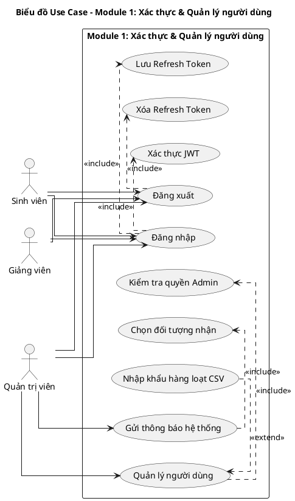
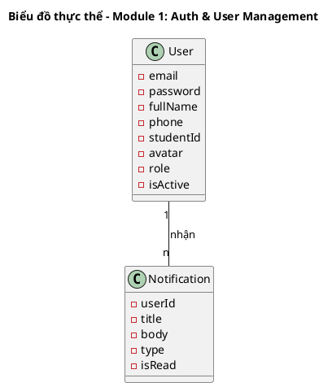
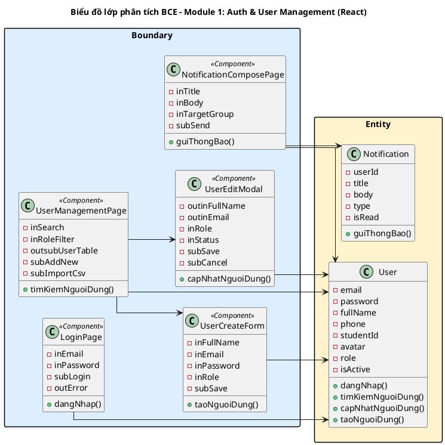
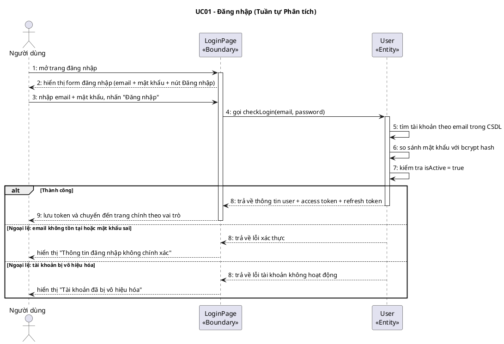
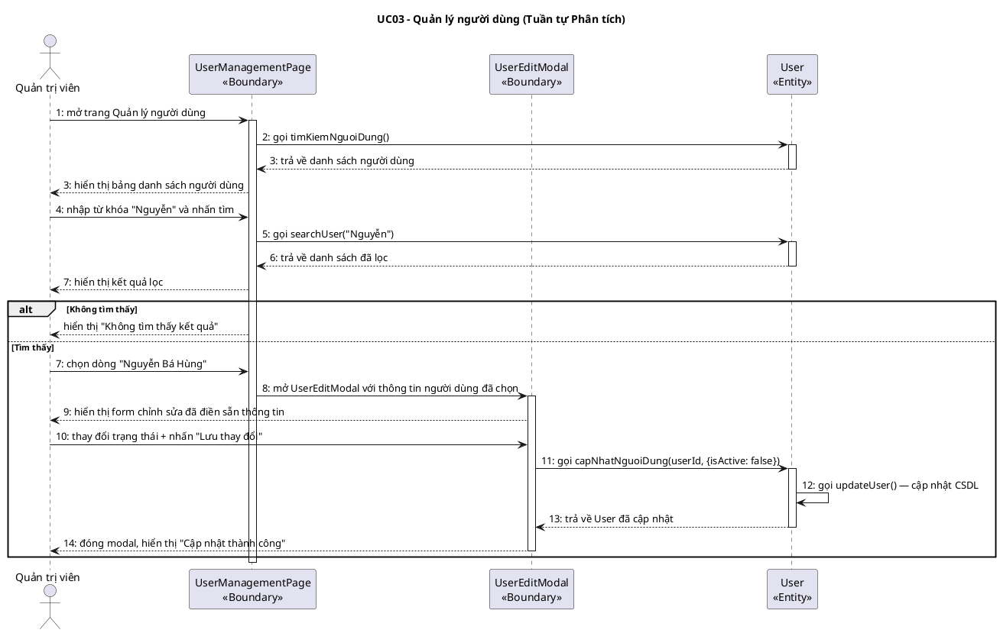

# MODULE 1: XÁC THỰC & QUẢN LÝ NGƯỜI DÙNG
> Phụ trách Pha III + IV: **Phạm Thị Thiên Hà**
> Công nghệ giao diện: HTML (React / Next.js)

---

## I.1. Mô hình nghiệp vụ bằng UML – Module 1

### Bước 1: Xác định UC và Actor trong phạm vi module

Module 1 bao gồm UC01–UC04 từ biểu đồ tổng quan: các chức năng xác thực danh tính người dùng và quản trị tài khoản.

### Bước 2: Phân rã UC con

- **UC01 Đăng nhập** → include: UC01a (Xác thực JWT), UC01b (Lưu token Redis)
- **UC02 Đăng xuất** → include: UC02a (Xóa Refresh Token khỏi Redis)
- **UC03 Quản lý người dùng** → include: UC03a (Kiểm tra quyền Admin); extend: UC03b (Nhập khẩu hàng loạt CSV)
- **UC04 Gửi thông báo** → include: UC04a (Chọn đối tượng nhận), UC04b (Gửi qua Kafka)

### Bước 3–4: Xác định quan hệ include/extend/generalization



**Mô tả các UC trong module:**
1. **UC01 "Đăng nhập":** Xác minh danh tính người dùng bằng email + mật khẩu, trả về JWT Access Token và Refresh Token
2. **UC02 "Đăng xuất":** Hủy phiên làm việc bằng cách xóa Refresh Token khỏi Redis
3. **UC03 "Quản lý người dùng":** Cho phép Admin thực hiện CRUD tài khoản và nhập khẩu danh sách người dùng hàng loạt
4. **UC04 "Gửi thông báo":** Cho phép Admin soạn và gửi thông báo đến nhóm người dùng cụ thể

---

## II.1. Mô hình hóa chức năng – Module 1

### Kịch bản UC01: Đăng nhập

| Trường | Nội dung |
|--------|---------|
| **Use case** | Đăng nhập |
| **Actor** | Sinh viên / Giảng viên / Quản trị viên |
| **Tiền điều kiện** | Người dùng chưa đăng nhập vào hệ thống |
| **Hậu điều kiện** | Người dùng đã xác thực, hệ thống cấp JWT Access Token và Refresh Token; người dùng được chuyển đến trang chính theo vai trò |
| **Kịch bản chính** | 1. Người dùng mở trình duyệt và truy cập vào trang đăng nhập của UniVerse.<br>2. Hệ thống hiển thị giao diện đăng nhập (LoginPage) gồm ô nhập Email, ô nhập Mật khẩu (ẩn ký tự), nút "Đăng nhập" và liên kết "Quên mật khẩu".<br>3. Người dùng nhập email: `nguyenbahung@ptit.edu.vn` vào ô Email.<br>4. Người dùng nhập mật khẩu vào ô Mật khẩu.<br>5. Người dùng nhấn nút "Đăng nhập".<br>6. Hệ thống gửi yêu cầu xác thực đến API `POST /auth/login` với email và mật khẩu.<br>7. Hệ thống tìm tài khoản có email `nguyenbahung@ptit.edu.vn` trong CSDL.<br>8. Hệ thống so sánh mật khẩu nhập vào với bcrypt hash trong CSDL, kết quả khớp.<br>9. Hệ thống kiểm tra trường `isActive = true`, tài khoản đang hoạt động.<br>10. Hệ thống tạo Access Token (JWT, hết hạn sau 15 phút) và Refresh Token (JWT, hết hạn sau 7 ngày).<br>11. Hệ thống lưu Refresh Token vào Redis với key `refresh:{userId}`.<br>12. Hệ thống trả về `{ accessToken, refreshToken, user: { id, email, role, fullName } }`.<br>13. Giao diện lưu token vào bộ nhớ cục bộ và chuyển người dùng đến trang chính tương ứng với vai trò (Admin → /dashboard, Giảng viên → /dashboard, Sinh viên → /dashboard). |
| **Ngoại lệ** | 7. Hệ thống không tìm thấy tài khoản có email đã nhập.<br>7.1 Hệ thống trả về lỗi 401 với thông báo "Thông tin đăng nhập không chính xác".<br>7.2 Giao diện hiển thị thông báo lỗi màu đỏ phía trên form.<br>7.3 Người dùng nhập lại email và mật khẩu (quay về Bước 3).<br><br>8. Mật khẩu nhập vào không khớp với bcrypt hash.<br>8.1 Hệ thống trả về lỗi 401 với thông báo "Thông tin đăng nhập không chính xác".<br>8.2 Giao diện hiển thị thông báo lỗi (quay về Bước 3).<br><br>9. Tài khoản có `isActive = false` (đã bị vô hiệu hóa).<br>9.1 Hệ thống trả về lỗi 401 với thông báo "Tài khoản đã bị vô hiệu hóa".<br>9.2 Giao diện hiển thị thông báo và hướng dẫn liên hệ quản trị viên. |

---

### Kịch bản UC03: Quản lý người dùng (Tìm kiếm và chỉnh sửa)

| Trường | Nội dung |
|--------|---------|
| **Use case** | Quản lý người dùng |
| **Actor** | Quản trị viên |
| **Tiền điều kiện** | Quản trị viên đã đăng nhập với vai trò Admin |
| **Hậu điều kiện** | Thông tin người dùng được cập nhật trong CSDL |
| **Kịch bản chính** | 1. Admin chọn chức năng "Quản lý người dùng" từ thanh điều hướng bên trái.<br>2. Hệ thống hiển thị giao diện Quản lý người dùng (UserManagementPage) gồm: ô tìm kiếm, bộ lọc vai trò, bộ lọc trạng thái, nút "Thêm mới", và danh sách người dùng:<br><table><tr><th>Mã số</th><th>Họ tên</th><th>Email</th><th>Vai trò</th><th>Trạng thái</th><th>Ngày tạo</th></tr><tr><td>B23DCAT120</td><td>Nguyễn Bá Hùng</td><td>nguyenbahung@ptit.edu.vn</td><td>Sinh viên</td><td>Đang hoạt động</td><td>01/09/2023</td></tr><tr><td>B23DCAT280</td><td>Trần Xuân Thành</td><td>tranxuanthanh@ptit.edu.vn</td><td>Sinh viên</td><td>Đang hoạt động</td><td>01/09/2023</td></tr><tr><td>GV001</td><td>Đỗ Thị Liên</td><td>dothilien@ptit.edu.vn</td><td>Giảng viên</td><td>Đang hoạt động</td><td>01/01/2022</td></tr></table><br>3. Admin nhập từ khóa "Nguyễn" vào ô tìm kiếm.<br>4. Hệ thống lọc và hiển thị danh sách người dùng có tên chứa "Nguyễn":<br><table><tr><th>Mã số</th><th>Họ tên</th><th>Email</th><th>Vai trò</th><th>Trạng thái</th></tr><tr><td>B23DCAT120</td><td>Nguyễn Bá Hùng</td><td>nguyenbahung@ptit.edu.vn</td><td>Sinh viên</td><td>Đang hoạt động</td></tr></table><br>5. Admin nhấn vào dòng "Nguyễn Bá Hùng" (mã B23DCAT120).<br>6. Hệ thống hiển thị form chỉnh sửa (UserEditModal) với thông tin hiện tại: Mã số = B23DCAT120, Họ tên = Nguyễn Bá Hùng, Email = nguyenbahung@ptit.edu.vn, Vai trò = Sinh viên, Trạng thái = Đang hoạt động.<br>7. Admin thay đổi Trạng thái từ "Đang hoạt động" thành "Đình chỉ".<br>8. Admin nhấn nút "Lưu thay đổi".<br>9. Hệ thống gửi yêu cầu `PATCH /users/B23DCAT120` với trường `isActive = false`.<br>10. Hệ thống cập nhật bản ghi User trong CSDL.<br>11. Hệ thống hiển thị thông báo "Cập nhật thành công" và cập nhật danh sách. |
| **Ngoại lệ** | 4. Không tìm thấy người dùng nào khớp từ khóa.<br>4.1 Hệ thống hiển thị thông báo "Không tìm thấy kết quả".<br>4.2 Admin xóa từ khóa và tìm lại (quay về Bước 3).<br><br>9. Email mới bị trùng với tài khoản khác.<br>9.1 Hệ thống trả về lỗi 409 "Email đã được sử dụng".<br>9.2 Admin sửa lại email và nhấn Lưu (quay về Bước 8). |

---

## II.2. Mô hình hóa lớp – Module 1

### Bước 1: Mô tả chức năng bằng đoạn văn xuôi

Người dùng truy cập trang đăng nhập và nhập thông tin tài khoản gồm email và mật khẩu. Hệ thống xác minh thông tin bằng cách tìm kiếm tài khoản trong cơ sở dữ liệu theo email, so sánh mật khẩu với giá trị đã băm bằng bcrypt, và kiểm tra trạng thái hoạt động. Nếu hợp lệ, hệ thống tạo token xác thực và lưu vào bộ lưu trữ tạm. Quản trị viên có thể tra cứu, tạo mới, chỉnh sửa và vô hiệu hóa tài khoản người dùng trong hệ thống. Mỗi tài khoản có một vai trò cố định (sinh viên, giảng viên, quản trị viên) xác định quyền truy cập vào các chức năng. Ngoài ra, quản trị viên có thể nhập danh sách người dùng hàng loạt từ file CSV và soạn thảo thông báo gửi đến nhóm người dùng cụ thể.

### Bước 2 + 3: Trích danh từ và đánh giá

```
▪ Người dùng        → lớp User: email, mật khẩu, họ tên, mã số, vai trò, trạng thái, số điện thoại, avatar
▪ Trang đăng nhập   → loại: là Boundary, không phải Entity
▪ Email             → thuộc tính của User
▪ Mật khẩu         → thuộc tính của User (lưu dưới dạng bcrypt hash)
▪ Hệ thống          → loại: quá chung
▪ Cơ sở dữ liệu    → loại: hạ tầng, không phải Entity
▪ Bcrypt hash       → loại: thuộc tính kỹ thuật, gộp vào User.password
▪ Token xác thực    → loại: kỹ thuật, lưu trong Redis — không thành lớp Entity độc lập
▪ Bộ lưu trữ tạm   → loại: Redis — hạ tầng
▪ Vai trò           → thuộc tính của User (enum: student/lecturer/admin) — không cần tách lớp riêng
▪ File CSV          → loại: đầu vào tạm thời, không lưu trữ lâu dài
▪ Thông báo         → lớp Notification: userId, tiêu đề, nội dung, loại, đã đọc
▪ Nhóm người dùng  → loại: đây là điều kiện lọc, không phải Entity riêng
```

**Các lớp giữ lại:**
- `User`: email, password, fullName, phone, studentId, avatar, role, isActive
- `Notification`: userId, title, body, type, isRead (lưu MongoDB)

### Bước 4: Xác định quan hệ số lượng

```
▪ 1 User có nhiều Notification → User – Notification: 1 – n
▪ 1 User có một Role (enum) → thuộc tính, không tách lớp riêng
```

### Bước 5: Bổ sung quan hệ

Không có quan hệ n-n trong module này. `Notification` phụ thuộc vào `User` qua `userId`.



---

## II.3. Sơ đồ lớp phân tích BCE – Module 1

### Bước 1: Xác định lớp Boundary (React Components)

1. **Giao diện Đăng nhập → `LoginPage`**
   - Màn hình chính của luồng xác thực, gắn với route `/login`
2. **Giao diện Quản lý người dùng → `UserManagementPage`**
   - Hiển thị bảng danh sách người dùng với tìm kiếm và lọc
3. **Giao diện Chỉnh sửa người dùng → `UserEditModal`**
   - Hộp thoại bật lên khi Admin chọn chỉnh sửa một người dùng
4. **Giao diện Thêm người dùng → `UserCreateForm`**
   - Form nhập thông tin người dùng mới
5. **Giao diện Soạn thông báo → `NotificationComposePage`**
   - Trang soạn và gửi thông báo hệ thống

### Bước 2: Xác định thành phần giao diện

**LoginPage:**
- `inEmail`: ô nhập email
- `inPassword`: ô nhập mật khẩu (ẩn ký tự)
- `subLogin`: nút Đăng nhập
- `outError`: thông báo lỗi (hiển thị khi đăng nhập thất bại)

**UserManagementPage:**
- `inSearch`: ô tìm kiếm theo tên / mã số
- `inRoleFilter`: bộ lọc vai trò (dropdown)
- `outsubUserTable`: bảng danh sách người dùng (có thể nhấn vào từng dòng)
- `subAddNew`: nút Thêm mới
- `subImportCsv`: nút Nhập khẩu CSV

**UserEditModal:**
- `outinFullName`: ô hiển thị & chỉnh sửa họ tên
- `outinEmail`: ô hiển thị & chỉnh sửa email
- `inRole`: dropdown chọn vai trò
- `inStatus`: toggle trạng thái hoạt động
- `subSave`: nút Lưu thay đổi
- `subCancel`: nút Hủy

**NotificationComposePage:**
- `inTitle`: ô nhập tiêu đề thông báo
- `inBody`: ô nhập nội dung thông báo
- `inTargetGroup`: dropdown chọn đối tượng nhận
- `subSend`: nút Gửi thông báo

### Bước 3: Xác định phương thức (Pha Phân tích — tên tiếng Việt)

| Giao diện | Phương thức | Input | Output | Lớp chủ thể |
|-----------|------------|-------|--------|-------------|
| LoginPage | `dangNhap()` | email, password | User info + token | `User` |
| UserManagementPage | `timKiemNguoiDung()` | từ khóa, bộ lọc | Danh sách User | `User` |
| UserEditModal | `capNhatNguoiDung()` | userId, thông tin mới | User đã cập nhật | `User` |
| UserCreateForm | `taoNguoiDung()` | thông tin người dùng mới | User mới tạo | `User` |
| NotificationComposePage | `guiThongBao()` | tiêu đề, nội dung, nhóm nhận | Notification đã gửi | `Notification` |

### Bước 4: Sơ đồ lớp BCE



---

## II.4. Biểu đồ tuần tự phân tích – Module 1

### Biểu đồ UC01: Đăng nhập

**Kịch bản phiên bản 2 – UC01 Đăng nhập**

1. Người dùng mở trình duyệt và điều hướng đến trang đăng nhập UniVerse.
2. Lớp `LoginPage` hiển thị form đăng nhập với ô nhập email, ô nhập mật khẩu và nút Đăng nhập.
3. Người dùng nhập email `nguyenbahung@ptit.edu.vn` và mật khẩu, sau đó nhấn nút "Đăng nhập".
4. Lớp `LoginPage` gọi lớp `User` để thực hiện xác thực thông qua phương thức `checkLogin`.
5. Lớp `User` gọi phương thức `checkLogin` để tìm kiếm tài khoản theo email trong CSDL.
6. Lớp `User` so sánh mật khẩu nhập vào với bcrypt hash lưu trong CSDL, kết quả khớp.
7. Lớp `User` kiểm tra trường `isActive = true`, tài khoản đang hoạt động.
8. Lớp `User` trả kết quả về `LoginPage`: thông tin người dùng và token xác thực.
9. Lớp `LoginPage` lưu token và chuyển hướng người dùng đến trang chính theo vai trò.

**Ngoại lệ: Email không tồn tại hoặc mật khẩu sai**
- Lớp `User` trả về kết quả xác thực thất bại (không tìm thấy / không khớp).
- Lớp `LoginPage` hiển thị thông báo lỗi màu đỏ "Thông tin đăng nhập không chính xác" ngay phía trên form.

**Ngoại lệ: Tài khoản bị vô hiệu hóa**
- Lớp `User` trả về lỗi tài khoản không hoạt động (`isActive = false`).
- Lớp `LoginPage` hiển thị thông báo "Tài khoản đã bị vô hiệu hóa, vui lòng liên hệ quản trị viên".



---

### Biểu đồ UC03: Quản lý người dùng (Tìm kiếm và chỉnh sửa)

**Kịch bản phiên bản 2 – UC03 Quản lý người dùng**

1. Quản trị viên đăng nhập thành công và mở trang Quản lý người dùng.
2. Lớp `UserManagementPage` gọi lớp `User` để tải danh sách người dùng thông qua phương thức `timKiemNguoiDung`.
3. Lớp `User` trả về danh sách tất cả người dùng cho `UserManagementPage` hiển thị dạng bảng.
4. Quản trị viên nhập từ khóa "Nguyễn" vào ô tìm kiếm và nhấn Enter.
5. Lớp `UserManagementPage` gọi lại `User` với từ khóa "Nguyễn".
6. Lớp `User` gọi phương thức `searchUser` và trả về danh sách lọc.
7. Lớp `UserManagementPage` hiển thị danh sách đã lọc. Quản trị viên chọn dòng "Nguyễn Bá Hùng".
8. Lớp `UserManagementPage` mở `UserEditModal` và truyền thông tin người dùng đã chọn.
9. Lớp `UserEditModal` hiển thị form chỉnh sửa với thông tin hiện tại được điền sẵn.
10. Quản trị viên thay đổi trạng thái và nhấn nút "Lưu thay đổi".
11. Lớp `UserEditModal` gọi lớp `User` để cập nhật thông qua phương thức `capNhatNguoiDung`.
12. Lớp `User` gọi phương thức `updateUser` để lưu thay đổi vào CSDL.
13. Lớp `User` trả về thông tin người dùng đã cập nhật cho `UserEditModal`.
14. Lớp `UserEditModal` đóng lại và `UserManagementPage` cập nhật danh sách hiển thị.

**Ngoại lệ: Không tìm thấy người dùng**
- Lớp `User` trả về danh sách rỗng.
- Lớp `UserManagementPage` hiển thị thông báo "Không tìm thấy kết quả phù hợp".



---

> **Hướng dẫn Pha III + IV cho Phạm Thị Thiên Hà:**
> - **III.1:** Bổ sung kiểu dữ liệu TypeScript cho `User` và `Notification` (xem entity thực tế ở `apps/server/src/modules/users/entities/user.entity.ts`)
> - **III.2:** Viết DDL bảng `users` với đầy đủ kiểu cột PostgreSQL
> - **III.3.1:** Wireframe ASCII cho `LoginPage`, `UserManagementPage`, `UserEditModal`, `NotificationComposePage`
> - **III.3.2:** Sơ đồ lớp thiết kế: `LoginPage<<Component>>` → `UserDAO` → `User`, thêm kiểu dữ liệu TypeScript đầy đủ
> - **III.4:** Biểu đồ tuần tự thiết kế (dùng tên hàm TS thật: `login(dto: LoginDto): Promise<AuthResponse>`, `findAll(query): Promise<PaginatedResponse<User>>`)
> - **IV:** Viết 8 test case cho UC01 (đăng nhập thành công, sai MK, email không tồn tại, tài khoản bị khóa...) và UC03 (tìm kiếm, cập nhật thành công, email trùng...)
