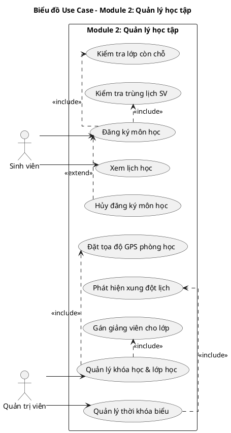
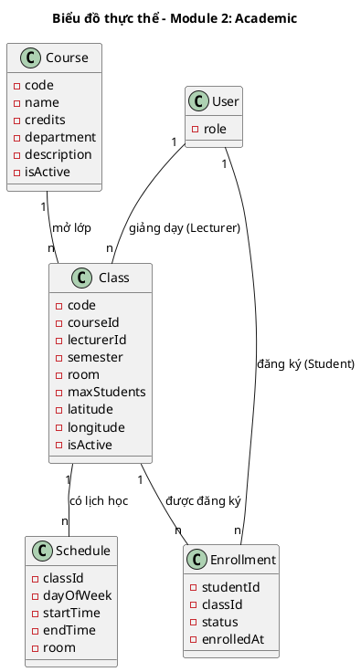
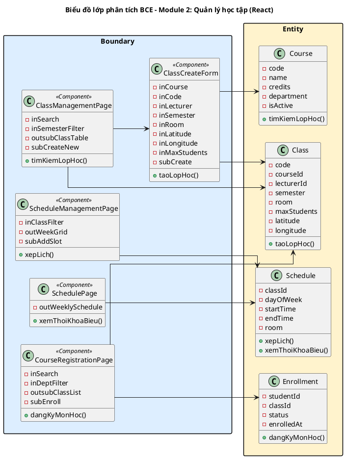
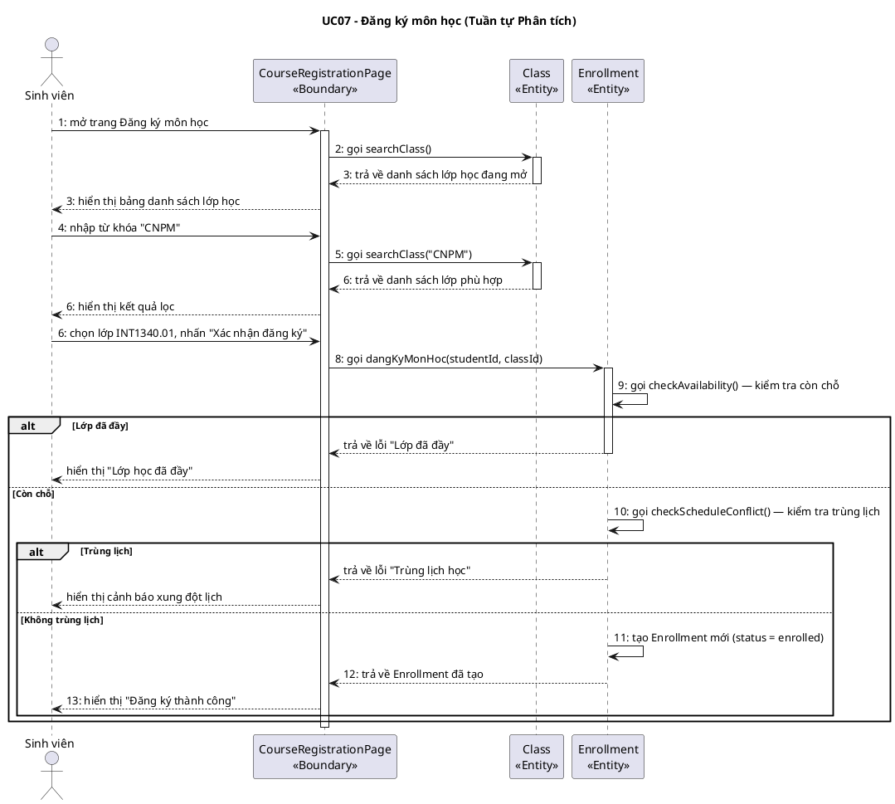
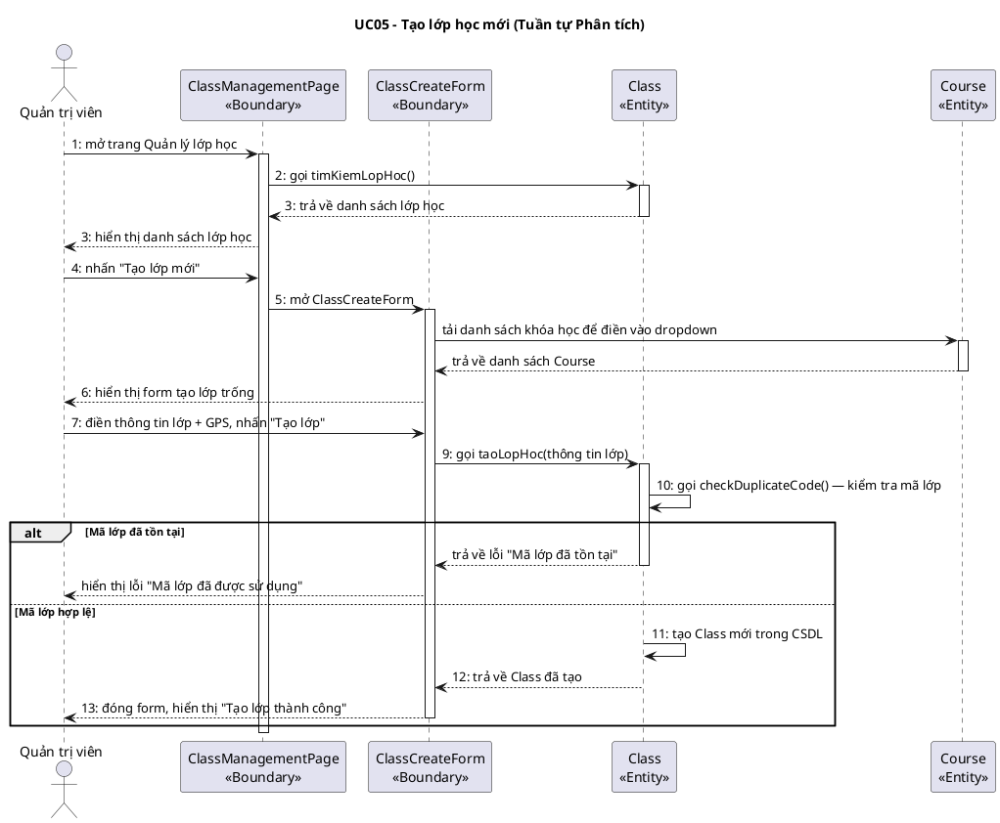

# MODULE 2: QUẢN LÝ HỌC TẬP (ACADEMIC)
> Phụ trách Pha III + IV: **Nguyễn Bá Hùng**
> Công nghệ giao diện: HTML (React / Next.js)

---

## I.1. Mô hình nghiệp vụ bằng UML – Module 2

### Bước 1: Xác định UC và Actor trong phạm vi module

Module 2 bao gồm UC05–UC08: quản lý danh mục học thuật (khóa học, lớp học, thời khóa biểu) và đăng ký môn học của sinh viên.

### Bước 2–4: Phân rã UC con và quan hệ

- **UC05 Quản lý khóa học & lớp học** → include: UC05a (Kiểm tra quyền Admin); UC05b (Gán giảng viên) là include; UC05c (Đặt tọa độ GPS) là include
- **UC06 Quản lý thời khóa biểu** → include: UC06a (Phát hiện xung đột phòng học), UC06b (Phát hiện xung đột giảng viên)
- **UC07 Đăng ký môn học** → include: UC07a (Kiểm tra còn chỗ), UC07b (Kiểm tra trùng lịch); extend: UC07c (Hủy đăng ký)
- **UC08 Xem lịch học** → (không có UC con phức tạp)



**Mô tả các UC trong module:**
1. **UC05 "Quản lý khóa học & lớp học":** Admin tạo và quản lý danh mục môn học, mở lớp học với phân công giảng viên và tọa độ GPS phòng học
2. **UC06 "Quản lý thời khóa biểu":** Admin xếp lịch học cho từng lớp, hệ thống tự động kiểm tra xung đột phòng và giảng viên
3. **UC07 "Đăng ký môn học":** Sinh viên đăng ký tham gia lớp học, hệ thống kiểm tra còn chỗ và không trùng lịch
4. **UC08 "Xem lịch học":** Sinh viên xem thời khóa biểu theo tuần của mình

---

## II.1. Mô hình hóa chức năng – Module 2

### Kịch bản UC07: Đăng ký môn học

| Trường | Nội dung |
|--------|---------|
| **Use case** | Đăng ký môn học |
| **Actor** | Sinh viên |
| **Tiền điều kiện** | Sinh viên đã đăng nhập; đang trong thời gian đăng ký học phần của học kỳ |
| **Hậu điều kiện** | Bản ghi Enrollment được tạo với status = "enrolled"; sinh viên được thêm vào danh sách lớp học |
| **Kịch bản chính** | 1. Sinh viên chọn chức năng "Đăng ký môn học" từ thanh điều hướng.<br>2. Hệ thống hiển thị giao diện đăng ký (CourseRegistrationPage) với: ô tìm kiếm môn học, bộ lọc khoa, và danh sách các lớp học đang mở:<br><table><tr><th>Mã lớp</th><th>Môn học</th><th>Giảng viên</th><th>Thứ/Tiết</th><th>Phòng</th><th>Đã đăng ký / Tối đa</th></tr><tr><td>INT1340.01</td><td>Nhập môn CNPM</td><td>Đỗ Thị Liên</td><td>Thứ 3, tiết 1-3</td><td>B1-201</td><td>38 / 40</td></tr><tr><td>INT1340.02</td><td>Nhập môn CNPM</td><td>Lê Văn Nam</td><td>Thứ 5, tiết 4-6</td><td>A2-103</td><td>25 / 40</td></tr><tr><td>INT1434.01</td><td>Lập trình web</td><td>Trần Thị Mai</td><td>Thứ 4, tiết 7-9</td><td>C3-305</td><td>20 / 40</td></tr></table><br>3. Sinh viên tìm kiếm môn "CNPM" trong ô tìm kiếm.<br>4. Hệ thống lọc và hiển thị danh sách lớp học phù hợp.<br>5. Sinh viên chọn dòng "INT1340.01 – Nhập môn CNPM" (Đỗ Thị Liên, Thứ 3 tiết 1-3).<br>6. Hệ thống hiển thị hộp xác nhận gồm thông tin chi tiết lớp và nút "Xác nhận đăng ký".<br>7. Sinh viên nhấn "Xác nhận đăng ký".<br>8. Hệ thống kiểm tra lớp INT1340.01 còn chỗ (38 < 40 → còn 2 chỗ).<br>9. Hệ thống kiểm tra lịch học Thứ 3 tiết 1-3 không trùng với các lớp sinh viên đã đăng ký.<br>10. Hệ thống tạo bản ghi Enrollment: studentId = {id sinh viên}, classId = INT1340.01, status = "enrolled".<br>11. Hệ thống thông báo "Đăng ký thành công! Môn Nhập môn CNPM đã được thêm vào lịch học." và cập nhật số sinh viên trong danh sách (39/40). |
| **Ngoại lệ** | 8. Lớp đã đầy (số sinh viên đã đăng ký = maxStudents).<br>8.1 Hệ thống hiển thị thông báo "Lớp học đã đầy, vui lòng chọn lớp khác".<br>8.2 Sinh viên chọn lớp khác từ danh sách (quay về Bước 5).<br><br>9. Thứ 3 tiết 1-3 trùng với lớp khác sinh viên đã đăng ký.<br>9.1 Hệ thống hiển thị cảnh báo "Lịch học bị xung đột với [tên lớp đã đăng ký]".<br>9.2 Sinh viên hủy và chọn lớp khác (quay về Bước 5).<br><br>10. Sinh viên đã đăng ký lớp này trước đó.<br>10.1 Hệ thống phát hiện vi phạm ràng buộc unique(studentId, classId).<br>10.2 Hệ thống hiển thị "Bạn đã đăng ký lớp này rồi". |

---

### Kịch bản UC05: Quản lý lớp học (Tạo lớp học mới)

| Trường | Nội dung |
|--------|---------|
| **Use case** | Quản lý khóa học & lớp học |
| **Actor** | Quản trị viên |
| **Tiền điều kiện** | Admin đã đăng nhập; khóa học (Course) tương ứng đã tồn tại trong hệ thống |
| **Hậu điều kiện** | Bản ghi Class được tạo với đầy đủ thông tin giảng viên, học kỳ và tọa độ GPS |
| **Kịch bản chính** | 1. Admin chọn chức năng "Quản lý lớp học" từ thanh điều hướng.<br>2. Hệ thống hiển thị giao diện quản lý lớp học (ClassManagementPage) với danh sách lớp học hiện tại và nút "Tạo lớp mới":<br><table><tr><th>Mã lớp</th><th>Khóa học</th><th>Giảng viên</th><th>Học kỳ</th><th>Sĩ số tối đa</th><th>Trạng thái</th></tr><tr><td>INT1340.01</td><td>Nhập môn CNPM</td><td>Đỗ Thị Liên</td><td>2025-1</td><td>40</td><td>Đang mở</td></tr><tr><td>INT1434.01</td><td>Lập trình web</td><td>Trần Thị Mai</td><td>2025-1</td><td>40</td><td>Đang mở</td></tr></table><br>3. Admin nhấn nút "Tạo lớp mới".<br>4. Hệ thống hiển thị form tạo lớp học (ClassCreateForm) gồm: chọn Khóa học, nhập Mã lớp, chọn Giảng viên, nhập Học kỳ, nhập Phòng học, nhập tọa độ GPS (latitude/longitude), nhập Sĩ số tối đa.<br>5. Admin điền thông tin: Khóa học = "Nhập môn CNPM", Mã lớp = "INT1340.03", Giảng viên = "Đỗ Thị Liên", Học kỳ = "2025-1", Phòng = "B1-202", Latitude = 21.003451, Longitude = 105.843670, Sĩ số tối đa = 40.<br>6. Admin nhấn nút "Tạo lớp".<br>7. Hệ thống kiểm tra mã lớp "INT1340.03" chưa tồn tại.<br>8. Hệ thống tạo bản ghi Class mới trong CSDL.<br>9. Hệ thống hiển thị thông báo "Lớp học INT1340.03 đã được tạo thành công" và cập nhật danh sách. |
| **Ngoại lệ** | 7. Mã lớp "INT1340.03" đã tồn tại.<br>7.1 Hệ thống hiển thị lỗi "Mã lớp đã được sử dụng, vui lòng nhập mã khác".<br>7.2 Admin nhập mã lớp khác (quay về Bước 5).<br><br>5. Tọa độ GPS nhập không hợp lệ (ngoài phạm vi [-90,90] hoặc [-180,180]).<br>5.1 Hệ thống hiển thị lỗi validate trực tiếp trên ô nhập.<br>5.2 Admin nhập lại tọa độ (quay về Bước 5). |

---

## II.2. Mô hình hóa lớp – Module 2

### Bước 1: Mô tả chức năng bằng đoạn văn xuôi

Quản trị viên tạo và quản lý danh mục khóa học gồm mã môn, tên môn, số tín chỉ và khoa phụ trách. Từ mỗi khóa học, quản trị viên mở các lớp học trong từng học kỳ, phân công giảng viên và ghi nhận tọa độ GPS của phòng học để phục vụ xác minh điểm danh sau này. Quản trị viên xếp thời khóa biểu cho từng lớp học bằng cách chỉ định thứ trong tuần, tiết học và phòng học; hệ thống kiểm tra xung đột phòng học và giảng viên trước khi lưu. Sinh viên tìm kiếm và đăng ký tham gia các lớp học, hệ thống kiểm tra còn chỗ và không trùng lịch với các lớp đã đăng ký. Sau khi đăng ký, sinh viên có thể xem toàn bộ thời khóa biểu của mình theo tuần.

### Bước 2 + 3: Trích danh từ và đánh giá

```
▪ Quản trị viên     → loại: Actor, không phải Entity
▪ Khóa học          → lớp Course: code, name, credits, department, description, isActive
▪ Mã môn            → thuộc tính của Course
▪ Số tín chỉ        → thuộc tính của Course
▪ Khoa              → thuộc tính của Course (string, không tách lớp riêng vì đơn giản)
▪ Lớp học           → lớp Class: code, courseId, lecturerId, semester, room, maxStudents, latitude, longitude, isActive
▪ Giảng viên        → loại: là User với role = LECTURER — không tách lớp riêng
▪ Học kỳ            → thuộc tính của Class (string, VD: "2025-1")
▪ Tọa độ GPS        → thuộc tính của Class (latitude, longitude — decimal)
▪ Phòng học         → thuộc tính của Class (string tên phòng — đơn giản, không cần lớp Room riêng ở pha phân tích)
▪ Thời khóa biểu    → lớp Schedule: classId, dayOfWeek, startTime, endTime, room
▪ Tiết học          → thuộc tính của Schedule (startTime, endTime)
▪ Thứ trong tuần    → thuộc tính của Schedule (dayOfWeek: 0–6)
▪ Đăng ký học       → lớp Enrollment: studentId, classId, status, enrolledAt
▪ Sinh viên         → loại: Actor và là User với role = STUDENT
▪ Trạng thái đăng ký → thuộc tính của Enrollment (enrolled/dropped/completed)
▪ Hệ thống          → loại: quá chung
```

**Các lớp giữ lại:** `Course`, `Class`, `Schedule`, `Enrollment`

### Bước 4: Xác định quan hệ số lượng

```
▪ 1 Course có nhiều Class → Course – Class: 1 – n
▪ 1 User (Lecturer) giảng nhiều Class → User – Class: 1 – n
▪ 1 Class có nhiều Schedule → Class – Schedule: 1 – n
▪ 1 User (Student) có nhiều Enrollment → User – Enrollment: 1 – n
▪ 1 Class có nhiều Enrollment → Class – Enrollment: 1 – n
▪ Quan hệ Student – Class là n-n → tách thành Enrollment (trung gian)
```

### Bước 5: Bổ sung quan hệ

`Enrollment` là lớp trung gian giải quyết quan hệ n-n giữa User (Student) và Class. Ràng buộc unique(studentId, classId) đảm bảo mỗi sinh viên chỉ đăng ký mỗi lớp một lần.



---

## II.3. Sơ đồ lớp phân tích BCE – Module 2

### Bước 1: Xác định lớp Boundary (React Components)

1. **Giao diện Quản lý lớp học → `ClassManagementPage`**
2. **Giao diện Tạo lớp học mới → `ClassCreateForm`**
3. **Giao diện Quản lý thời khóa biểu → `ScheduleManagementPage`**
4. **Giao diện Đăng ký môn học → `CourseRegistrationPage`**
5. **Giao diện Xem lịch học → `SchedulePage`** (Sinh viên xem TKB của mình)

### Bước 2: Xác định thành phần giao diện

**ClassManagementPage:**
- `inSearch`: ô tìm kiếm lớp học
- `inSemesterFilter`: bộ lọc học kỳ
- `outsubClassTable`: bảng danh sách lớp học
- `subCreateNew`: nút Tạo lớp mới

**ClassCreateForm:**
- `inCourse`: dropdown chọn khóa học
- `inCode`: ô nhập mã lớp
- `inLecturer`: dropdown chọn giảng viên
- `inSemester`: ô nhập học kỳ
- `inRoom`: ô nhập phòng học
- `inLatitude` / `inLongitude`: ô nhập tọa độ GPS
- `inMaxStudents`: ô nhập sĩ số tối đa
- `subCreate`: nút Tạo lớp

**ScheduleManagementPage:**
- `inClassFilter`: dropdown chọn lớp cần xếp lịch
- `outWeekGrid`: lưới lịch học theo tuần
- `subAddSlot`: nút Thêm buổi học

**CourseRegistrationPage:**
- `inSearch`: ô tìm kiếm môn học
- `inDeptFilter`: bộ lọc khoa
- `outsubClassList`: danh sách lớp học đang mở (có thể chọn)
- `subEnroll`: nút Xác nhận đăng ký

**SchedulePage:**
- `outWeeklySchedule`: lịch học theo tuần của sinh viên

### Bước 3: Xác định phương thức

| Giao diện | Phương thức | Input | Output | Lớp chủ thể |
|-----------|------------|-------|--------|-------------|
| ClassManagementPage | `timKiemLopHoc()` | từ khóa, học kỳ | Danh sách Class | `Class` |
| ClassCreateForm | `taoLopHoc()` | thông tin lớp + GPS | Class mới | `Class` |
| ScheduleManagementPage | `xepLich()` | classId, thứ, tiết, phòng | Schedule | `Schedule` |
| CourseRegistrationPage | `dangKyMonHoc()` | classId | Enrollment | `Enrollment` |
| SchedulePage | `xemThoiKhoaBieu()` | studentId | Danh sách Schedule | `Schedule` |

### Bước 4: Sơ đồ lớp BCE



---

## II.4. Biểu đồ tuần tự phân tích – Module 2

### Biểu đồ UC07: Đăng ký môn học

**Kịch bản phiên bản 2 – UC07 Đăng ký môn học**

1. Sinh viên đăng nhập thành công và mở trang Đăng ký môn học.
2. Lớp `CourseRegistrationPage` gọi lớp `Class` để tải danh sách lớp học đang mở thông qua phương thức `searchClass`.
3. Lớp `Class` trả về danh sách lớp học cho `CourseRegistrationPage` hiển thị dạng bảng.
4. Sinh viên nhập từ khóa "CNPM" vào ô tìm kiếm.
5. Lớp `CourseRegistrationPage` gọi lại `Class` với từ khóa "CNPM".
6. Lớp `Class` trả về danh sách lớp học phù hợp. Sinh viên chọn lớp "INT1340.01".
7. Sinh viên nhấn "Xác nhận đăng ký".
8. Lớp `CourseRegistrationPage` gọi lớp `Enrollment` để thực hiện đăng ký thông qua phương thức `dangKyMonHoc`.
9. Lớp `Enrollment` gọi phương thức `checkAvailability` kiểm tra lớp còn chỗ (38 < 40 → còn chỗ).
10. Lớp `Enrollment` gọi phương thức `checkScheduleConflict` kiểm tra lịch học không trùng.
11. Lớp `Enrollment` tạo bản ghi đăng ký mới với status = "enrolled".
12. Lớp `Enrollment` trả kết quả thành công về `CourseRegistrationPage`.
13. Lớp `CourseRegistrationPage` hiển thị thông báo "Đăng ký thành công".

**Ngoại lệ: Lớp đã đầy**
- Lớp `Enrollment` phát hiện `enrolledCount >= maxStudents`.
- Lớp `CourseRegistrationPage` hiển thị "Lớp học đã đầy, vui lòng chọn lớp khác".

**Ngoại lệ: Trùng lịch học**
- Lớp `Enrollment` phát hiện trùng lịch với lớp đã đăng ký.
- Lớp `CourseRegistrationPage` hiển thị cảnh báo xung đột lịch.



---

### Biểu đồ UC05: Tạo lớp học mới

**Kịch bản phiên bản 2 – UC05 Tạo lớp học mới**

1. Admin mở trang Quản lý lớp học.
2. Lớp `ClassManagementPage` gọi lớp `Class` để tải danh sách lớp học qua phương thức `timKiemLopHoc`.
3. Lớp `Class` trả về danh sách lớp học hiện tại. Admin xem danh sách.
4. Admin nhấn nút "Tạo lớp mới".
5. Lớp `ClassManagementPage` mở `ClassCreateForm`.
6. Lớp `ClassCreateForm` hiển thị form tạo lớp học trống.
7. Admin điền đầy đủ thông tin lớp học gồm khóa học, mã lớp, giảng viên, học kỳ, phòng học và tọa độ GPS.
8. Admin nhấn nút "Tạo lớp".
9. Lớp `ClassCreateForm` gọi lớp `Class` để tạo mới thông qua phương thức `taoLopHoc`.
10. Lớp `Class` gọi phương thức `checkDuplicateCode` kiểm tra mã lớp chưa trùng.
11. Lớp `Class` tạo bản ghi Class mới trong CSDL.
12. Lớp `Class` trả kết quả thành công về `ClassCreateForm`.
13. Lớp `ClassCreateForm` đóng form và `ClassManagementPage` cập nhật danh sách.

**Ngoại lệ: Mã lớp đã tồn tại**
- Lớp `Class` phát hiện trùng code.
- Lớp `ClassCreateForm` hiển thị lỗi "Mã lớp đã được sử dụng".



---

> **Hướng dẫn Pha III + IV cho Nguyễn Bá Hùng:**
> - **III.1:** Bổ sung kiểu dữ liệu TypeScript đầy đủ cho `Course`, `Class`, `Schedule`, `Enrollment` (xem entities thực tế ở `apps/server/src/modules/`)
> - **III.2:** Viết DDL 4 bảng PostgreSQL: `courses`, `classes`, `schedules`, `enrollments` kèm FK và constraint
> - **III.1 Kiến trúc:** Viết mục 3.1 — kiến trúc tổng thể (3-tier + Docker + REST/Socket.IO/Kafka)
> - **III.3.1:** Wireframe ASCII cho `ClassManagementPage`, `ScheduleManagementPage`, `CourseRegistrationPage`
> - **III.3.2:** Sơ đồ lớp thiết kế với DAO: `CourseDAO`, `ClassDAO`, `ScheduleDAO`, `EnrollmentDAO`
> - **III.4:** Biểu đồ tuần tự thiết kế (tên hàm TS thật: `findAll(query: QueryDto): Promise<PaginatedResponse<Class>>`, `create(dto: CreateClassDto): Promise<Class>`)
> - **IV:** Viết 8 test case cho UC07 (đăng ký thành công, lớp đầy, trùng lịch, đăng ký trùng...) và UC05 (tạo lớp thành công, mã trùng, tọa độ GPS không hợp lệ...)
