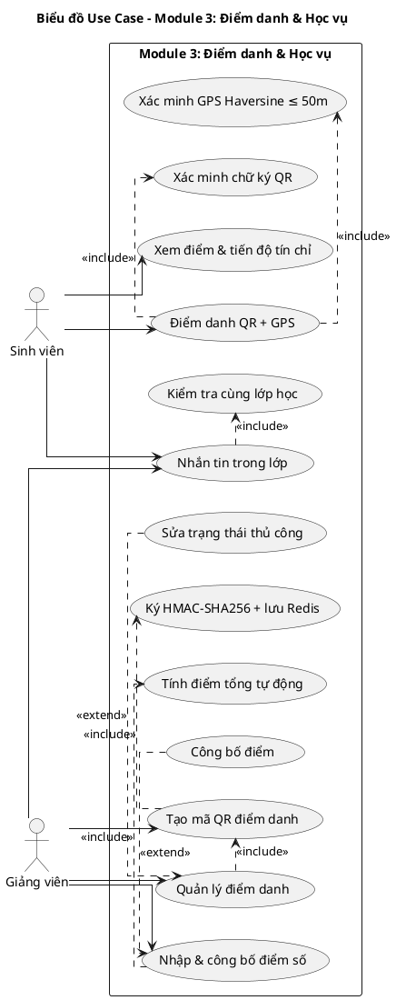
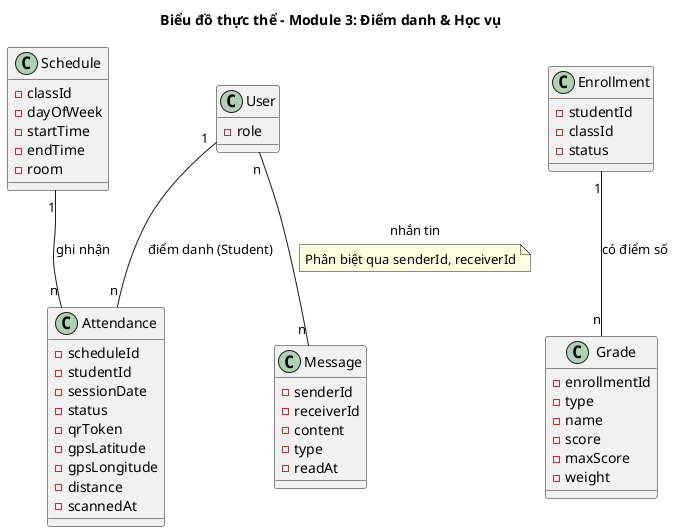
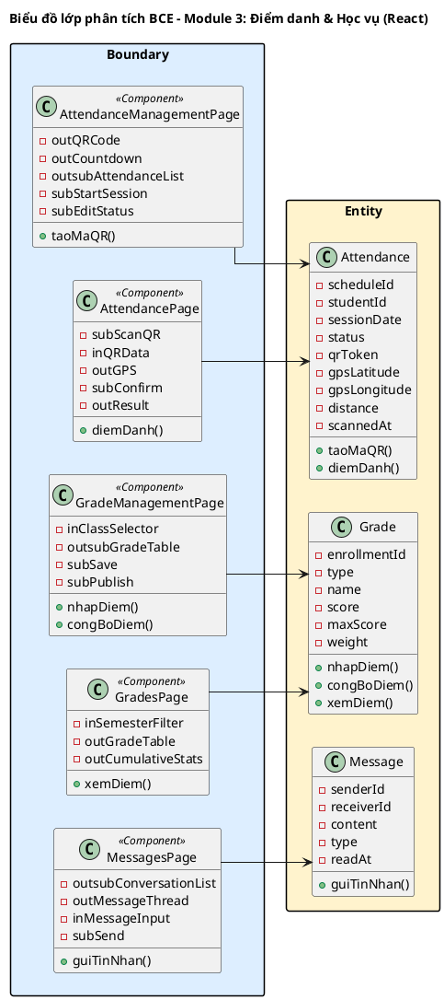
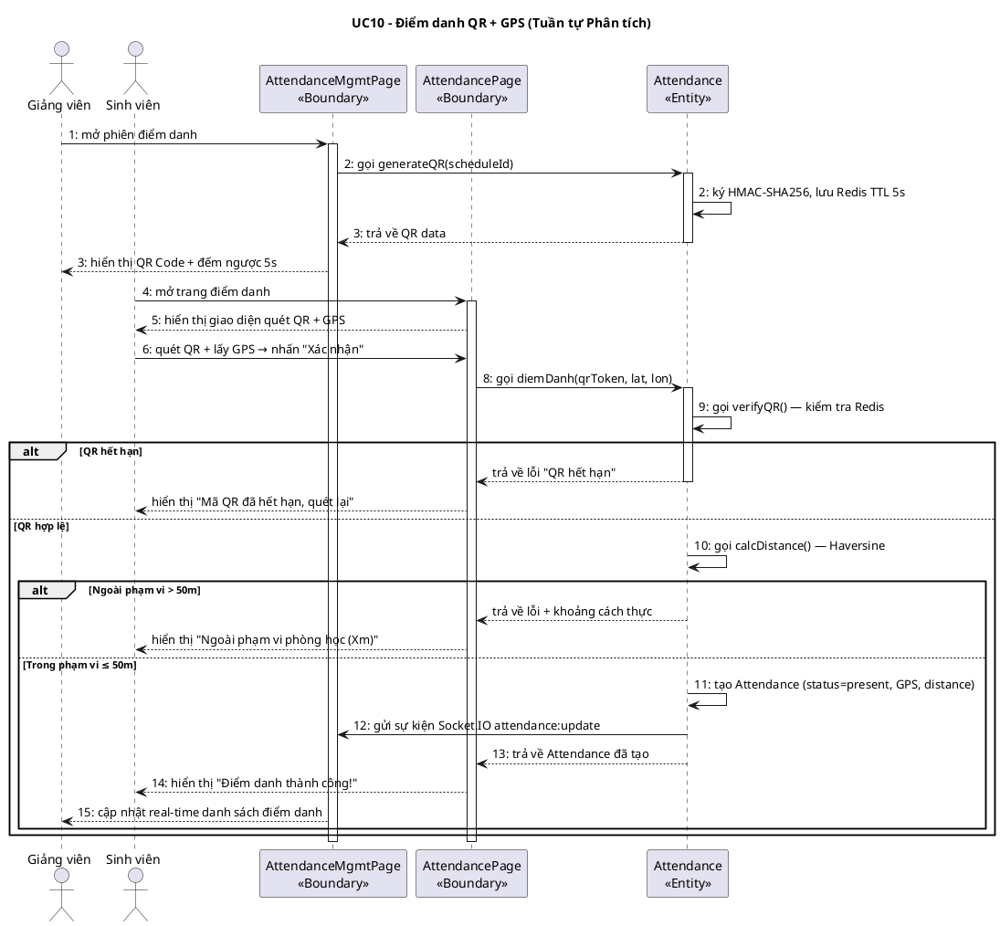
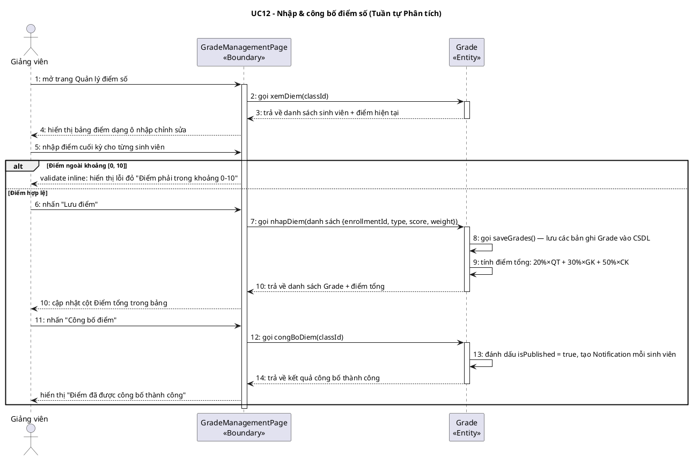

# MODULE 3: ĐIỂM DANH & HỌC VỤ
> Phụ trách Pha III + IV: **Trần Xuân Thành**
> Công nghệ giao diện: HTML (React / Next.js)

---

## I.1. Mô hình nghiệp vụ bằng UML – Module 3

### Bước 1: Xác định UC và Actor trong phạm vi module

Module 3 bao gồm UC09–UC14: điểm danh thông minh QR+GPS, quản lý điểm số và nhắn tin nội bộ — đây là các chức năng đặc trưng và phức tạp nhất của hệ thống.

### Bước 2–4: Phân rã UC con và quan hệ

- **UC09 Tạo mã QR** → include: UC09a (Ký HMAC-SHA256), UC09b (Lưu Redis TTL 5s)
- **UC10 Điểm danh QR + GPS** → include: UC10a (Xác minh chữ ký QR), UC10b (Xác minh GPS Haversine); extend: UC10c (Giảng viên ghi đè thủ công)
- **UC11 Quản lý điểm danh** → include: UC10 (bắt buộc mở phiên trước); UC11a (Sửa trạng thái điểm danh)
- **UC12 Nhập & công bố điểm** → include: UC12a (Tính điểm tổng tự động); UC12b (Công bố điểm) là extend
- **UC13 Xem điểm** → (xem sau khi UC12b công bố)
- **UC14 Nhắn tin** → include: UC14a (Kiểm tra cùng lớp học)



**Mô tả các UC trong module:**
1. **UC09 "Tạo mã QR điểm danh":** Giảng viên mở phiên điểm danh, hệ thống tạo QR Token ký bằng HMAC-SHA256 và lưu Redis với TTL 5 giây, hiển thị QR Code động
2. **UC10 "Điểm danh QR + GPS":** Sinh viên quét QR và gửi tọa độ GPS; hệ thống xác minh chữ ký QR và khoảng cách Haversine ≤ 50m
3. **UC11 "Quản lý điểm danh":** Giảng viên xem danh sách điểm danh theo buổi và có thể chỉnh sửa trạng thái
4. **UC12 "Nhập & công bố điểm":** Giảng viên nhập điểm từng loại, hệ thống tự tính tổng; giảng viên công bố để sinh viên xem
5. **UC13 "Xem điểm":** Sinh viên xem điểm số theo từng môn, học kỳ và tiến độ tín chỉ tích lũy
6. **UC14 "Nhắn tin":** Sinh viên và giảng viên nhắn tin 1-1 trong phạm vi các lớp học chung

---

## II.1. Mô hình hóa chức năng – Module 3

### Kịch bản UC10: Điểm danh QR + GPS

| Trường | Nội dung |
|--------|---------|
| **Use case** | Điểm danh QR + GPS |
| **Actor** | Sinh viên |
| **Tiền điều kiện** | Sinh viên đã đăng nhập; giảng viên đã mở phiên điểm danh (UC09); sinh viên đã đăng ký lớp học này (Enrollment tồn tại) |
| **Hậu điều kiện** | Bản ghi Attendance được tạo với status = "present", lưu qrToken, gpsLatitude, gpsLongitude và distance; màn hình giảng viên cập nhật real-time qua Socket.IO |
| **Kịch bản chính** | 1. Giảng viên mở phiên điểm danh và màn hình hiển thị QR Code đang chạy đếm ngược 5 giây.<br>2. Hệ thống (backend) liên tục tạo QR Token mới bằng HMAC-SHA256 mỗi 5 giây và lưu vào Redis.<br>3. Sinh viên mở ứng dụng và chọn chức năng "Điểm danh".<br>4. Hệ thống hiển thị giao diện quét QR (AttendancePage) với nút "Quét mã QR" và nút "Cho phép truy cập vị trí".<br>5. Sinh viên nhấn "Quét mã QR" và hướng camera vào mã QR trên màn hình giảng viên.<br>6. Ứng dụng giải mã QR Token thành `{sessionId, timestamp, signature}`.<br>7. Ứng dụng tự động lấy tọa độ GPS hiện tại của thiết bị: latitude = 21.003451, longitude = 105.843672.<br>8. Sinh viên nhấn "Xác nhận điểm danh" để gửi lên server.<br>9. Hệ thống xác minh chữ ký HMAC-SHA256 của token còn hợp lệ (so sánh với bản lưu trong Redis).<br>10. Hệ thống tính khoảng cách Haversine giữa GPS sinh viên (21.003451, 105.843672) và GPS phòng học lớp (21.003450, 105.843670): kết quả = 0.3m ≤ 50m → hợp lệ.<br>11. Hệ thống tạo bản ghi Attendance: scheduleId, studentId, sessionDate = hôm nay, status = "present", qrToken, gpsLatitude = 21.003451, gpsLongitude = 105.843672, distance = 0.3, scannedAt = now().<br>12. Hệ thống gửi sự kiện Socket.IO `attendance:update` đến màn hình giảng viên.<br>13. Màn hình giảng viên cập nhật real-time: tên sinh viên chuyển từ "Vắng" sang "Có mặt".<br>14. Giao diện sinh viên hiển thị thông báo "Điểm danh thành công! 08:32" |
| **Ngoại lệ** | 9. QR Token không tìm thấy trong Redis (đã hết hạn sau 5 giây hoặc đã bị sử dụng).<br>9.1 Hệ thống trả về lỗi "Mã QR đã hết hạn".<br>9.2 Giao diện hiển thị "Mã QR đã hết hạn, vui lòng quét lại mã mới".<br>9.3 Sinh viên quét lại mã QR mới (quay về Bước 5).<br><br>10. Khoảng cách Haversine > 50m (sinh viên không ở trong phạm vi phòng học).<br>10.1 Hệ thống trả về lỗi "Ngoài phạm vi cho phép" kèm khoảng cách thực tế: 250m.<br>10.2 Giao diện hiển thị "Bạn đang ở cách phòng học 250m. Vui lòng đến đúng phòng học để điểm danh".<br><br>11. Sinh viên đã điểm danh trong buổi này (bản ghi Attendance đã tồn tại với scheduleId và studentId).<br>11.1 Hệ thống trả về lỗi "Đã điểm danh".<br>11.2 Giao diện hiển thị "Bạn đã điểm danh thành công trước đó". |

---

### Kịch bản UC12: Nhập & công bố điểm số

| Trường | Nội dung |
|--------|---------|
| **Use case** | Nhập & công bố điểm số |
| **Actor** | Giảng viên |
| **Tiền điều kiện** | Giảng viên đã đăng nhập; kỳ học đang trong giai đoạn nhập điểm |
| **Hậu điều kiện** | Các bản ghi Grade được tạo/cập nhật; sau khi công bố, sinh viên nhận thông báo và có thể xem điểm |
| **Kịch bản chính** | 1. Giảng viên chọn chức năng "Quản lý điểm số" từ thanh điều hướng.<br>2. Hệ thống hiển thị giao diện quản lý điểm (GradeManagementPage) với dropdown chọn lớp.<br>3. Giảng viên chọn lớp "INT1340.01 – Nhập môn CNPM".<br>4. Hệ thống hiển thị bảng điểm với danh sách sinh viên và các cột điểm:<br><table><tr><th>MSSV</th><th>Họ tên</th><th>Thường xuyên (20%)</th><th>Giữa kỳ (30%)</th><th>Cuối kỳ (50%)</th><th>Điểm tổng</th></tr><tr><td>B23DCAT120</td><td>Nguyễn Bá Hùng</td><td>8.5</td><td>7.0</td><td>—</td><td>—</td></tr><tr><td>B23DCAT280</td><td>Trần Xuân Thành</td><td>9.0</td><td>8.5</td><td>—</td><td>—</td></tr><tr><td>B23DCCN266</td><td>Phạm Thị Thiên Hà</td><td>9.5</td><td>9.0</td><td>—</td><td>—</td></tr></table><br>5. Giảng viên nhập điểm cuối kỳ cho từng sinh viên: Nguyễn Bá Hùng = 8.0, Trần Xuân Thành = 9.0, Phạm Thị Thiên Hà = 9.5.<br>6. Giảng viên nhấn nút "Lưu điểm".<br>7. Hệ thống lưu các bản ghi Grade (type = "final") vào CSDL.<br>8. Hệ thống tính điểm tổng tự động: Nguyễn Bá Hùng = 8.5×20% + 7.0×30% + 8.0×50% = 1.7 + 2.1 + 4.0 = **7.8**.<br>9. Hệ thống cập nhật cột "Điểm tổng" trong bảng hiển thị.<br>10. Giảng viên kiểm tra kết quả và nhấn nút "Công bố điểm".<br>11. Hệ thống đánh dấu toàn bộ Grade của lớp là `isPublished = true`.<br>12. Hệ thống tạo Notification cho từng sinh viên trong lớp: "Điểm môn Nhập môn CNPM đã được công bố".<br>13. Socket.IO broadcast thông báo đến sinh viên đang online; Firebase FCM gửi push notification đến sinh viên offline. |
| **Ngoại lệ** | 5. Giảng viên nhập điểm ngoài khoảng [0, 10].<br>5.1 Giao diện validate inline: hiển thị lỗi màu đỏ dưới ô nhập "Điểm phải trong khoảng 0–10".<br>5.2 Ô nhập trở về giá trị cũ; giảng viên nhập lại (quay về Bước 5).<br><br>7. Lỗi kết nối CSDL khi lưu.<br>7.1 Hệ thống hiển thị thông báo lỗi "Lưu thất bại, vui lòng thử lại".<br>7.2 Giảng viên nhấn Lưu lại (quay về Bước 6). |

---

## II.2. Mô hình hóa lớp – Module 3

### Bước 1: Mô tả chức năng bằng đoạn văn xuôi

Giảng viên mở phiên điểm danh cho một buổi học cụ thể; hệ thống tạo mã QR Token ký bằng HMAC-SHA256, lưu vào Redis với thời gian tồn tại 5 giây, và hiển thị mã QR động. Sinh viên quét mã QR bằng camera điện thoại và thiết bị ghi nhận tọa độ GPS hiện tại; hệ thống xác minh chữ ký token và tính khoảng cách Haversine giữa vị trí sinh viên và tọa độ phòng học đã lưu trong lớp học. Nếu hợp lệ (QR còn hiệu lực và khoảng cách ≤ 50m), hệ thống ghi nhận bản ghi điểm danh với đầy đủ thông tin GPS. Giảng viên có thể xem và chỉnh sửa trạng thái điểm danh sau buổi học. Giảng viên nhập điểm số cho từng loại bài kiểm tra (thường xuyên, giữa kỳ, cuối kỳ); hệ thống tự động tính điểm tổng theo trọng số. Sau khi công bố, sinh viên nhận thông báo và có thể xem điểm. Sinh viên và giảng viên trong cùng lớp có thể nhắn tin 1-1 với nhau; tin nhắn được lưu trong MongoDB và gửi real-time qua Socket.IO.

### Bước 2 + 3: Trích danh từ và đánh giá

```
▪ Phiên điểm danh   → loại: là trạng thái của một buổi học (Schedule), không tách lớp riêng
▪ Mã QR Token       → loại: kỹ thuật tạm thời trong Redis — không thành Entity lâu dài; lưu như thuộc tính của Attendance
▪ Redis             → loại: hạ tầng
▪ Tọa độ GPS        → thuộc tính của Attendance (gpsLatitude, gpsLongitude) và của Class (latitude, longitude)
▪ Khoảng cách Haversine → thuộc tính tính toán, lưu vào Attendance.distance (decimal, đơn vị mét)
▪ Sinh viên         → loại: Actor = User với role = STUDENT
▪ Bản ghi điểm danh → lớp Attendance: scheduleId, studentId, sessionDate, status, qrToken, gpsLatitude, gpsLongitude, distance, scannedAt
▪ Trạng thái điểm danh → thuộc tính của Attendance (enum: present/absent/late)
▪ Buổi học          → lớp Schedule (đã định nghĩa ở Module 2)
▪ Lớp học           → lớp Class (đã định nghĩa ở Module 2)
▪ Điểm số           → lớp Grade: enrollmentId, type, name, score, maxScore, weight
▪ Loại bài kiểm tra → thuộc tính của Grade (enum: midterm/final/assignment/quiz)
▪ Trọng số          → thuộc tính của Grade.weight (percentage)
▪ Điểm tổng         → loại: giá trị tính toán, không lưu riêng — tính từ các Grade
▪ Thông báo         → lớp Notification (đã định nghĩa ở Module 1 — MongoDB)
▪ Tin nhắn          → lớp Message: senderId, receiverId, content, type, readAt (MongoDB)
▪ Cuộc trò chuyện   → loại: tổng hợp từ Message theo cặp (senderId, receiverId)
```

**Các lớp giữ lại (mới trong module 3):** `Attendance`, `Grade`, `Message`
**Tái sử dụng từ module khác:** `Schedule`, `Class`, `Enrollment`, `Notification`

### Bước 4: Xác định quan hệ số lượng

```
▪ 1 Schedule có nhiều Attendance → Schedule – Attendance: 1 – n (một buổi học → nhiều sinh viên điểm danh)
▪ 1 User (Student) có nhiều Attendance → User – Attendance: 1 – n
▪ 1 Enrollment có nhiều Grade → Enrollment – Grade: 1 – n (điểm thường xuyên, giữa kỳ, cuối kỳ)
▪ User gửi nhiều Message cho nhiều User → n-n; giải quyết bằng (senderId, receiverId) compound index trong Message
```

### Bước 5: Bổ sung quan hệ

`Grade` không trực tiếp thuộc `User` mà thông qua `Enrollment` — điều này đảm bảo nếu sinh viên học lại cùng môn, điểm được phân biệt theo lần đăng ký.



---

## II.3. Sơ đồ lớp phân tích BCE – Module 3

### Bước 1: Xác định lớp Boundary (React Components)

1. **Giao diện Điểm danh (Giảng viên) → `AttendanceManagementPage`** — tạo QR, xem danh sách real-time
2. **Giao diện Điểm danh (Sinh viên) → `AttendancePage`** — quét QR, gửi GPS
3. **Giao diện Quản lý điểm số → `GradeManagementPage`** — Giảng viên nhập điểm
4. **Giao diện Xem điểm (Sinh viên) → `GradesPage`** — xem điểm theo học kỳ
5. **Giao diện Nhắn tin → `MessagesPage`** — chat 1-1

### Bước 2: Xác định thành phần giao diện

**AttendanceManagementPage (Giảng viên):**
- `outQRCode`: hiển thị mã QR động (xoay vòng 5s)
- `outCountdown`: bộ đếm ngược (QRTimer component)
- `outsubAttendanceList`: danh sách sinh viên + trạng thái real-time
- `subStartSession`: nút Bắt đầu điểm danh
- `subEditStatus`: nút Sửa trạng thái

**AttendancePage (Sinh viên):**
- `subScanQR`: nút Quét mã QR (kích hoạt camera)
- `inQRData`: dữ liệu QR sau khi quét (ẩn, tự động điền)
- `outGPS`: hiển thị tọa độ GPS hiện tại
- `subConfirm`: nút Xác nhận điểm danh
- `outResult`: kết quả điểm danh (thành công / thất bại + lý do)

**GradeManagementPage:**
- `inClassSelector`: dropdown chọn lớp học
- `outsubGradeTable`: bảng điểm (ô nhập có thể chỉnh sửa)
- `subSave`: nút Lưu điểm
- `subPublish`: nút Công bố điểm

**GradesPage:**
- `inSemesterFilter`: dropdown chọn học kỳ
- `outGradeTable`: bảng điểm theo học kỳ
- `outCumulativeStats`: thông tin tín chỉ tích lũy và GPA

**MessagesPage:**
- `outsubConversationList`: danh sách cuộc trò chuyện
- `outMessageThread`: chuỗi tin nhắn của cuộc trò chuyện đang chọn
- `inMessageInput`: ô nhập tin nhắn mới
- `subSend`: nút Gửi

### Bước 3: Xác định phương thức

| Giao diện | Phương thức | Input | Output | Lớp chủ thể |
|-----------|------------|-------|--------|-------------|
| AttendanceManagementPage | `taoMaQR()` | scheduleId | QR Token | `Attendance` |
| AttendancePage | `diemDanh()` | qrToken, gpsLat, gpsLon | Attendance | `Attendance` |
| GradeManagementPage | `nhapDiem()` | enrollmentId, type, score, weight | Grade | `Grade` |
| GradeManagementPage | `congBoDiem()` | classId | Danh sách Grade đã công bố | `Grade` |
| GradesPage | `xemDiem()` | studentId, semester | Danh sách Grade | `Grade` |
| MessagesPage | `guiTinNhan()` | receiverId, content | Message | `Message` |

### Bước 4: Sơ đồ lớp BCE



---

## II.4. Biểu đồ tuần tự phân tích – Module 3

### Biểu đồ UC10: Điểm danh QR + GPS

**Kịch bản phiên bản 2 – UC10 Điểm danh QR + GPS**

1. Giảng viên mở phiên điểm danh trên `AttendanceManagementPage`, lớp này gọi `Attendance` để tạo QR Token mới.
2. Lớp `Attendance` gọi phương thức `generateQR` để tạo token ký HMAC-SHA256, lưu Redis TTL 5s, và trả về QR data.
3. Lớp `AttendanceManagementPage` hiển thị QR Code động và bộ đếm ngược 5 giây.
4. Sinh viên mở ứng dụng và điều hướng đến trang điểm danh (`AttendancePage`).
5. Lớp `AttendancePage` hiển thị giao diện điểm danh với nút Quét QR và hiển thị GPS hiện tại.
6. Sinh viên hướng camera quét mã QR và ứng dụng tự động lấy tọa độ GPS thiết bị.
7. Sinh viên nhấn "Xác nhận điểm danh".
8. Lớp `AttendancePage` gọi lớp `Attendance` để thực hiện điểm danh thông qua phương thức `diemDanh`.
9. Lớp `Attendance` gọi phương thức `verifyQR` — xác minh chữ ký HMAC với Redis; token hợp lệ.
10. Lớp `Attendance` gọi phương thức `calcDistance` — tính khoảng cách Haversine; kết quả 0.3m ≤ 50m.
11. Lớp `Attendance` tạo bản ghi điểm danh mới: status = "present", gpsLatitude, gpsLongitude, distance = 0.3.
12. Lớp `Attendance` gửi sự kiện Socket.IO `attendance:update` đến `AttendanceManagementPage`.
13. Lớp `Attendance` trả kết quả thành công về `AttendancePage`.
14. Lớp `AttendancePage` hiển thị "Điểm danh thành công!" và cập nhật trạng thái.
15. Lớp `AttendanceManagementPage` nhận sự kiện Socket.IO và cập nhật trạng thái sinh viên real-time.

**Ngoại lệ: QR Token hết hạn**
- Lớp `Attendance` không tìm thấy token trong Redis (đã hết TTL 5s).
- Lớp `AttendancePage` hiển thị "Mã QR đã hết hạn, vui lòng quét lại mã mới".

**Ngoại lệ: Ngoài phạm vi GPS**
- Lớp `Attendance` tính khoảng cách Haversine > 50m.
- Lớp `AttendancePage` hiển thị "Bạn đang ở cách phòng học Xm. Vui lòng đến đúng phòng học".



---

### Biểu đồ UC12: Nhập & công bố điểm số

**Kịch bản phiên bản 2 – UC12 Nhập & công bố điểm số**

1. Giảng viên mở trang Quản lý điểm số (`GradeManagementPage`).
2. Lớp `GradeManagementPage` gọi lớp `Grade` để tải danh sách điểm hiện tại của lớp học.
3. Lớp `Grade` trả về danh sách sinh viên và các bản ghi điểm hiện có.
4. Giảng viên chọn lớp "INT1340.01" và bảng điểm hiển thị với các ô nhập chỉnh sửa được.
5. Giảng viên nhập điểm cuối kỳ cho từng sinh viên trong bảng.
6. Giảng viên nhấn "Lưu điểm".
7. Lớp `GradeManagementPage` gọi lớp `Grade` thông qua phương thức `nhapDiem` với danh sách điểm đã nhập.
8. Lớp `Grade` gọi phương thức `saveGrades` để lưu từng bản ghi Grade (type = "final") vào CSDL.
9. Lớp `Grade` tính điểm tổng tự động theo công thức trọng số cho từng sinh viên.
10. Lớp `Grade` trả kết quả về `GradeManagementPage` và bảng điểm cập nhật cột Điểm tổng.
11. Giảng viên kiểm tra kết quả và nhấn "Công bố điểm".
12. Lớp `GradeManagementPage` gọi lớp `Grade` thông qua phương thức `congBoDiem`.
13. Lớp `Grade` đánh dấu tất cả Grade của lớp là `isPublished = true` và tạo Notification cho mỗi sinh viên.
14. Socket.IO broadcast thông báo đến sinh viên đang online.

**Ngoại lệ: Điểm ngoài khoảng [0, 10]**
- Giao diện validate inline khi người dùng rời khỏi ô nhập.
- Hiển thị lỗi đỏ "Điểm phải trong khoảng 0–10" trực tiếp dưới ô nhập.



---

> **Hướng dẫn Pha III + IV cho Trần Xuân Thành:**
> - **III.1:** Bổ sung kiểu dữ liệu TypeScript đầy đủ cho `Attendance` và `Grade` (xem entity thực tế ở `apps/server/src/modules/attendance/entities/attendance.entity.ts` và `grades/entities/grade.entity.ts`)
> - **III.2 PostgreSQL:** DDL bảng `attendances` (decimal GPS, enum status) và `grades` (decimal score/weight); kèm bảng trung gian và index
> - **III.2 MongoDB:** Schema `messages` (senderId, receiverId, content, type, readAt, timestamps; compound index)
> - **III.3 Thuật toán:** Mô tả chi tiết:
>   1. Haversine Formula (công thức tính khoảng cách GPS)
>   2. HMAC-SHA256 QR Token generation + Redis TTL 5s
>   3. Grade calculation: `total = Σ(score × weight / 100)`
> - **III.3.1:** Wireframe ASCII cho `AttendanceManagementPage` (với QR hiển thị), `AttendancePage` (sinh viên), `GradeManagementPage` (bảng điểm chỉnh sửa)
> - **III.3.2:** Sơ đồ lớp thiết kế: `AttendanceDAO`, `GradeDAO`, `MessageDAO (MongoDB)`; bổ sung `AttendanceGateway<<Socket>>` và `NotificationsGateway<<Socket>>`
> - **III.4:** Biểu đồ tuần tự thiết kế (tên hàm TS thật từ `attendance.service.ts`: `generateQrToken(scheduleId: string): Promise<QrPayload>`, `checkIn(dto: CheckInDto): Promise<Attendance>`)
> - **IV:** Viết 10 test case cho UC10 (QR hợp lệ trong 50m, QR hết hạn, ngoài 50m, đã điểm danh, QR giả mạo...) và UC12 (nhập điểm thành công, điểm ngoài khoảng, công bố điểm, tính điểm tổng đúng...)
