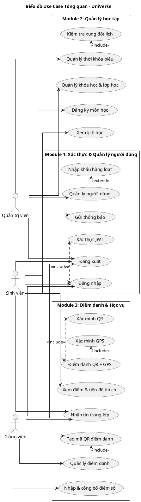

# REQUIREMENTS TOÀN HỆ THỐNG – UniVerse
> Giai đoạn 1 | Ánh xạ sang Chương 2 báo cáo TTCS

---

## 1. Bảng thuật ngữ

| STT | Thuật ngữ | Định nghĩa / Giải thích |
|-----|-----------|------------------------|
| 1 | **QR Token** | Mã định danh phiên điểm danh được ký bằng HMAC-SHA256, xoay vòng mỗi 5 giây, lưu trong Redis |
| 2 | **Geo-fencing** | Vùng địa lý ảo (bán kính 50m) xung quanh tọa độ GPS phòng học, dùng để xác minh sinh viên có mặt thực tế |
| 3 | **Haversine** | Công thức tính khoảng cách đường thẳng trên mặt cầu giữa hai tọa độ GPS |
| 4 | **JWT** | JSON Web Token — chuỗi mã hóa chứa thông tin xác thực, có thời hạn, dùng thay thế session |
| 5 | **RBAC** | Role-Based Access Control — phân quyền truy cập dựa trên vai trò (Student, Lecturer, Admin) |
| 6 | **Enrollment** | Bản ghi đăng ký của một sinh viên vào một lớp học cụ thể |
| 7 | **Schedule** | Lịch học định kỳ của một lớp học (thứ, tiết học, phòng học) |
| 8 | **AttendanceStatus** | Trạng thái điểm danh: `present` (có mặt), `absent` (vắng), `late` (muộn) |
| 9 | **GradeType** | Loại điểm: `midterm` (giữa kỳ, 30%), `final` (cuối kỳ, 50%), `assignment` / `quiz` (thường xuyên, 20%) |
| 10 | **Socket.IO** | Thư viện giao tiếp WebSocket real-time, dùng cho thông báo điểm danh, chat và push notification |
| 11 | **Kafka** | Message broker phân tán, dùng để streaming sự kiện thông báo bất đồng bộ |
| 12 | **Access Token** | JWT tồn tại ngắn (15 phút), dùng để xác thực mỗi request API |
| 13 | **Refresh Token** | JWT tồn tại dài (7 ngày), lưu trong Redis, dùng để lấy Access Token mới |
| 14 | **bcrypt** | Thuật toán băm mật khẩu có salt, độ phức tạp cấu hình được (cost factor = 12) |
| 15 | **TypeORM** | ORM (Object-Relational Mapping) cho TypeScript, ánh xạ entity class sang bảng PostgreSQL |

---

## 2. Mô hình nghiệp vụ bằng ngôn ngữ tự nhiên

### 2.1. Mục tiêu và phạm vi hệ thống

UniVerse là hệ thống quản lý đại học số tích hợp, được xây dựng nhằm giải quyết bài toán phân mảnh trong quản lý học tập tại môi trường đại học. Hệ thống phục vụ ba nhóm người dùng: sinh viên theo dõi và tham gia quá trình học tập; giảng viên quản lý lớp học và đánh giá sinh viên; quản trị viên vận hành và cấu hình toàn bộ hệ thống.

Hệ thống bao phủ toàn bộ vòng đời học tập trong một học kỳ: từ khi quản trị viên tạo danh mục khóa học, phân công giảng viên và xếp thời khóa biểu; sinh viên đăng ký môn học; đến khi giảng viên tổ chức điểm danh theo từng buổi, nhập điểm số, và công bố kết quả học tập. Thêm vào đó, hệ thống cung cấp kênh giao tiếp nội bộ (chat 1-1) và hệ thống thông báo push real-time.

### 2.2. Ai có thể sử dụng phần mềm?

Hệ thống UniVerse có ba nhóm người dùng chính:

**Sinh viên (Student)** là người dùng cuối trực tiếp tham gia hoạt động học tập. Sinh viên sử dụng hệ thống để đăng ký môn học đầu học kỳ, xem thời khóa biểu theo tuần, thực hiện điểm danh bằng cách quét mã QR và xác minh vị trí GPS, theo dõi lịch sử điểm danh, tra cứu điểm số theo từng môn và từng loại bài kiểm tra, nhắn tin với giảng viên trong cùng lớp, và nhận thông báo từ hệ thống về lịch học, điểm số và các thông báo quan trọng.

**Giảng viên (Lecturer)** là người tổ chức và quản lý hoạt động dạy học. Giảng viên xem danh sách các lớp học được phân công, tạo và quản lý phiên điểm danh bằng cách hiển thị mã QR động cho sinh viên quét, theo dõi danh sách điểm danh theo thời gian thực qua Socket.IO, chỉnh sửa trạng thái điểm danh khi có lý do đặc biệt, nhập điểm số cho từng sinh viên theo từng loại bài thi, công bố điểm để sinh viên có thể xem, và nhắn tin trao đổi với sinh viên trong lớp.

**Quản trị viên (Admin)** là người vận hành và cấu hình toàn bộ hệ thống. Quản trị viên quản lý toàn bộ tài khoản người dùng (tạo, sửa, xóa, nhập khẩu hàng loạt từ file CSV), quản lý danh mục khóa học và tạo lớp học (phân công giảng viên, xác định phòng học và tọa độ GPS), xếp thời khóa biểu với cơ chế tự động phát hiện xung đột phòng học và giảng viên, gửi thông báo hệ thống tới toàn bộ hoặc nhóm người dùng cụ thể, và xem báo cáo thống kê toàn hệ thống.

### 2.3. Người dùng có những chức năng gì?

**Sinh viên có thể:**
- Đăng nhập / Đăng xuất khỏi hệ thống
- Đăng ký môn học (chọn lớp học để tham gia)
- Xem thời khóa biểu học tập
- Điểm danh bằng QR Code + GPS
- Xem lịch sử điểm danh của bản thân
- Xem điểm số theo từng môn, từng học kỳ
- Xem tiến độ tín chỉ tích lũy
- Nhắn tin với giảng viên trong lớp học chung
- Nhận và đọc thông báo hệ thống

**Giảng viên có thể:**
- Đăng nhập / Đăng xuất khỏi hệ thống
- Xem danh sách lớp học được phân công
- Tạo phiên điểm danh và hiển thị QR Code động (tự xoay vòng 5s)
- Theo dõi điểm danh real-time theo từng buổi
- Chỉnh sửa trạng thái điểm danh (cho phép có phép / sửa nhầm)
- Nhập điểm số cho sinh viên (theo loại: giữa kỳ, cuối kỳ, thường xuyên)
- Công bố điểm số để sinh viên có thể xem
- Nhắn tin với sinh viên trong lớp
- Nhận thông báo hệ thống

**Quản trị viên có thể:**
- Đăng nhập / Đăng xuất khỏi hệ thống
- Quản lý người dùng: tạo / sửa / xóa / nhập khẩu hàng loạt
- Quản lý khóa học: tạo / sửa / xóa môn học
- Quản lý lớp học: tạo lớp, gán giảng viên, đặt tọa độ GPS phòng học
- Quản lý thời khóa biểu: xếp lịch học với phát hiện xung đột tự động
- Gửi thông báo hệ thống đến người dùng
- Xem thống kê điểm danh, người dùng toàn hệ thống

### 2.4. Mỗi chức năng hoạt động như thế nào?

**Chức năng "Đăng nhập":**
Người dùng mở trang đăng nhập → Nhập email và mật khẩu → Nhấn Đăng nhập → Hệ thống xác minh email tồn tại → Hệ thống so sánh mật khẩu với bcrypt hash → Hệ thống kiểm tra tài khoản đang hoạt động → Hệ thống tạo JWT Access Token (15 phút) và Refresh Token (7 ngày) → Hệ thống lưu Refresh Token vào Redis → Người dùng được chuyển đến trang chính theo vai trò

**Chức năng "Đăng ký môn học" (Sinh viên):**
Sinh viên chọn chức năng Đăng ký môn học → Hệ thống hiển thị danh sách lớp học còn chỗ → Sinh viên chọn lớp muốn đăng ký → Hệ thống kiểm tra lịch học có xung đột không → Hệ thống kiểm tra lớp chưa đầy → Hệ thống tạo bản ghi Enrollment (trạng thái: enrolled) → Thông báo đăng ký thành công

**Chức năng "Điểm danh QR + GPS" (Sinh viên):**
Giảng viên mở phiên điểm danh → Hệ thống tạo QR Token (HMAC-SHA256, TTL 5s Redis) và hiển thị mã QR → Sinh viên mở ứng dụng, quét mã QR → Thiết bị ghi nhận tọa độ GPS hiện tại → Hệ thống xác minh chữ ký QR hợp lệ và chưa hết hạn → Hệ thống tính khoảng cách Haversine giữa GPS sinh viên và tọa độ phòng học → Nếu khoảng cách ≤ 50m: lưu Attendance (status: present, scannedAt, gpsLatitude, gpsLongitude, distance) → Thông báo điểm danh thành công; cập nhật real-time trên màn hình giảng viên qua Socket.IO

**Chức năng "Nhập điểm" (Giảng viên):**
Giảng viên chọn lớp học và chọn chức năng Quản lý điểm → Hệ thống hiển thị danh sách sinh viên theo Enrollment → Giảng viên nhập điểm cho từng sinh viên theo loại (midterm/final/assignment/quiz) và trọng số → Giảng viên nhấn Lưu → Hệ thống lưu bản ghi Grade → Hệ thống tính điểm tổng tự động: 20% QT + 30% GK + 50% CK → Giảng viên nhấn Công bố → Sinh viên nhận thông báo và có thể xem điểm

**Chức năng "Quản lý người dùng" (Admin):**
Admin chọn Quản lý người dùng → Hệ thống hiển thị danh sách tất cả người dùng kèm bộ lọc theo vai trò và trạng thái → Admin tìm kiếm hoặc chọn người dùng cần sửa → Admin chỉnh sửa thông tin → Hệ thống cập nhật CSDL → Thông báo thành công; hoặc Admin nhấn Thêm mới → Nhập thông tin → Hệ thống kiểm tra email chưa trùng → Lưu và gửi email thông báo tài khoản

**Chức năng "Gửi thông báo" (Admin):**
Admin chọn chức năng Gửi thông báo → Hệ thống hiển thị form soạn thảo với ô tiêu đề, nội dung, chọn nhóm nhận (toàn bộ / theo vai trò / sinh viên cụ thể) → Admin điền nội dung và chọn đối tượng → Nhấn Gửi → Hệ thống publish sự kiện lên Kafka topic → Notification service consume và lưu vào MongoDB → Socket.IO broadcast đến người dùng đang online → Firebase FCM gửi push notification đến người dùng offline

**Chức năng "Quản lý thời khóa biểu" (Admin):**
Admin chọn Quản lý thời khóa biểu → Hệ thống hiển thị lưới lịch hiện tại theo tuần → Admin chọn lớp học cần xếp lịch → Admin chọn thứ, tiết bắt đầu-kết thúc, phòng học → Hệ thống kiểm tra phòng học không bị trùng giờ → Hệ thống kiểm tra giảng viên không bị trùng giờ → Nếu không xung đột: lưu Schedule → Thông báo thành công; Nếu xung đột: thông báo chi tiết xung đột với ai / phòng nào

### 2.5. Những thông tin / đối tượng mà hệ thống cần xử lý

| STT | Đối tượng | Mô tả | Nguồn (bảng/collection) |
|-----|-----------|-------|------------------------|
| 1 | **Người dùng (User)** | Tài khoản hệ thống cho 3 vai trò: Student, Lecturer, Admin. Gồm: email, mật khẩu (bcrypt), họ tên, mã số (MSSV/MGV), vai trò, trạng thái | `users` |
| 2 | **Khóa học (Course)** | Môn học trong chương trình đào tạo: mã môn, tên môn, số tín chỉ, khoa | `courses` |
| 3 | **Lớp học (Class)** | Một lớp mở cụ thể của một khóa học trong một học kỳ, gắn với một giảng viên, có tọa độ GPS phòng học | `classes` |
| 4 | **Lịch học (Schedule)** | Buổi học định kỳ của một lớp: thứ trong tuần, tiết bắt đầu/kết thúc, phòng học | `schedules` |
| 5 | **Đăng ký học (Enrollment)** | Bản ghi sinh viên đăng ký vào lớp học: trạng thái (enrolled/dropped/completed) | `enrollments` |
| 6 | **Điểm danh (Attendance)** | Bản ghi điểm danh của một sinh viên trong một buổi học: trạng thái (present/absent/late), QR token, tọa độ GPS, khoảng cách Haversine | `attendances` |
| 7 | **Điểm số (Grade)** | Điểm của một sinh viên trong một môn: loại điểm (midterm/final/assignment/quiz), giá trị điểm, trọng số | `grades` |
| 8 | **Thông báo (Notification)** | Thông báo đến người dùng: tiêu đề, nội dung, loại (attendance/grade/announcement/system), đã đọc chưa | `notifications` (MongoDB) |
| 9 | **Tin nhắn (Message)** | Tin nhắn 1-1 giữa sinh viên và giảng viên trong cùng lớp: người gửi, người nhận, nội dung, thời gian đọc | `messages` (MongoDB) |

### 2.6. Quan hệ giữa các đối tượng

- Một **User** (vai trò Student) có nhiều **Enrollment** (1-n) — mỗi sinh viên có thể đăng ký nhiều lớp học
- Một **User** (vai trò Lecturer) giảng dạy nhiều **Class** (1-n) — một giảng viên phụ trách nhiều lớp
- Một **Course** có nhiều **Class** (1-n) — một môn học có thể mở nhiều lớp trong cùng học kỳ
- Một **Class** có nhiều **Enrollment** và ngược lại một **Enrollment** thuộc về một **Class** (n-1) — n-n giữa Student và Class, được giải quyết qua **Enrollment** làm trung gian
- Một **Class** có nhiều **Schedule** (1-n) — một lớp học có nhiều buổi học trong tuần
- Một **Schedule** có nhiều **Attendance** (1-n) — một buổi học có nhiều bản ghi điểm danh (mỗi sinh viên một bản)
- Một **User** (Student) có nhiều **Attendance** (1-n) — lịch sử điểm danh xuyên suốt nhiều môn học
- Một **Enrollment** có nhiều **Grade** (1-n) — điểm số của một sinh viên trong một lớp gồm nhiều loại: midterm, final, assignment, quiz
- Một **User** có nhiều **Notification** (1-n) — thông báo gửi đến từng người dùng
- Một **User** có thể gửi nhiều **Message** cho nhiều **User** khác (n-n) — quan hệ chat 1-1, được lưu theo cặp (senderId, receiverId)
- Một **Class** có tọa độ GPS (latitude, longitude) — dùng để xác minh Geo-fencing trong **Attendance**
- Một **Grade** thuộc về một **Enrollment** (n-1) — Grade không trực tiếp thuộc User mà thông qua Enrollment, vì cùng một User có thể học lại cùng môn
- Ràng buộc: Unique(studentId, classId) trên **Enrollment** — mỗi sinh viên chỉ được đăng ký một lớp học một lần

---

## 3. Mô hình nghiệp vụ bằng UML

### 3.1. Danh sách Actor

| STT | Tên Actor | Mô tả |
|-----|-----------|-------|
| 1 | **Sinh viên** | Người học, thực hiện điểm danh, xem lịch học và điểm số |
| 2 | **Giảng viên** | Người dạy, quản lý điểm danh và nhập điểm số |
| 3 | **Quản trị viên** | Người vận hành hệ thống, quản lý tài khoản và cấu hình |

### 3.2. Các Use Case cho từng Actor

| Mã UC | Actor | Use Case |
|-------|-------|----------|
| **UC01** | Sinh viên, Giảng viên, Admin | Đăng nhập |
| **UC02** | Sinh viên, Giảng viên, Admin | Đăng xuất |
| **UC03** | Admin | Quản lý người dùng (tạo / sửa / xóa / nhập khẩu) |
| **UC04** | Admin | Gửi thông báo hệ thống |
| **UC05** | Admin | Quản lý khóa học & lớp học |
| **UC06** | Admin | Quản lý thời khóa biểu |
| **UC07** | Sinh viên | Đăng ký môn học |
| **UC08** | Sinh viên | Xem lịch học & thời khóa biểu |
| **UC09** | Giảng viên | Tạo & hiển thị mã QR điểm danh |
| **UC10** | Sinh viên | Điểm danh QR + GPS |
| **UC11** | Giảng viên | Quản lý & chỉnh sửa điểm danh |
| **UC12** | Giảng viên | Nhập & công bố điểm số |
| **UC13** | Sinh viên | Xem điểm số & tiến độ tín chỉ |
| **UC14** | Sinh viên, Giảng viên | Nhắn tin trong lớp học |

### 3.3. Biểu đồ Use Case tổng quan

