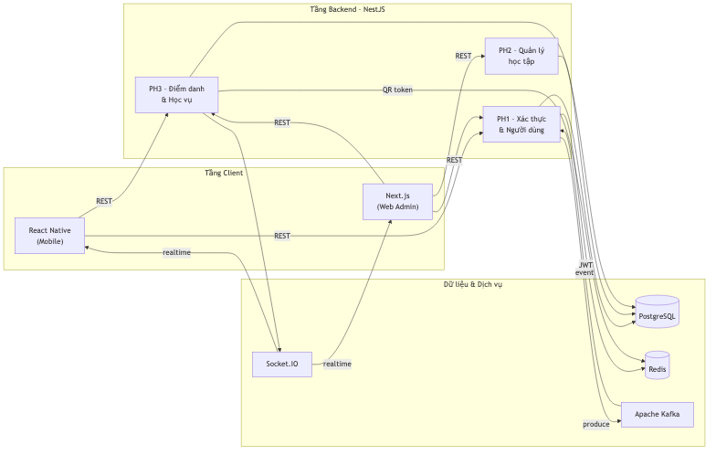
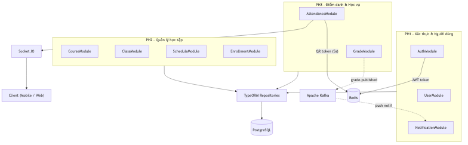

# CHƯƠNG 2: NGHIÊN CỨU PHƯƠNG PHÁP TIẾP CẬN VÀ GIẢI QUYẾT VẤN ĐỀ

---

## 2.1. Mô hình tổng quát hệ thống

Hệ thống UniVerse được xây dựng theo kiến trúc đa tầng, phục vụ đồng thời ba nhóm người dùng với các nền tảng giao diện khác nhau. Để nắm bắt toàn cảnh hệ thống, chúng ta xem xét từ hai góc nhìn bổ sung nhau: lớp kỹ thuật và phân hệ chức năng.

### 2.1.1. Theo lớp kỹ thuật

Hệ thống tổ chức theo ba tầng rõ ràng:

- **Tầng Client**: Gồm ứng dụng di động React Native (dành cho sinh viên và giảng viên điểm danh, xem lịch, xem điểm) và cổng web quản trị Next.js (dành cho quản trị viên và giảng viên nhập điểm, quản lý lớp học). Hai nền tảng này giao tiếp với backend thông qua REST API bảo mật HTTPS.

- **Tầng Backend**: Toàn bộ logic nghiệp vụ tập trung tại server NestJS, tổ chức theo mô hình module hóa. Ngoài REST API, backend còn cung cấp kênh Socket.IO để đẩy kết quả điểm danh theo thời gian thực đến màn hình giảng viên, và kênh Kafka Consumer để xử lý sự kiện bất đồng bộ (như gửi thông báo sau khi công bố điểm).

- **Tầng Dữ liệu**: PostgreSQL lưu trữ toàn bộ dữ liệu học vụ có cấu trúc quan hệ chặt chẽ; Redis đóng vai trò bộ nhớ đệm tốc độ cao cho JWT refresh token và QR token điểm danh (TTL 5 giây); Apache Kafka làm hàng đợi message broker cho luồng sự kiện bất đồng bộ.

### 2.1.2. Theo phân hệ chức năng

Toàn bộ chức năng hệ thống được chia thành **3 phân hệ**, mỗi phân hệ bao gồm một nhóm use case có liên quan chặt chẽ với nhau:

| Phân hệ | Phạm vi chức năng | Use Case |
|---|---|---|
| **Phân hệ 1**: Quản lý người dùng | Quản lý tài khoản, gửi thông báo, quản lý lịch học | UC01 – UC03 |
| **Phân hệ 2**: Quản lý học tập | Quản lý học phần, quản lý lớp học phần, đăng ký học phần, xem thời khóa biểu | UC04 – UC07 |
| **Phân hệ 3**: Điểm danh & Học vụ | Tạo/tắt mã QR, quản lý điểm danh, xem điểm, nhập/sửa điểm | UC08 – UC11 |

Sơ đồ dưới đây thể hiện mô hình tổng quát kết hợp cả hai góc nhìn trên:



---

## 2.2. Phương pháp xây dựng phần mềm

### 2.2.1. Phương pháp hướng đối tượng (OOAD)

Nhóm áp dụng **Phương pháp phân tích và thiết kế hướng đối tượng** (Object-Oriented Analysis and Design — OOAD) xuyên suốt quá trình xây dựng hệ thống UniVerse. Đây là phương pháp tiếp cận phần mềm theo đó toàn bộ hệ thống được mô hình hóa thành tập hợp các đối tượng tương tác với nhau, mỗi đối tượng kết hợp dữ liệu (thuộc tính) và hành vi (phương thức) trong cùng một đơn vị.

Phương pháp OOAD dựa trên bốn tính chất cốt lõi của lập trình hướng đối tượng, được áp dụng cụ thể như sau trong hệ thống UniVerse:

- **Đóng gói (Encapsulation)**: Mỗi lớp thực thể (User, Course, Class, Attendance, Grade…) chỉ công khai giao diện cần thiết ra ngoài, che giấu logic nội bộ. Trong NestJS, mỗi module chỉ export những service cần thiết cho module khác, không để lộ repository hay implementation detail.

- **Kế thừa (Inheritance)**: Cấu trúc actor trong hệ thống áp dụng nguyên tắc kế thừa — Sinh viên, Giảng viên và Quản trị viên đều là người dùng (User), phân biệt nhau qua thuộc tính `role`. Trong biểu đồ use case, actor `User` là cha chung của ba actor cụ thể.

- **Đa hình (Polymorphism)**: Cùng một hành động "gửi thông báo" nhưng thực hiện khác nhau tùy vai trò — Giảng viên gửi thông báo đến lớp học, Quản trị viên gửi đến toàn hệ thống hoặc theo nhóm.

- **Trừu tượng hóa (Abstraction)**: Lớp phân tích tập trung vào WHAT (đối tượng có thuộc tính gì, quan hệ thế nào) thay vì HOW (cơ chế thực thi). Biểu đồ lớp pha phân tích chỉ có tên lớp, thuộc tính và quan hệ — chưa có kiểu dữ liệu hay phương thức cụ thể.

### 2.2.2. Lý do chọn OOAD

OOAD phù hợp với hệ thống UniVerse vì ba lý do chính:

1. **Phù hợp với công nghệ**: NestJS và TypeScript bản chất là hướng đối tượng — class, decorator, dependency injection đều là khái niệm OOP. Phương pháp phân tích và ngôn ngữ lập trình hoàn toàn nhất quán.

2. **Ánh xạ tự nhiên từ mô hình sang code**: Lớp thực thể trong biểu đồ phân tích (User, Course, Class, Enrollment, Attendance, Grade, Notification) ánh xạ trực tiếp thành các entity TypeScript trong codebase — giảm khoảng cách giữa tài liệu thiết kế và code thực tế.

3. **Hỗ trợ UML toàn diện**: Toàn bộ tài liệu của báo cáo này — biểu đồ use case, biểu đồ lớp phân tích, biểu đồ tuần tự — đều là sản phẩm của phương pháp OOAD theo chuẩn Unified Process (UP).

---

## 2.3. Mô hình phát triển phần mềm

### 2.3.1. Mô hình Lặp và Tăng trưởng

Nhóm áp dụng **Mô hình Lặp và Tăng trưởng** (Iterative and Incremental Development) làm vòng đời phát triển phần mềm. Trong mô hình này, hệ thống không được xây dựng hoàn chỉnh trong một lần duy nhất mà được phát triển qua nhiều vòng lặp (iteration), mỗi vòng tạo ra một phiên bản hệ thống hoàn chỉnh hơn. Mỗi iteration đi qua đủ bốn pha: **Phân tích → Thiết kế → Lập trình → Kiểm thử**.

Đặc điểm của mô hình:
- Rủi ro được phát hiện và xử lý sớm vì phần mềm được chạy thực tế sau mỗi iteration.
- Cho phép điều chỉnh yêu cầu giữa các iteration khi có phản hồi từ người dùng hoặc giảng viên hướng dẫn.
- Phù hợp với dự án nhóm sinh viên: mỗi thành viên phụ trách một module độc lập, các module được tích hợp dần theo từng iteration.

### 2.3.2. Ba vòng lặp của dự án UniVerse

Dự án UniVerse được chia thành **3 iteration**, mỗi iteration tương ứng với một trong ba module chức năng của hệ thống:

| Iteration | Module | Use Case | Sản phẩm chính |
|---|---|---|---|
| **Iteration 1** | Quản lý người dùng | UC01 – UC03 | Quản lý tài khoản, gửi thông báo, quản lý lịch học |
| **Iteration 2** | Quản lý học tập | UC04 – UC07 | Quản lý học phần, lớp học phần, đăng ký học phần, xem thời khóa biểu |
| **Iteration 3** | Điểm danh & Học vụ | UC08 – UC11 | Tạo/tắt QR, quản lý điểm danh, xem điểm, nhập/sửa điểm |

Mỗi iteration đều trải qua đầy đủ bốn bước phân tích – thiết kế – lập trình – kiểm thử, đảm bảo module hoàn chỉnh trước khi chuyển sang iteration tiếp theo. Iteration sau có thể kế thừa và sử dụng kết quả từ iteration trước (ví dụ: Iteration 3 dùng User và Class từ Iteration 1 và 2).

### 2.3.3. Lý do chọn mô hình Lặp và Tăng trưởng

- **Phân rã công việc tự nhiên theo module**: Ba module của UniVerse (Auth, Academic, Attendance) độc lập về mặt chức năng, phù hợp để phát triển tuần tự theo vòng lặp.
- **Demo từng phần**: Sau mỗi iteration có thể demo module hoàn chỉnh cho giảng viên hướng dẫn, dễ nhận phản hồi và điều chỉnh kịp thời.
- **Phù hợp với Unified Process**: UP (Unified Process) — khung phương pháp mà báo cáo này tuân theo — vốn có bản chất lặp và tăng trưởng, chia mỗi pha phát triển thành các luồng hoạt động (workflows) lặp đi lặp lại qua từng iteration.

---

## 2.4. Kiến trúc phần mềm được áp dụng trong triển khai hệ thống

### 2.4.1. Kiến trúc Client – Server

Hệ thống UniVerse xây dựng theo mô hình **Client – Server**, trong đó phần client (React Native và Next.js) chịu trách nhiệm hiển thị giao diện và tương tác người dùng, còn phần server (NestJS) xử lý toàn bộ logic nghiệp vụ, kiểm soát phân quyền và quản lý dữ liệu.

Giao tiếp giữa client và server thực hiện qua ba kênh:
- **REST API (HTTPS)**: Kênh chính cho các thao tác CRUD và truy vấn dữ liệu.
- **Socket.IO**: Kênh realtime — khi sinh viên điểm danh thành công, server đẩy cập nhật ngay lên màn hình giảng viên mà không cần client reload trang.
- **Push Notification (qua Kafka)**: Khi giảng viên công bố điểm, server phát sự kiện `grade.published` vào Kafka; Notification Consumer xử lý và gửi thông báo đến từng sinh viên trong lớp.

### 2.4.2. Kiến trúc Modular Monolith

Backend NestJS áp dụng kiến trúc **Modular Monolith** — toàn bộ ứng dụng backend chạy trong một tiến trình (monolith) nhưng được tổ chức thành các module NestJS **độc lập và có ranh giới rõ ràng** (modular). Mỗi module gói gọn đầy đủ Controller, Service, Repository và Entity của một miền nghiệp vụ cụ thể.

Ba phân hệ chức năng ánh xạ thành các NestJS module như sau:

| Phân hệ | NestJS Module |
|---|---|
| Phân hệ 1 — Quản lý người dùng | `UserModule`, `NotificationModule`, `ScheduleModule` |
| Phân hệ 2 — Quản lý học tập | `CourseModule`, `ClassModule`, `EnrollmentModule` |
| Phân hệ 3 — Điểm danh & Học vụ | `AttendanceModule`, `GradeModule` |

Luồng xử lý trong mỗi module tuân theo mô hình phân tầng nhất quán:

```
HTTP Request → Controller → Service → Repository → PostgreSQL
```

Ưu điểm của Modular Monolith so với Microservices trong bối cảnh dự án:
- Triển khai đơn giản hơn (một Docker container thay vì nhiều service).
- Không phát sinh overhead giao tiếp mạng giữa service.
- Vẫn duy trì ranh giới module rõ ràng — dễ tách thành microservice sau nếu cần mở rộng.

Sơ đồ kiến trúc module và kênh giao tiếp:



---

## 2.5. Lựa chọn công nghệ phù hợp để triển khai xây dựng hệ thống

Dựa trên yêu cầu chức năng (điểm danh QR+GPS realtime, phân quyền 3 role, quản lý học vụ) và yêu cầu phi chức năng (bảo mật, hiệu năng, khả năng mở rộng), nhóm lựa chọn stack công nghệ như sau:

### 2.5.1. Bảng tổng hợp công nghệ

| Tầng | Công nghệ | Lý do lựa chọn |
|---|---|---|
| Mobile Client | **React Native** | Cross-platform iOS/Android từ một codebase TypeScript; hỗ trợ native camera API (quét QR) và Geolocation API (GPS) |
| Web Client | **Next.js** | SSR/CSR linh hoạt; file-based routing tiện lợi cho Admin Portal; dùng chung TypeScript với backend |
| Backend Framework | **NestJS + TypeScript** | Kiến trúc module rõ ràng, Dependency Injection tích hợp sẵn, decorator-based phù hợp với OOAD |
| Cơ sở dữ liệu | **PostgreSQL** | RDBMS với đảm bảo ACID; ràng buộc khóa ngoại phù hợp với quan hệ chặt chẽ giữa User – Class – Enrollment – Attendance – Grade |
| Bộ nhớ đệm | **Redis** | In-memory, TTL linh hoạt; lưu JWT refresh token và QR token xoay vòng 5 giây chống tái sử dụng |
| Realtime | **Socket.IO** | Cập nhật danh sách điểm danh tức thì trên màn hình giảng viên; hỗ trợ cả WebSocket và long-polling fallback |
| Message Broker | **Apache Kafka** | Gửi thông báo bất đồng bộ sau sự kiện (công bố điểm, cập nhật lịch); tách rời NotificationModule khỏi GradeModule |
| Container | **Docker** | Đảm bảo môi trường nhất quán giữa máy phát triển và server triển khai; dễ cấu hình multi-service (NestJS + PostgreSQL + Redis + Kafka) |

### 2.5.2. Phân tích chi tiết từng công nghệ

**React Native** được chọn thay vì Flutter hay native iOS/Android vì nhóm đã có nền tảng JavaScript/TypeScript từ phía backend, giúp rút ngắn thời gian học công nghệ mới. Thư viện `expo-camera` và `expo-location` cung cấp API camera và GPS đơn giản, phù hợp với luồng điểm danh QR+GPS của UC08 và UC09.

**NestJS** mang lại cấu trúc dự án rõ ràng ngay từ đầu — không như Express.js thuần túy, NestJS bắt buộc tổ chức code theo module và áp dụng các pattern như Repository, Service Layer, DTO validation. Điều này giúp nhiều thành viên trong nhóm làm việc song song trên các module khác nhau mà không gây xung đột.

**PostgreSQL** phù hợp hơn các cơ sở dữ liệu NoSQL trong trường hợp này vì dữ liệu học vụ có cấu trúc quan hệ chặt chẽ: một Attendance bắt buộc phải thuộc về một Schedule, một Grade bắt buộc thuộc về một Enrollment. Ràng buộc khóa ngoại của PostgreSQL đảm bảo tính toàn vẹn dữ liệu ở tầng database.

**Redis** đảm nhận hai vai trò quan trọng: (1) Lưu JWT refresh token với TTL dài (7 ngày) để hỗ trợ tính năng "nhớ đăng nhập"; (2) Lưu QR token với TTL ngắn (5 giây) — mỗi lần giảng viên refresh màn hình điểm danh, server sinh QR mới và ghi token vào Redis; khi sinh viên quét, server kiểm tra Redis để xác minh token còn hiệu lực và chưa được dùng (chống tái sử dụng mã QR).

**Apache Kafka** tách rời luồng thông báo khỏi luồng nghiệp vụ chính. Khi giảng viên nhấn "Công bố điểm" (UC11), GradeModule chỉ cần phát sự kiện `grade.published` vào Kafka rồi trả về response ngay cho client. NotificationModule đọc sự kiện từ Kafka và gửi push notification đến từng sinh viên trong lớp — quá trình này diễn ra bất đồng bộ, không làm chậm trải nghiệm của giảng viên.

**Docker** cho phép toàn bộ stack (NestJS + PostgreSQL + Redis + Kafka) chạy thống nhất bằng một lệnh `docker compose up`, loại bỏ vấn đề "chạy được trên máy mình nhưng không chạy được trên máy bạn" khi làm việc nhóm.
