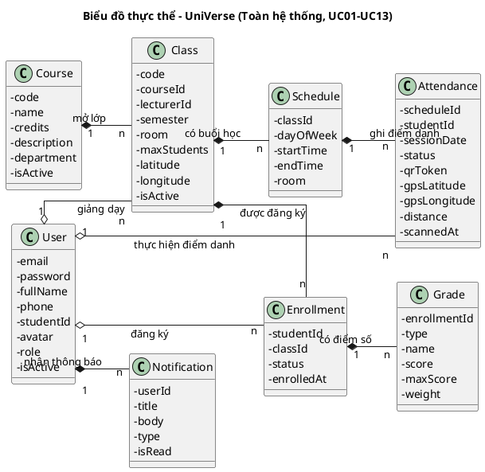

# CHƯƠNG 3: PHÂN TÍCH THIẾT KẾ VÀ THỰC NGHIỆM HỆ THỐNG

---

## 3.2. Thiết kế cơ sở dữ liệu

### II.2. Mô hình hóa lớp – Toàn hệ thống

---

### Bước 1: Mô tả chức năng bằng đoạn văn xuôi

Hệ thống UniVerse phục vụ ba nhóm người dùng — sinh viên, giảng viên và quản trị viên — mỗi người dùng có tài khoản riêng với vai trò xác định quyền truy cập. Quản trị viên quản lý toàn bộ tài khoản trong hệ thống và gửi thông báo đến người dùng; mỗi thông báo ghi lại người nhận, tiêu đề, nội dung và trạng thái đã đọc. Quản trị viên xây dựng danh mục đào tạo gồm các khóa học (mã môn, tên môn, số tín chỉ, mô tả, khoa), từ đó mở các lớp học theo từng học kỳ với giảng viên phụ trách, sĩ số tối đa và tọa độ GPS phòng học. Mỗi lớp học được xếp lịch định kỳ theo thứ trong tuần, giờ bắt đầu và giờ kết thúc tạo thành các buổi học. Sinh viên đăng ký vào các lớp học phần; mỗi đăng ký học ghi nhận liên kết sinh viên – lớp học cùng trạng thái và thời điểm đăng ký. Trong mỗi buổi học, giảng viên mở điểm danh bằng mã QR; sinh viên dùng ứng dụng di động quét mã QR kèm tọa độ GPS để điểm danh — hệ thống ghi kết quả điểm danh gồm trạng thái, ngày điểm danh, tọa độ GPS thực tế và khoảng cách so với phòng học. Giảng viên nhập điểm cho sinh viên theo từng loại bài đánh giá (thường xuyên, giữa kỳ, cuối kỳ, bài kiểm tra nhanh); mỗi bản ghi điểm số lưu loại điểm, tên bài, điểm đạt được, thang điểm và trọng số. Khi công bố điểm, hệ thống gửi thông báo đến sinh viên.

---

### Bước 2+3: Trích xuất danh từ và phân loại

*   Hệ thống: danh từ trừu tượng, quá chung --> loại bỏ.
*   Người dùng: cần lưu trữ và quản lý --> một lớp: User (email, password, fullName, phone, studentId, avatar, role, isActive).
*   Tài khoản: đồng nghĩa với Người dùng --> gộp vào lớp User.
*   Email, Mật khẩu, Họ và tên, Số điện thoại, Mã số sinh viên, Ảnh đại diện: thông tin mô tả Người dùng --> thuộc tính của User.
*   Vai trò: đặc tính của Người dùng, không cần tách lớp riêng vì đơn giản và cố định --> thuộc tính enum của User (STUDENT | LECTURER | ADMIN).
*   Trạng thái tài khoản: đặc tính của Người dùng --> thuộc tính của User (isActive).
*   Token xác thực: tồn tại tạm thời cho phiên làm việc, không lưu bền vững --> loại bỏ.
*   Phiên làm việc: gắn với Token, không phải đối tượng nghiệp vụ --> loại bỏ.
*   Tệp CSV: đầu vào nhất thời, không lưu trữ lâu dài --> loại bỏ.
*   Sinh viên: Actor, là User với role = STUDENT --> loại bỏ (không tách lớp riêng).
*   Giảng viên: Actor, là User với role = LECTURER --> loại bỏ.
*   Quản trị viên: Actor, là User với role = ADMIN --> loại bỏ.
*   Thông báo: cần lưu trữ và gửi đến người dùng --> một lớp: Notification (userId, title, body, type, isRead).
*   Người nhận, Tiêu đề, Nội dung, Loại thông báo, Trạng thái đọc: thông tin của Thông báo --> thuộc tính của Notification.
*   Khóa học: cần quản lý danh mục đào tạo --> một lớp: Course (code, name, credits, description, department, isActive).
*   Mã môn học, Tên môn, Số tín chỉ, Mô tả nội dung, Khoa: thông tin của Khóa học --> thuộc tính của Course.
*   Lớp học: một phiên mở cụ thể của Khóa học, cần quản lý --> một lớp: Class (code, courseId, lecturerId, semester, room, maxStudents, latitude, longitude, isActive).
*   Học kỳ, Sĩ số tối đa, Phòng học, Tọa độ GPS: thông tin của Lớp học --> thuộc tính của Class.
*   Buổi học: lịch học định kỳ của Lớp, cần lưu trữ --> một lớp: Schedule (classId, dayOfWeek, startTime, endTime, room).
*   Thứ trong tuần, Giờ bắt đầu, Giờ kết thúc: thông tin của Buổi học --> thuộc tính của Schedule.
*   Thời khóa biểu: tổng hợp từ Schedule của các lớp đã đăng ký, không phải đối tượng độc lập --> loại bỏ.
*   Xung đột lịch: ràng buộc nghiệp vụ kiểm tra khi lưu, không phải đối tượng cần lưu trữ --> loại bỏ.
*   Đăng ký học: ghi nhận liên kết giữa Sinh viên và Lớp học, cần lưu trữ --> một lớp: Enrollment (studentId, classId, status, enrolledAt).
*   Trạng thái đăng ký, Thời điểm đăng ký: thông tin của Đăng ký học --> thuộc tính của Enrollment.
*   Phiên điểm danh: trạng thái kích hoạt của Buổi học, không phải đối tượng riêng --> loại bỏ.
*   Mã QR: token tạm thời xoay vòng, không lưu Entity độc lập; giá trị được lưu vào Attendance để chống tái sử dụng --> loại bỏ (không tách lớp riêng).
*   Kết quả điểm danh: cần lưu bền vững theo từng sinh viên từng buổi --> một lớp: Attendance (scheduleId, studentId, sessionDate, status, qrToken, gpsLatitude, gpsLongitude, distance, scannedAt).
*   Trạng thái có mặt, Ngày điểm danh, Tọa độ GPS thực tế, Khoảng cách: thông tin của Điểm danh --> thuộc tính của Attendance.
*   Ứng dụng di động, Màn hình giảng viên: giao diện người dùng (Boundary) --> loại bỏ.
*   Điểm số: cần lưu từng loại bài đánh giá riêng --> một lớp: Grade (enrollmentId, type, name, score, maxScore, weight).
*   Loại bài đánh giá, Tên bài kiểm tra, Điểm đạt được, Thang điểm tối đa, Trọng số: thông tin của Điểm số --> thuộc tính của Grade.
*   Điểm tổng kết: giá trị tính toán từ các Grade theo công thức trọng số, không lưu riêng --> loại bỏ.
*   Tín chỉ tích lũy: giá trị tổng hợp từ credits các Course đã hoàn thành, không lưu riêng --> loại bỏ.

Vậy chúng ta thu được **8 lớp thực thể**: User, Notification, Course, Class, Schedule, Enrollment, Attendance, Grade.

---

### Bước 4+5: Quan hệ định lượng và quan hệ đối tượng giữa các lớp

*   Một User có thể nhận nhiều Notification; mỗi Notification thuộc về đúng một User. Vậy User – Notification là **1-n**, quan hệ **hợp thành (composition)** vì Notification không tồn tại độc lập nếu User bị xoá.
*   Một Course có thể mở nhiều Class trong các học kỳ khác nhau; mỗi Class thuộc về đúng một Course. Vậy Course – Class là **1-n**, quan hệ **hợp thành (composition)** vì Class không có nghĩa nếu Course bị xoá.
*   Một User (Lecturer) có thể giảng dạy nhiều Class; mỗi Class chỉ có một Giảng viên phụ trách. Vậy User – Class là **1-n**, quan hệ **tập hợp (aggregation)** vì Giảng viên tồn tại độc lập ngoài Class.
*   Một Class có nhiều Schedule (buổi học định kỳ trong tuần); mỗi Schedule thuộc về đúng một Class. Vậy Class – Schedule là **1-n**, quan hệ **hợp thành (composition)** vì Schedule không tồn tại độc lập khi Class bị xoá.
*   Một User (Student) có thể đăng ký nhiều Class; một Class tiếp nhận nhiều Student. Vậy User – Class là **n-n**. Do đó chúng ta đề xuất lớp trung gian Enrollment. Một Student có nhiều Enrollment (**1-n, aggregation** — Student tồn tại độc lập); một Class có nhiều Enrollment (**1-n, composition** — Enrollment mất ý nghĩa khi Class bị xoá). Ràng buộc unique(studentId, classId) đảm bảo mỗi sinh viên chỉ đăng ký mỗi lớp một lần.
*   Một Schedule có nhiều Attendance (một bản ghi cho mỗi sinh viên trong buổi học); mỗi Attendance gắn với đúng một Schedule. Vậy Schedule – Attendance là **1-n**, quan hệ **hợp thành (composition)** vì Attendance không tồn tại nếu Schedule bị xoá.
*   Một User (Student) có nhiều Attendance xuyên suốt các môn học; mỗi Attendance gắn với đúng một sinh viên. Vậy User – Attendance là **1-n**, quan hệ **tập hợp (aggregation)** vì User tồn tại độc lập.
*   Một Enrollment có nhiều Grade (điểm thường xuyên, giữa kỳ, cuối kỳ, quiz); mỗi Grade thuộc về đúng một Enrollment. Vậy Enrollment – Grade là **1-n**, quan hệ **hợp thành (composition)**. Grade liên kết qua Enrollment chứ không trực tiếp với User — đảm bảo phân biệt điểm khi sinh viên học lại cùng môn.

---

### Biểu đồ thực thể toàn hệ thống

