# MODULE 3: ĐIỂM DANH & HỌC VỤ
> Phụ trách: **Trần Xuân Thành**
> Công nghệ giao diện: HTML (React / Next.js)
> Phạm vi: UC08–UC11

---

## I.1. Mô hình nghiệp vụ bằng UML – Module 3

### (a) UC08 – Tạo/tắt mã QR điểm danh

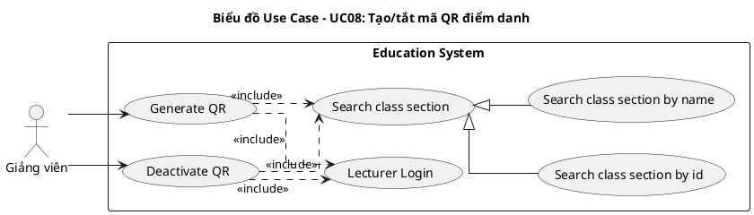

**Mô tả UC:**
- **Generate QR:** GV tạo mã QR điểm danh cho một buổi học cụ thể, kèm tọa độ GPS và thời hạn sử dụng.
- **Deactivate QR:** GV tắt mã QR trước khi hết hạn; các SV chưa điểm danh tự động bị ghi nhận vắng.
- **Search class section:** GV tìm kiếm lớp học phần (theo mã hoặc tên) để phục vụ thao tác.

---

### (b) UC09 – Quản lý điểm danh

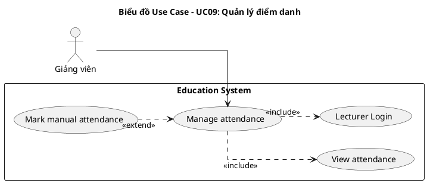

**Mô tả UC:**
- **Manage attendance:** GV xem và chỉnh sửa kết quả điểm danh của SV theo từng buổi học.
- **View attendance:** GV xem trạng thái điểm danh toàn bộ SV trong một buổi học.
- **Mark manual attendance:** GV điểm danh thủ công hoặc chỉnh sửa trạng thái điểm danh đã có cho một SV cụ thể.

---

### (c) UC10 – Xem điểm

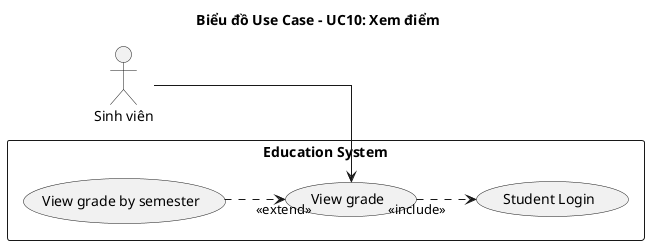

**Mô tả UC:**
- **View grade:** SV xem các đầu điểm và điểm tổng kết của các học phần đã đăng ký.
- **View grade by semester:** SV xem chi tiết điểm theo kỳ học.

---

### (d) UC11 – Nhập/sửa điểm

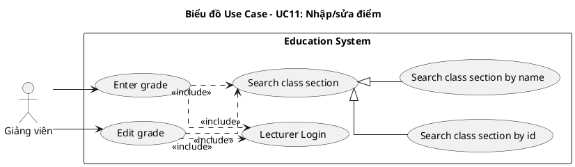

**Mô tả UC:**
- **Enter grade:** GV nhập điểm thành phần và điểm thi cho SV trong lớp phụ trách.
- **Edit grade:** GV chỉnh sửa điểm đã nhập trong thời gian cho phép.

---

## II.1. Mô hình hóa chức năng – Module 3

### Kịch bản UC08: Tạo/tắt mã QR điểm danh

| Trường | Nội dung |
|--------|---------|
| **Use case** | Tạo/tắt mã QR điểm danh |
| **Actor** | Giảng viên |
| **Tiền điều kiện** | Giảng viên đã đăng nhập; buổi học chưa mở điểm danh |
| **Hậu điều kiện** | Buổi học có danh sách điểm danh hoàn chỉnh cho tất cả sinh viên |
| **Kịch bản chính** | 1. Giảng viên chọn chức năng "Điểm danh" từ giao diện chính.<br>2. Hệ thống hiển thị giao diện tìm kiếm lớp học phần với ô nhập từ khóa và nút Tìm.<br>3. Giảng viên nhập từ khóa "INT1340" và nhấn nút Tìm.<br>4. Hệ thống hiển thị danh sách lớp học phần phù hợp:<br><table><tr><th>Mã lớp</th><th>Tên học phần</th><th>Phòng</th><th>Giờ</th></tr><tr><td>INT1340.01</td><td>Nhập môn CNPM</td><td>A101</td><td>07:30</td></tr><tr><td>INT1340.02</td><td>Nhập môn CNPM</td><td>B203</td><td>09:30</td></tr></table><br>5. Giảng viên chọn lớp INT1340.01.<br>6. Hệ thống hiển thị danh sách các buổi học của lớp INT1340.01.<br>7. Giảng viên chọn buổi học ngày hôm nay và nhấn "Tạo mã QR".<br>8. Hệ thống hiển thị mã QR điểm danh cho buổi học trên màn hình.<br>9. (Sinh viên điểm danh trong thời gian mã mở.)<br>10. Giảng viên nhấn "Tắt mã QR" sau khi kết thúc điểm danh.<br>11. Hệ thống đóng điểm danh, chốt danh sách và đánh dấu các sinh viên chưa điểm danh là "vắng".<br>12. Hệ thống thông báo "Đã đóng điểm danh – X sinh viên có mặt, Y sinh viên vắng". |
| **Ngoại lệ** | 7. Buổi học đã có mã QR đang hoạt động.<br>7.1 Hệ thống hiển thị thông báo "Buổi học đã mở điểm danh".<br>7.2 Giảng viên chọn buổi học khác (quay về Bước 6). |

---

### Kịch bản UC09: Quản lý điểm danh

| Trường | Nội dung |
|--------|---------|
| **Use case** | Quản lý điểm danh |
| **Actor** | Giảng viên |
| **Tiền điều kiện** | Giảng viên đã đăng nhập |
| **Hậu điều kiện** | Trạng thái điểm danh của sinh viên được cập nhật chính xác |
| **Kịch bản chính** | 1. Giảng viên chọn chức năng "Quản lý điểm danh" từ giao diện chính.<br>2. Hệ thống hiển thị giao diện tìm kiếm lớp học phần.<br>3. Giảng viên tìm và chọn lớp học phần INT1340.01.<br>4. Hệ thống hiển thị danh sách các buổi học của lớp.<br>5. Giảng viên chọn buổi học cần xem.<br>6. Hệ thống hiển thị danh sách sinh viên kèm trạng thái điểm danh của buổi học:<br><table><tr><th>MSSV</th><th>Họ tên</th><th>Trạng thái</th><th>Giờ điểm danh</th><th>Hình thức</th></tr><tr><td>B23DCAT120</td><td>Nguyễn Bá Hùng</td><td>Có mặt</td><td>07:35</td><td>QR</td></tr><tr><td>B23DCAT280</td><td>Trần Xuân Thành</td><td>Có mặt</td><td>07:38</td><td>QR</td></tr><tr><td>B23DCCN266</td><td>Phạm Thị Thiên Hà</td><td>Vắng</td><td>—</td><td>—</td></tr></table><br>7. Giảng viên chọn sinh viên Phạm Thị Thiên Hà để chỉnh trạng thái.<br>8. Hệ thống hiển thị form chỉnh sửa với dropdown trạng thái (vắng/có mặt/đi muộn) và ô nhập lý do.<br>9. Giảng viên chọn trạng thái "Có mặt", nhập lý do "Có giấy phép" và nhấn "Lưu".<br>10. Hệ thống cập nhật trạng thái điểm danh và thông báo "Cập nhật thành công". |
| **Ngoại lệ** | 9. Trạng thái mới trùng với trạng thái cũ.<br>9.1 Hệ thống hiển thị cảnh báo "Trạng thái không thay đổi".<br>9.2 Giảng viên chọn trạng thái khác (quay về Bước 8). |

---

### Kịch bản UC10: Xem điểm

| Trường | Nội dung |
|--------|---------|
| **Use case** | Xem điểm |
| **Actor** | Sinh viên |
| **Tiền điều kiện** | Sinh viên đã đăng nhập |
| **Hậu điều kiện** | Sinh viên xem được kết quả điểm số các môn đã đăng ký |
| **Kịch bản chính** | 1. Sinh viên chọn chức năng "Xem điểm" từ giao diện chính.<br>2. Hệ thống hiển thị danh sách lớp học đã đăng ký kèm trạng thái điểm:<br><table><tr><th>Mã lớp</th><th>Tên học phần</th><th>Học kỳ</th><th>Trạng thái</th></tr><tr><td>INT1340.01</td><td>Nhập môn CNPM</td><td>2024-1</td><td>Đã có điểm</td></tr><tr><td>INT1305.02</td><td>Lập trình Web</td><td>2024-1</td><td>Chưa có điểm</td></tr></table><br>3. Sinh viên chọn học kỳ "2024-1" để xem chi tiết.<br>4. Hệ thống hiển thị bảng chi tiết điểm các môn trong học kỳ:<br><table><tr><th>Tên học phần</th><th>Thường xuyên</th><th>Giữa kỳ</th><th>Cuối kỳ</th><th>Tổng kết</th><th>Xếp loại</th></tr><tr><td>Nhập môn CNPM</td><td>9.0</td><td>8.5</td><td>9.0</td><td>8.9</td><td>A</td></tr></table> |
| **Ngoại lệ** | 3. Học phần chưa có điểm.<br>3.1 Hệ thống hiển thị thông báo "Chưa có điểm" tại dòng học phần đó.<br>3.2 Sinh viên tiếp tục xem các môn khác. |

---

### Kịch bản UC11: Nhập/sửa điểm

| Trường | Nội dung |
|--------|---------|
| **Use case** | Nhập/sửa điểm |
| **Actor** | Giảng viên |
| **Tiền điều kiện** | Giảng viên đã đăng nhập; lớp học phần đang trong giai đoạn nhập điểm |
| **Hậu điều kiện** | Điểm số của sinh viên được lưu vào hệ thống |
| **Kịch bản chính** | 1. Giảng viên chọn chức năng "Nhập điểm" từ giao diện chính.<br>2. Hệ thống hiển thị giao diện tìm kiếm lớp học phần với ô nhập từ khóa và nút Tìm.<br>3. Giảng viên nhập từ khóa "INT1340" và nhấn Tìm.<br>4. Hệ thống hiển thị danh sách lớp học phần phù hợp:<br><table><tr><th>Mã lớp</th><th>Tên học phần</th><th>Số SV</th><th>Trạng thái</th></tr><tr><td>INT1340.01</td><td>Nhập môn CNPM</td><td>35</td><td>Đang nhập điểm</td></tr></table><br>5. Giảng viên chọn lớp INT1340.01.<br>6. Hệ thống hiển thị bảng sinh viên với các ô nhập điểm:<br><table><tr><th>MSSV</th><th>Họ tên</th><th>Thường xuyên</th><th>Giữa kỳ</th><th>Cuối kỳ</th><th>Tổng kết</th></tr><tr><td>B23DCAT120</td><td>Nguyễn Bá Hùng</td><td>8.5</td><td>7.0</td><td>[__]</td><td>—</td></tr><tr><td>B23DCAT280</td><td>Trần Xuân Thành</td><td>9.0</td><td>8.5</td><td>[__]</td><td>—</td></tr><tr><td>B23DCCN266</td><td>Phạm Thị Thiên Hà</td><td>9.5</td><td>9.0</td><td>[__]</td><td>—</td></tr></table><br>7. Giảng viên nhập điểm cuối kỳ cho từng sinh viên.<br>8. Hệ thống tính và hiển thị điểm tổng kết tương ứng.<br>9. Giảng viên nhấn "Xác nhận nộp điểm".<br>10. Hệ thống lưu điểm và thông báo "Nộp điểm thành công". |
| **Ngoại lệ** | 7. Điểm nhập ngoài thang [0, 10].<br>7.1 Hệ thống hiển thị lỗi "Điểm phải trong khoảng 0–10" ngay tại ô nhập.<br>7.2 Giảng viên nhập lại giá trị hợp lệ (quay về Bước 7).<br><br>9. Giảng viên sửa điểm ngoài thời gian cho phép.<br>9.1 Hệ thống hiển thị thông báo "Đã quá thời hạn sửa điểm".<br>9.2 Giảng viên liên hệ bộ phận đào tạo để được hỗ trợ. |

---

## II.2. Mô hình hóa lớp – Module 3

### Bước 1: Mô tả chức năng bằng đoạn văn xuôi

Giảng viên mở mã QR điểm danh cho một buổi học; hệ thống hiển thị mã QR trên giao diện để sinh viên quét. Khi giảng viên tắt mã QR, hệ thống chốt danh sách và ghi nhận sinh viên chưa điểm danh là vắng. Giảng viên có thể xem toàn bộ danh sách điểm danh theo buổi và điểm danh thủ công/chỉnh sửa trạng thái cho từng sinh viên. Giảng viên nhập điểm số cho từng loại bài kiểm tra (thường xuyên, giữa kỳ, cuối kỳ); hệ thống hiển thị điểm tổng kết. Sinh viên xem điểm theo môn học và theo học kỳ.

### Bước 2 + 3: Trích danh từ và đánh giá

```
▪ Mã QR điểm danh   → loại: cơ chế kỹ thuật tạm thời — không thành Entity lâu dài; lưu như thuộc tính của Attendance
▪ Buổi học          → lớp Schedule (đã định nghĩa ở Module 2)
▪ Lớp học phần      → lớp Class (đã định nghĩa ở Module 2)
▪ Sinh viên         → Actor = User với role = STUDENT
▪ Bản ghi điểm danh → lớp Attendance: scheduleId, studentId, sessionDate, status, method
▪ Trạng thái điểm danh → thuộc tính của Attendance (enum: present/absent/late)
▪ Hình thức điểm danh → thuộc tính của Attendance (enum: qr/manual) — khớp cột "hình thức" trong docx
▪ Điểm số           → lớp Grade: enrollmentId, type, name, score, maxScore, weight
▪ Loại bài kiểm tra → thuộc tính của Grade (enum: assignment/midterm/final)
▪ Trọng số          → thuộc tính của Grade.weight
▪ Điểm tổng kết     → giá trị tính toán từ các Grade, không lưu riêng
▪ Đăng ký học phần  → lớp Enrollment (đã định nghĩa ở Module 2)
▪ Tin nhắn          → loại: UC14 "Nhắn tin" đã bỏ khỏi phạm vi — không tạo lớp Message
```

**Các lớp giữ lại (mới trong Module 3):** `Attendance`, `Grade`
**Tái sử dụng từ module khác:** `Schedule`, `Class`, `Enrollment`, `User`

### Bước 4: Xác định quan hệ số lượng

- 1 Schedule (lịch học trong tuần) có nhiều ClassSession (buổi học cụ thể theo ngày) → Schedule – ClassSession: 1 – n
- 1 ClassSession gắn với 1 QRCode → ClassSession – QRCode: 1 – 1
- 1 Student (User) và 1 ClassSession có quan hệ n – n thông qua Attendance
- 1 Enrollment có nhiều Grade → Enrollment – Grade: 1 – n

### Bước 5: Sơ đồ thực thể

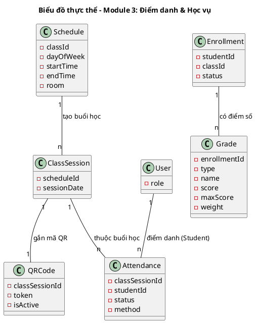

---

## II.3. Sơ đồ lớp phân tích BCE – Module 3

### UC08 – Tạo/tắt mã QR

**Phân tích chi tiết chức năng Tạo/tắt mã QR:**
- Sau khi đăng nhập thành công, hệ thống hiển thị giao diện chính của giảng viên → đề xuất lớp `LecturerHomeView`, có ít nhất nút chọn điểm danh (`-subAttendance`).
- GV click vào `subAttendance` → giao diện tạo/tắt mã QR hiện lên → đề xuất lớp `QRSessionView`, giao diện này chứa: ô nhập từ khóa tìm lớp học phần (`-inClassSection`), nút tìm kiếm (`-subSearch`), bảng kết quả lớp học phần có thể chọn (`-outsubListClass`), danh sách buổi học của lớp đã chọn (`-outsubListSession`), vùng hiển thị mã QR (`-outQRCode`), nút tạo mã QR (`-subGenerateQr`), nút tắt mã QR (`-subDeactivateQr`) và bảng danh sách sinh viên kèm trạng thái điểm danh (`-outAttendanceList`).
- GV nhập từ khóa vào `inClassSection` và click `subSearch` → hệ thống tra cứu lớp học phần → cần chức năng `searchClassSection()` → chức năng này là hành động của đối tượng thực thể `Class` (lớp này sở hữu các thuộc tính `-classId`, `-name`, `-courseId`).
- Hệ thống trả về kết quả → `outsubListClass` hiển thị danh sách lớp; GV chọn một lớp → `outsubListSession` hiển thị danh sách buổi học.
- GV chọn buổi học trong `outsubListSession` và click `subGenerateQr` → hệ thống tạo mã QR điểm danh cho buổi học → cần chức năng `generateQr()` → chức năng này là hành động của đối tượng thực thể `Attendance` (lớp này sở hữu các thuộc tính `-classSessionId`, `-studentId`, `-status`, `-method`).
- Hệ thống trả về mã QR → `outQRCode` hiển thị mã; `outAttendanceList` hiển thị danh sách SV với trạng thái điểm danh ban đầu.
- GV click `subDeactivateQr` sau khi kết thúc điểm danh → hệ thống đóng điểm danh và ghi vắng cho SV chưa điểm danh → cần chức năng `deactivateQr()` của đối tượng thực thể `Attendance`.
- Hệ thống thông báo đóng điểm danh thành công, đồng thời tải lại `outAttendanceList` và quay về `QRSessionView`.

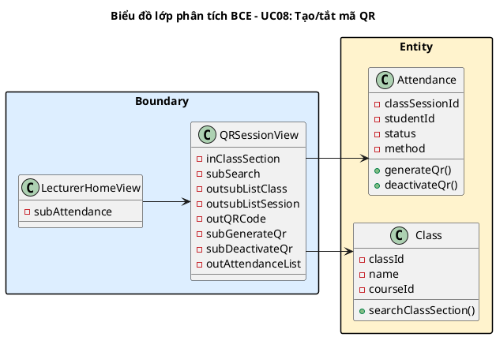

---

### UC09 – Quản lý điểm danh

**Phân tích chi tiết chức năng Quản lý điểm danh:**
- Sau khi đăng nhập thành công, hệ thống hiển thị giao diện chính của giảng viên → đề xuất lớp `LecturerHomeView`, có ít nhất nút quản lý điểm danh (`-subManageAttendance`).
- GV click vào `subManageAttendance` → giao diện quản lý điểm danh hiện lên → đề xuất lớp `AttendanceManageView`, giao diện này chứa: ô nhập từ khóa tìm lớp học phần (`-inClassSection`), nút tìm kiếm (`-subSearch`), bảng kết quả lớp học phần có thể chọn (`-outsubListClass`), dropdown chọn buổi học (`-inSession`), bảng danh sách SV kèm trạng thái điểm danh có thể chọn để sửa (`-outsubAttendance`) và nút lưu trạng thái thủ công (`-subSaveManual`).
- GV nhập từ khóa và click `subSearch` → hệ thống tra cứu lớp học phần → cần chức năng `searchClassSection()` → chức năng này là hành động của đối tượng thực thể `Class` (lớp này sở hữu các thuộc tính `-classId`, `-name`, `-courseId`).
- GV chọn lớp trong `outsubListClass` và chọn buổi học qua `inSession` → hệ thống tải danh sách điểm danh → cần chức năng `viewAttendance()` → chức năng này là hành động của đối tượng thực thể `Attendance` (lớp này sở hữu các thuộc tính `-classSessionId`, `-studentId`, `-status`, `-method`).
- Hệ thống trả về danh sách → `outsubAttendance` hiển thị từng SV kèm trạng thái điểm danh hiện tại.
- GV click vào một SV trong `outsubAttendance`, chọn trạng thái mới và click `subSaveManual` → hệ thống ghi nhận điểm danh thủ công → cần chức năng `markManualAttendance()` → chức năng này là hành động của đối tượng thực thể `Attendance`.
- Hệ thống thông báo cập nhật thành công, đồng thời tải lại `outsubAttendance` thông qua hàm `viewAttendance()` và quay về `AttendanceManageView`.

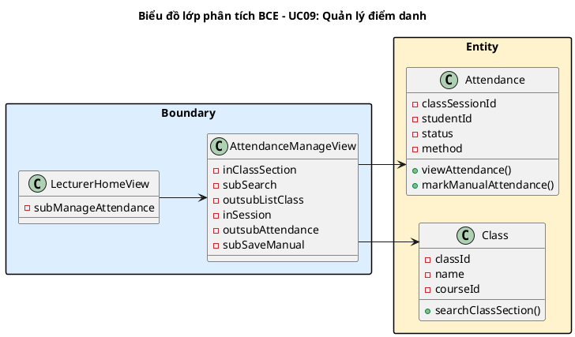

---

### UC10 – Xem điểm

**Phân tích chi tiết chức năng Xem điểm:**
- Sau khi đăng nhập thành công, hệ thống hiển thị giao diện chính của sinh viên → đề xuất lớp `StudentHomeView`, có ít nhất nút xem điểm (`-subViewGrade`).
- SV click vào `subViewGrade` → giao diện xem điểm hiện lên → đề xuất lớp `GradeView`, giao diện này chứa: danh sách lớp học phần đã đăng ký kèm điểm tổng kết (có thể chọn để xem chi tiết) (`-outsubCourseList`), bộ lọc học kỳ (`-inSemester`) và bảng chi tiết các đầu điểm theo kỳ học (`-outGradeDetail`).
- Hệ thống tải danh sách lớp học phần và điểm tổng kết của SV → cần chức năng `viewGrade()` → chức năng này là hành động của đối tượng thực thể `Grade` (lớp này sở hữu các thuộc tính `-enrollmentId`, `-type`, `-score`, `-weight`).
- Hệ thống trả về danh sách → `outsubCourseList` hiển thị các lớp kèm điểm tổng kết tương ứng.
- SV chọn học kỳ qua `inSemester` → hệ thống lọc và hiển thị chi tiết điểm theo kỳ → cần chức năng `viewGradeBySemester()` → chức năng này là hành động của đối tượng thực thể `Grade`.
- Hệ thống trả về kết quả → `outGradeDetail` hiển thị bảng các đầu điểm (thường xuyên, giữa kỳ, cuối kỳ, tổng kết) của học kỳ được chọn.

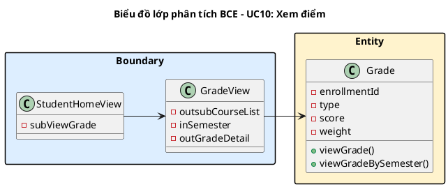

---

### UC11 – Nhập/sửa điểm

**Phân tích chi tiết chức năng Nhập/sửa điểm:**
- Sau khi đăng nhập thành công, hệ thống hiển thị giao diện chính của giảng viên → đề xuất lớp `LecturerHomeView`, có ít nhất nút nhập điểm (`-subEnterGrade`).
- GV click vào `subEnterGrade` → giao diện nhập/sửa điểm hiện lên → đề xuất lớp `GradeEntryView`, giao diện này chứa: ô nhập từ khóa tìm lớp học phần (`-inClassSection`), nút tìm kiếm (`-subSearch`), bảng kết quả lớp học phần có thể chọn (`-outsubListClass`), bảng nhập điểm hiển thị điểm hiện tại và cho phép sửa inline (`-inoutGrades`) và nút xác nhận nộp điểm (`-subSubmitGrades`).
- GV nhập từ khóa và click `subSearch` → hệ thống tra cứu lớp học phần → cần chức năng `searchClassSection()` → chức năng này là hành động của đối tượng thực thể `Class` (lớp này sở hữu các thuộc tính `-classId`, `-name`, `-courseId`).
- GV chọn lớp trong `outsubListClass` → hệ thống tải bảng sinh viên kèm điểm hiện tại vào `inoutGrades`.
- GV nhập điểm mới vào các ô trong `inoutGrades` và click `subSubmitGrades` → hệ thống lưu điểm → cần chức năng `enterGrade()` → chức năng này là hành động của đối tượng thực thể `Grade` (lớp này sở hữu các thuộc tính `-enrollmentId`, `-type`, `-score`, `-weight`).
- Hệ thống thông báo nộp điểm thành công và tải lại `inoutGrades` thông qua hàm `enterGrade()`.
- Khi GV sửa điểm đã nhập, click `subSubmitGrades` → hệ thống cập nhật điểm → cần chức năng `editGrade()` của đối tượng thực thể `Grade`.
- Hệ thống thông báo cập nhật điểm thành công và quay về `GradeEntryView`.

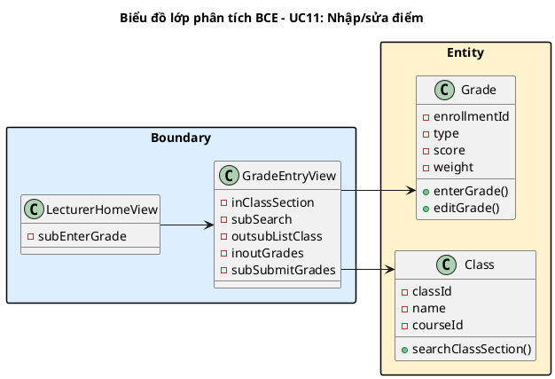

---

## II.4. Biểu đồ tuần tự phân tích – Module 3

### Biểu đồ UC08: Tạo/tắt mã QR

Kịch bản chi tiết cho chức năng tạo/tắt mã QR (bỏ qua giai đoạn đăng nhập) diễn ra như sau:

1. Giảng viên chọn chức năng Điểm danh trên giao diện `LecturerHomeView`.
2. Lớp `LecturerHomeView` gọi lớp `QRSessionView`.
3. Lớp `QRSessionView` hiển thị cho giảng viên.
4. Giảng viên nhập từ khóa "INT1340" và click nút Tìm.
5. Lớp `QRSessionView` gọi đến lớp `Class` để xử lý.
6. Lớp `Class` gọi hàm `searchClassSection()`.
7. Lớp `Class` trả kết quả về lớp `QRSessionView`.
8. Lớp `QRSessionView` hiển thị danh sách lớp học phần cho giảng viên.
9. Giảng viên chọn lớp INT1340.01 và chọn buổi học, sau đó click nút "Tạo mã QR".
10. Lớp `QRSessionView` gọi đến lớp `Attendance` để xử lý.
11. Lớp `Attendance` gọi hàm `generateQr()`.
12. Lớp `Attendance` trả kết quả về lớp `QRSessionView`.
13. Lớp `QRSessionView` hiển thị mã QR điểm danh cho giảng viên.
14. Giảng viên click nút "Tắt mã QR" sau khi kết thúc điểm danh.
15. Lớp `QRSessionView` gọi đến lớp `Attendance` để xử lý.
16. Lớp `Attendance` gọi hàm `deactivateQr()`.
17. Lớp `Attendance` trả kết quả về lớp `QRSessionView`.
18. Lớp `QRSessionView` hiển thị thông báo đóng điểm danh thành công và cập nhật danh sách cho giảng viên.

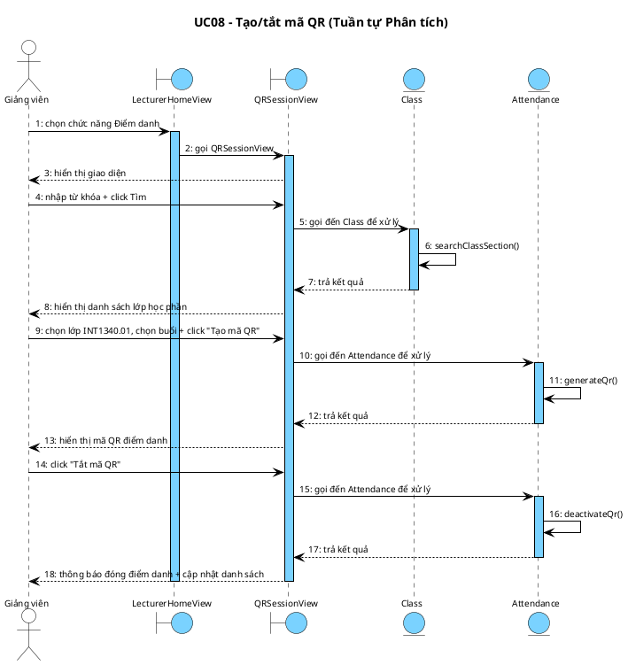

---

### Biểu đồ UC09: Quản lý điểm danh

Kịch bản chi tiết cho chức năng quản lý điểm danh (bỏ qua giai đoạn đăng nhập) diễn ra như sau:

1. Giảng viên chọn chức năng Quản lý điểm danh trên giao diện `LecturerHomeView`.
2. Lớp `LecturerHomeView` gọi lớp `AttendanceManageView`.
3. Lớp `AttendanceManageView` hiển thị cho giảng viên.
4. Giảng viên nhập từ khóa tìm kiếm lớp học phần và click nút Tìm.
5. Lớp `AttendanceManageView` gọi đến lớp `Class` để xử lý.
6. Lớp `Class` gọi hàm `searchClassSection()`.
7. Lớp `Class` trả kết quả về lớp `AttendanceManageView`.
8. Lớp `AttendanceManageView` hiển thị danh sách lớp học phần cho giảng viên.
9. Giảng viên chọn lớp INT1340.01 và chọn buổi học cần xem.
10. Lớp `AttendanceManageView` gọi đến lớp `Attendance` để xử lý.
11. Lớp `Attendance` gọi hàm `viewAttendance()`.
12. Lớp `Attendance` trả kết quả về lớp `AttendanceManageView`.
13. Lớp `AttendanceManageView` hiển thị bảng điểm danh theo buổi học cho giảng viên.
14. Giảng viên click vào dòng sinh viên Phạm Thị Thiên Hà muốn sửa.
15. Lớp `AttendanceManageView` hiển thị modal chỉnh sửa trạng thái cho giảng viên.
16. Giảng viên chọn trạng thái "Có mặt", nhập lý do và click nút Lưu.
17. Lớp `AttendanceManageView` gọi đến lớp `Attendance` để xử lý.
18. Lớp `Attendance` gọi hàm `markManualAttendance()`.
19. Lớp `Attendance` trả kết quả về lớp `AttendanceManageView`.
20. Lớp `AttendanceManageView` hiển thị thông báo cập nhật thành công và cập nhật bảng cho giảng viên.

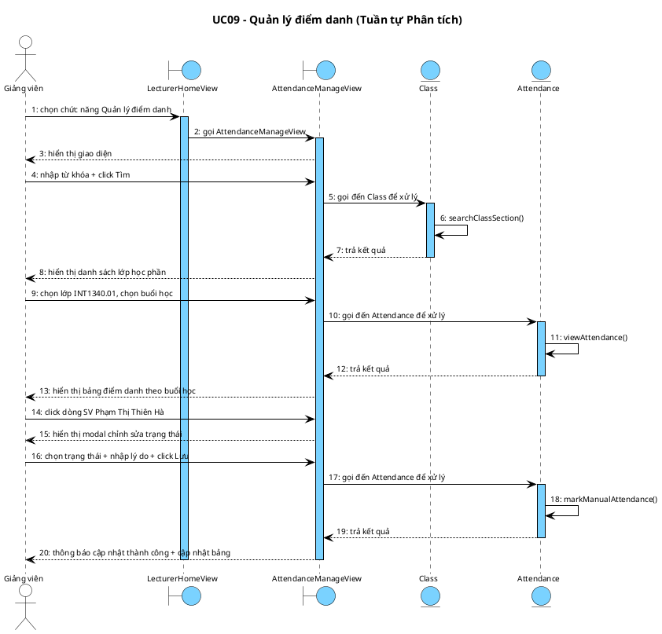

---

### Biểu đồ UC10: Xem điểm

Kịch bản chi tiết cho chức năng xem điểm (bỏ qua giai đoạn đăng nhập) diễn ra như sau:

1. Sinh viên chọn chức năng Xem điểm trên giao diện `StudentHomeView`.
2. Lớp `StudentHomeView` gọi lớp `GradeView`.
3. Lớp `GradeView` hiển thị cho sinh viên.
4. Lớp `GradeView` gọi đến lớp `Grade` để xử lý.
5. Lớp `Grade` gọi hàm `viewGrade()`.
6. Lớp `Grade` trả kết quả về lớp `GradeView`.
7. Lớp `GradeView` hiển thị danh sách lớp đã đăng ký kèm điểm tổng kết cho sinh viên.
8. Sinh viên chọn học kỳ "2024-1" để xem chi tiết.
9. Lớp `GradeView` gọi đến lớp `Grade` để xử lý.
10. Lớp `Grade` gọi hàm `viewGradeBySemester()`.
11. Lớp `Grade` trả kết quả về lớp `GradeView`.
12. Lớp `GradeView` hiển thị bảng chi tiết điểm theo kỳ học cho sinh viên.

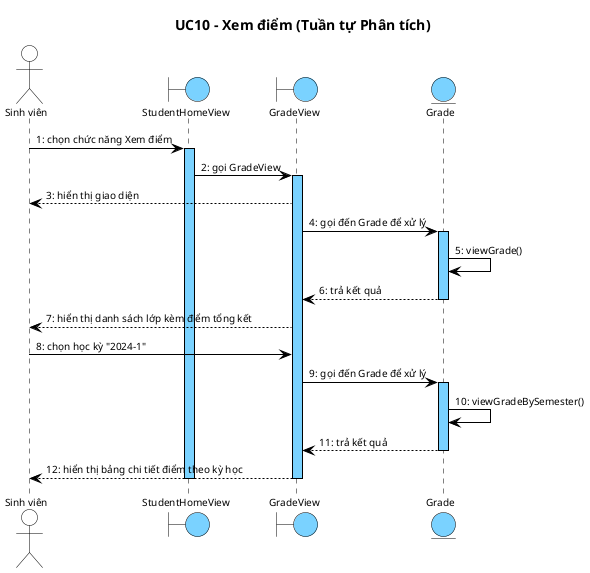

---

### Biểu đồ UC11: Nhập/sửa điểm

Kịch bản chi tiết cho chức năng nhập/sửa điểm (bỏ qua giai đoạn đăng nhập) diễn ra như sau:

1. Giảng viên chọn chức năng Nhập điểm trên giao diện `LecturerHomeView`.
2. Lớp `LecturerHomeView` gọi lớp `GradeEntryView`.
3. Lớp `GradeEntryView` hiển thị cho giảng viên.
4. Giảng viên nhập từ khóa tìm kiếm lớp học phần và click nút Tìm.
5. Lớp `GradeEntryView` gọi đến lớp `Class` để xử lý.
6. Lớp `Class` gọi hàm `searchClassSection()`.
7. Lớp `Class` trả kết quả về lớp `GradeEntryView`.
8. Lớp `GradeEntryView` hiển thị danh sách lớp học phần cho giảng viên.
9. Giảng viên chọn lớp INT1340.01.
10. Lớp `GradeEntryView` hiển thị bảng sinh viên với các ô nhập điểm cho giảng viên.
11. Giảng viên nhập điểm cho từng sinh viên và click nút "Xác nhận nộp điểm".
12. Lớp `GradeEntryView` gọi đến lớp `Grade` để xử lý.
13. Lớp `Grade` gọi hàm `enterGrade()`.
14. Lớp `Grade` trả kết quả về lớp `GradeEntryView`.
15. Lớp `GradeEntryView` hiển thị thông báo nộp điểm thành công cho giảng viên.

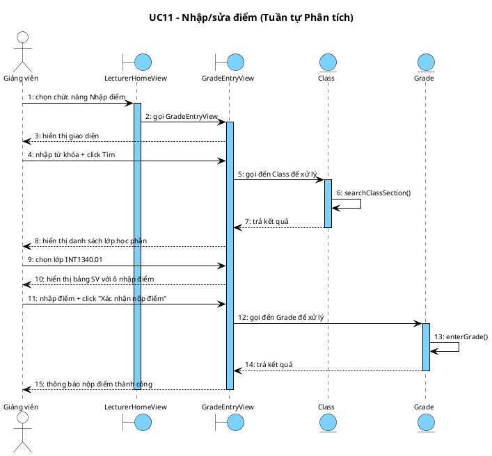

---

## III.1. Thiết kế lớp thực thể – Module 3

### Bước 1 – Thêm id

Thêm `id : int` cho các lớp mới trong module: `Attendance` và `Grade`.

### Bước 2 – Thêm kiểu dữ liệu (TypeScript/NestJS)

**Attendance:**
- `id: number`, `classSessionId: number`, `studentId: number`
- `status: AttendanceStatus` (enum: `PRESENT | ABSENT | LATE`)
- `method: AttendanceMethod` (enum: `QR | MANUAL`) — cột "hình thức" trong docx
- `qrToken: string | null`, `gpsLatitude: number | null`, `gpsLongitude: number | null`
- `distance: number | null`, `scannedAt: Date | null`, `note: string | null`

**Grade:**
- `id: number`, `enrollmentId: number`
- `type: GradeType` (enum: `ASSIGNMENT | MIDTERM | FINAL`)
- `name: string`, `score: number`, `maxScore: number`, `weight: number`

### Bước 3 – Chuyển association → composition/aggregation

- `Schedule 1 *── n ClassSession` — composition (ClassSession không tồn tại nếu không có Schedule)
- `ClassSession 1 ◇── n Attendance` — aggregation (ClassSession tồn tại độc lập)
- `User 1 ◇── n Attendance` — aggregation (User tồn tại độc lập)
- `Enrollment 1 *── n Grade` — composition (Grade không tồn tại nếu không có Enrollment)

### Bước 4 – Thuộc tính kiểu đối tượng

- `Attendance` chứa: `classSession: ClassSession`, `student: User`
- `Grade` chứa: `enrollment: Enrollment`

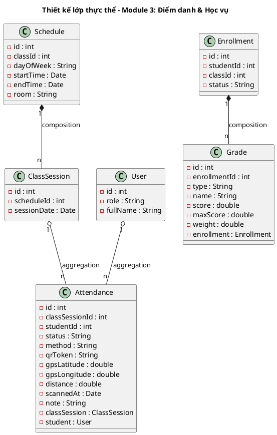

---

## III.2. Thiết kế CSDL – Module 3

### Bước 1–4: Bảng và khóa

**tblClassSession:**

| Cột | Kiểu | Ràng buộc | Ghi chú |
|-----|------|-----------|---------|
| classSessionId | SERIAL | PK | Khóa chính tự tăng |
| scheduleId | INTEGER(10) | FK → tblSchedule | Lịch học trong tuần |
| sessionDate | DATE | NOT NULL | Ngày buổi học cụ thể |

**tblAttendance:**

| Cột | Kiểu | Ràng buộc | Ghi chú |
|-----|------|-----------|---------|
| attendanceId | SERIAL | PK | Khóa chính tự tăng |
| classSessionId | INTEGER(10) | FK → tblClassSession | Buổi học cụ thể |
| studentId | INTEGER(10) | FK → tblUser | Sinh viên |
| status | VARCHAR(10) | NOT NULL | present / absent / late |
| method | VARCHAR(10) | NOT NULL | qr / manual |
| qrToken | VARCHAR(255) | NULL | Token QR đã dùng |
| gpsLatitude | DOUBLE(10) | NULL | Vĩ độ GPS |
| gpsLongitude | DOUBLE(10) | NULL | Kinh độ GPS |
| distance | DOUBLE(10) | NULL | Khoảng cách tính được (m) |
| scannedAt | TIMESTAMP | NULL | Thời điểm điểm danh |
| note | TEXT | NULL | Lý do chỉnh sửa thủ công |

**tblGrade:**

| Cột | Kiểu | Ràng buộc | Ghi chú |
|-----|------|-----------|---------|
| gradeId | SERIAL | PK | Khóa chính tự tăng |
| enrollmentId | INTEGER(10) | FK → tblEnrollment | Đăng ký học phần |
| type | VARCHAR(20) | NOT NULL | assignment / midterm / final |
| name | VARCHAR(100) | NOT NULL | Tên đầu điểm |
| score | DOUBLE(10) | NOT NULL | Điểm đạt được |
| maxScore | DOUBLE(10) | NOT NULL | Điểm tối đa |
| weight | DOUBLE(10) | NOT NULL | Trọng số (%) |

### Bước 5 – Loại bỏ dư thừa

Điểm tổng kết không lưu — tính runtime từ `score × weight`. Không có thuộc tính dẫn xuất nào cần loại bỏ.

### ERD PlantUML

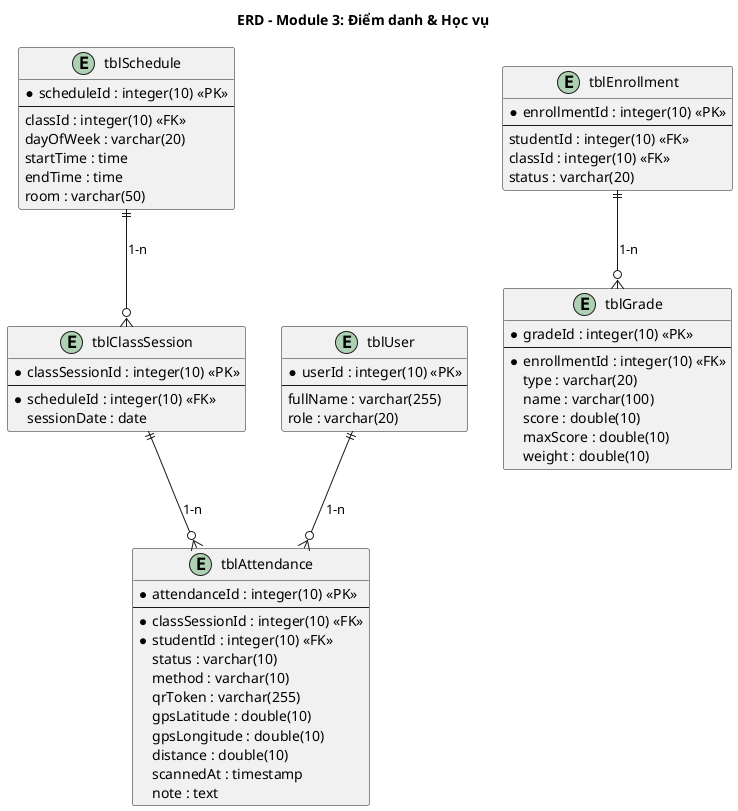

---

## III.3.1. Thiết kế giao diện – Module 3

### Màn hình 1: QRSessionPage

```
┌─────────────────────────────────────────────────────────┐
│             Điểm danh – QR Session                      │
│                                                         │
│  Tìm lớp: [________________________]    [ Tìm ]         │
│                                                         │
│  ┌──────────────┬───────────────┬──────┬────────┐       │
│  │ Mã lớp       │ Tên học phần  │ Phòng│ Giờ    │       │
│  ├──────────────┼───────────────┼──────┼────────┤       │
│  │ INT1340.01   │ Nhập môn CNPM │ A101 │ 07:30  │       │
│  └──────────────┴───────────────┴──────┴────────┘       │
│                                                         │
│  Buổi học: [Thứ 2 – 09/06/2026 – 07:30-09:00]          │
│                                                         │
│  ┌──────────────────────────┐                           │
│  │                          │                           │
│  │    ██████████████        │  ← Mã QR điểm danh        │
│  │    ██          ██        │                           │
│  │    ██  ██████  ██        │                           │
│  │    ██          ██        │                           │
│  │    ██████████████        │                           │
│  │                          │                           │
│  └──────────────────────────┘                           │
│                                                         │
│  [ Tạo mã QR ]              [ Tắt mã QR ]               │
│                                                         │
│  ┌──────────────┬────────────────┬──────────┐           │
│  │ MSSV         │ Họ tên         │ Trạng thái│           │
│  ├──────────────┼────────────────┼──────────┤           │
│  │ B23DCAT120   │ Nguyễn Bá Hùng │ Có mặt   │           │
│  │ B23DCAT280   │ Trần Xuân Thành│ Có mặt   │           │
│  │ B23DCCN266   │ Phạm Thị T. Hà │ Vắng     │           │
│  └──────────────┴────────────────┴──────────┘           │
└─────────────────────────────────────────────────────────┘
```

### Màn hình 2: AttendanceManagePage

```
┌─────────────────────────────────────────────────────────┐
│             Quản lý điểm danh – INT1340.01              │
│                                                         │
│  Buổi học: [ Thứ 2 – 09/06/2026  ▼ ]                   │
│                                                         │
│  ┌──────────┬────────────────┬──────────┬──────┬──────┬───────┐ │
│  │ MSSV     │ Họ tên         │ Trạng thái│ Giờ  │ HTức │[Sửa] │ │
│  ├──────────┼────────────────┼──────────┼──────┼──────┼───────┤ │
│  │B23DCAT120│ Nguyễn Bá Hùng │ Có mặt   │07:35 │ QR   │[Sửa] │ │
│  │B23DCAT280│ Trần Xuân Thành│ Có mặt   │07:38 │ QR   │[Sửa] │ │
│  │B23DCCN266│ Phạm Thị T. Hà │ Vắng     │ —    │ —    │[Sửa] │ │
│  └──────────┴────────────────┴──────────┴──────┴──────┴───────┘ │
│                                                         │
│  ┌──────────────── Modal sửa trạng thái ─────────────┐  │
│  │ SV: Phạm Thị Thiên Hà – B23DCCN266               │  │
│  │ Trạng thái: [ Có mặt           ▼ ]                │  │
│  │ Lý do:      [____________________________]        │  │
│  │                    [ Hủy ]  [ Lưu ]               │  │
│  └───────────────────────────────────────────────────┘  │
└─────────────────────────────────────────────────────────┘
```

### Màn hình 3: GradePage

```
┌─────────────────────────────────────────────────────────┐
│                  Xem điểm – Sinh viên                   │
│                                                         │
│  Học kỳ: [ 2024-1  ▼ ]                                  │
│                                                         │
│  ┌──────────────┬───────────────┬──────┬──────┬───────┐  │
│  │ Mã lớp       │ Tên học phần  │ TX   │ GK   │ CK    │  │
│  ├──────────────┼───────────────┼──────┼──────┼───────┤  │
│  │ INT1340.01   │ Nhập môn CNPM │  9.0 │  8.5 │  9.0  │  │
│  │ INT1305.02   │ Lập trình Web │  —   │  —   │  —    │  │
│  └──────────────┴───────────────┴──────┴──────┴───────┘  │
│                                                         │
│  ┌──────────────────── Chi tiết: INT1340.01 ──────────┐  │
│  │ Loại điểm    │ Điểm │ Trọng số │                   │  │
│  │ Thường xuyên │  9.0 │   20%    │                   │  │
│  │ Giữa kỳ      │  8.5 │   30%    │                   │  │
│  │ Cuối kỳ      │  9.0 │   50%    │                   │  │
│  │ ────────────────────────────── │                   │  │
│  │ Tổng kết: 8.9   Xếp loại: A   │                   │  │
│  └────────────────────────────────────────────────────┘  │
└─────────────────────────────────────────────────────────┘
```

### Màn hình 4: GradeEntryPage

```
┌─────────────────────────────────────────────────────────┐
│               Nhập điểm – Giảng viên                    │
│                                                         │
│  Tìm lớp: [________________________]    [ Tìm ]         │
│                                                         │
│  ┌──────────────┬───────────────┬──────┬────────┐       │
│  │ Mã lớp       │ Tên học phần  │ SV   │ Trạng thái│     │
│  ├──────────────┼───────────────┼──────┼───────────┤    │
│  │ INT1340.01   │ Nhập môn CNPM │  35  │ Đang nhập │    │
│  └──────────────┴───────────────┴──────┴───────────┘    │
│                                                         │
│  ┌──────────┬────────────────┬────┬────┬────┬───────┐   │
│  │ MSSV     │ Họ tên         │ TX │ GK │ CK │ Tổng  │   │
│  ├──────────┼────────────────┼────┼────┼────┼───────┤   │
│  │B23DCAT120│ Nguyễn Bá Hùng │8.5 │7.0 │[__]│  —    │   │
│  │B23DCAT280│ Trần Xuân Thành│9.0 │8.5 │[__]│  —    │   │
│  │B23DCCN266│ Phạm Thị T. Hà │9.5 │9.0 │[__]│  —    │   │
│  └──────────┴────────────────┴────┴────┴────┴───────┘   │
│                                                         │
│                      [ Xác nhận nộp điểm ]              │
└─────────────────────────────────────────────────────────┘
```

---

## III.3.2. Sơ đồ lớp thiết kế – Module 3 (React MVC)

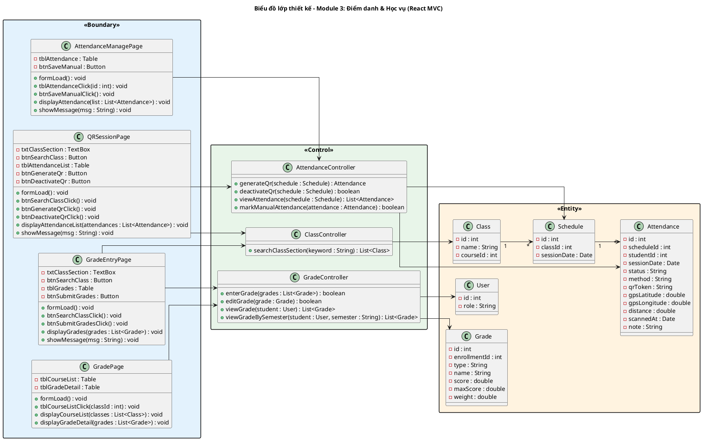

---

## III.4. Biểu đồ tuần tự thiết kế – Module 3

### Biểu đồ UC08: Tạo/tắt mã QR

Kịch bản chi tiết cho chức năng tạo/tắt mã QR (thiết kế, bỏ qua giai đoạn đăng nhập) diễn ra như sau:

1. Giảng viên chọn chức năng Điểm danh trên giao diện `LecturerHomePage`.
2. Lớp `LecturerHomePage` gọi lớp `QRSessionPage`.
3. Lớp `QRSessionPage` gọi phương thức `formLoad()` để khởi tạo giao diện.
4. Lớp `QRSessionPage` hiển thị cho giảng viên.
5. Giảng viên nhập từ khóa "INT1340" và click nút Tìm; lớp `QRSessionPage` gọi `btnSearchClassClick()`.
6. Lớp `QRSessionPage` gọi đến lớp `ClassController` để xử lý.
7. Lớp `ClassController` gọi đến lớp `Class` để xử lý.
8. Lớp `Class` gọi hàm `searchClassSection(keyword : String) : List<Class>`.
9. Lớp `Class` trả kết quả `List<Class>` về lớp `ClassController`.
10. Lớp `ClassController` trả kết quả `List<Class>` về lớp `QRSessionPage`.
11. Lớp `QRSessionPage` hiển thị danh sách lớp học phần cho giảng viên.
12. Giảng viên chọn lớp INT1340.01 và click nút "Tạo mã QR"; lớp `QRSessionPage` gọi `btnGenerateQrClick()`.
13. Lớp `QRSessionPage` gọi đến lớp `AttendanceController` để xử lý.
14. Lớp `AttendanceController` gọi đến lớp `Attendance` để xử lý.
15. Lớp `Attendance` gọi hàm `generateQr(schedule : Schedule) : Attendance`.
16. Lớp `Attendance` trả kết quả `Attendance` về lớp `AttendanceController`.
17. Lớp `AttendanceController` trả kết quả `Attendance` về lớp `QRSessionPage`.
18. Lớp `QRSessionPage` hiển thị mã QR điểm danh cho giảng viên.
19. Giảng viên click nút "Tắt mã QR"; lớp `QRSessionPage` gọi `btnDeactivateQrClick()`.
20. Lớp `QRSessionPage` gọi đến lớp `AttendanceController` để xử lý.
21. Lớp `AttendanceController` gọi đến lớp `Attendance` để xử lý.
22. Lớp `Attendance` gọi hàm `deactivateQr(schedule : Schedule) : boolean`.
23. Lớp `Attendance` trả kết quả `boolean` về lớp `AttendanceController`.
24. Lớp `AttendanceController` trả kết quả `boolean` về lớp `QRSessionPage`.
25. Lớp `QRSessionPage` hiển thị thông báo đóng điểm danh thành công và cập nhật bảng điểm danh cho giảng viên.

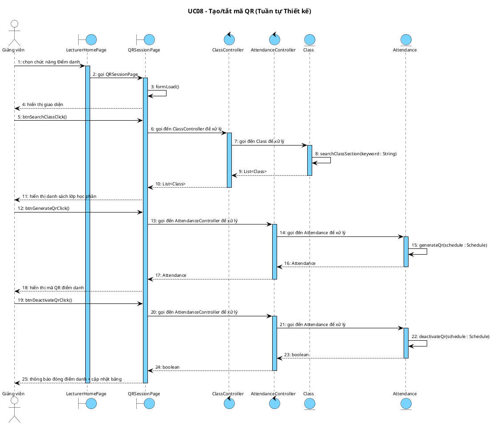

---

### Biểu đồ UC09: Quản lý điểm danh

Kịch bản chi tiết cho chức năng quản lý điểm danh (thiết kế, bỏ qua giai đoạn đăng nhập) diễn ra như sau:

1. Giảng viên chọn chức năng Quản lý điểm danh trên giao diện `LecturerHomePage`.
2. Lớp `LecturerHomePage` gọi lớp `AttendanceManagePage`.
3. Lớp `AttendanceManagePage` gọi phương thức `formLoad()` để khởi tạo giao diện.
4. Lớp `AttendanceManagePage` gọi đến lớp `AttendanceController` để xử lý.
5. Lớp `AttendanceController` gọi đến lớp `Attendance` để xử lý.
6. Lớp `Attendance` gọi hàm `viewAttendance(schedule : Schedule) : List<Attendance>`.
7. Lớp `Attendance` trả kết quả `List<Attendance>` về lớp `AttendanceController`.
8. Lớp `AttendanceController` trả kết quả `List<Attendance>` về lớp `AttendanceManagePage`.
9. Lớp `AttendanceManagePage` hiển thị bảng điểm danh theo buổi học cho giảng viên.
10. Giảng viên click vào dòng sinh viên Phạm Thị Thiên Hà; lớp `AttendanceManagePage` gọi `tblAttendanceClick(id : int)`.
11. Lớp `AttendanceManagePage` hiển thị modal chỉnh sửa trạng thái cho giảng viên.
12. Giảng viên chọn trạng thái "Có mặt", nhập lý do và click nút Lưu; lớp `AttendanceManagePage` gọi `btnSaveManualClick()`.
13. Lớp `AttendanceManagePage` gọi đến lớp `AttendanceController` để xử lý.
14. Lớp `AttendanceController` gọi đến lớp `Attendance` để xử lý.
15. Lớp `Attendance` gọi hàm `markManualAttendance(attendance : Attendance) : boolean`.
16. Lớp `Attendance` trả kết quả `boolean` về lớp `AttendanceController`.
17. Lớp `AttendanceController` trả kết quả `boolean` về lớp `AttendanceManagePage`.
18. Lớp `AttendanceManagePage` hiển thị thông báo cập nhật thành công và cập nhật bảng cho giảng viên.

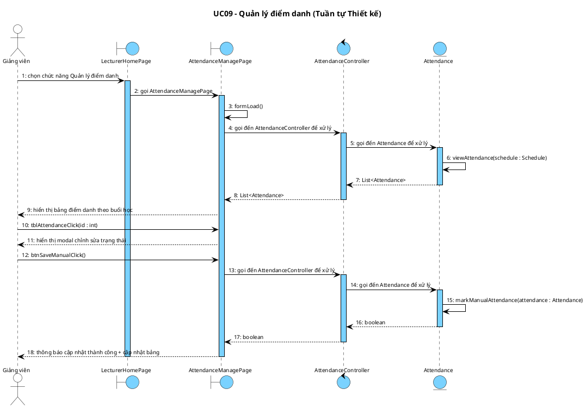

---

### Biểu đồ UC10: Xem điểm

Kịch bản chi tiết cho chức năng xem điểm (thiết kế, bỏ qua giai đoạn đăng nhập) diễn ra như sau:

1. Sinh viên chọn chức năng Xem điểm trên giao diện `StudentHomePage`.
2. Lớp `StudentHomePage` gọi lớp `GradePage`.
3. Lớp `GradePage` gọi phương thức `formLoad()` để khởi tạo giao diện.
4. Lớp `GradePage` gọi đến lớp `GradeController` để xử lý.
5. Lớp `GradeController` gọi đến lớp `Grade` để xử lý.
6. Lớp `Grade` gọi hàm `viewGrade(student : User) : List<Grade>`.
7. Lớp `Grade` trả kết quả `List<Grade>` về lớp `GradeController`.
8. Lớp `GradeController` trả kết quả `List<Grade>` về lớp `GradePage`.
9. Lớp `GradePage` hiển thị danh sách lớp đã đăng ký kèm điểm tổng kết cho sinh viên.
10. Sinh viên click vào lớp INT1340.01; lớp `GradePage` gọi `tblCourseListClick(classId : int)`.
11. Lớp `GradePage` gọi đến lớp `GradeController` để xử lý.
12. Lớp `GradeController` gọi đến lớp `Grade` để xử lý.
13. Lớp `Grade` gọi hàm `viewGradeBySemester(student : User, semester : String) : List<Grade>`.
14. Lớp `Grade` trả kết quả `List<Grade>` về lớp `GradeController`.
15. Lớp `GradeController` trả kết quả `List<Grade>` về lớp `GradePage`.
16. Lớp `GradePage` hiển thị bảng chi tiết điểm theo kỳ học cho sinh viên.

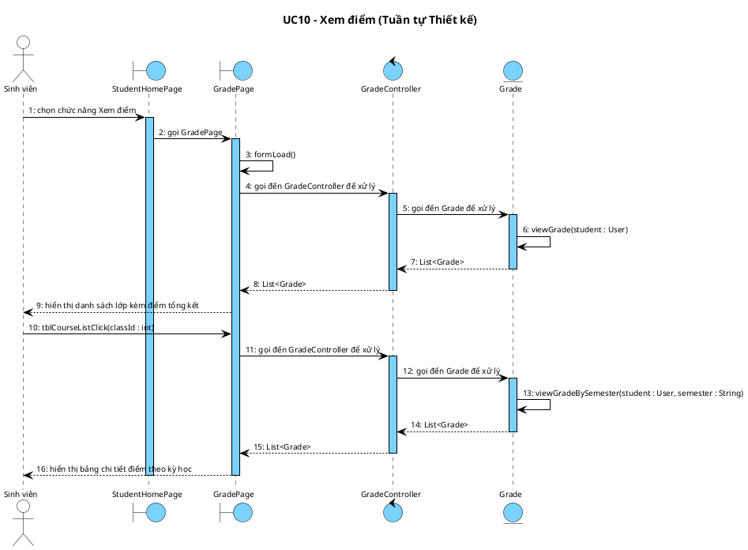

---

### Biểu đồ UC11: Nhập/sửa điểm

Kịch bản chi tiết cho chức năng nhập/sửa điểm (thiết kế, bỏ qua giai đoạn đăng nhập) diễn ra như sau:

1. Giảng viên chọn chức năng Nhập điểm trên giao diện `LecturerHomePage`.
2. Lớp `LecturerHomePage` gọi lớp `GradeEntryPage`.
3. Lớp `GradeEntryPage` gọi phương thức `formLoad()` để khởi tạo giao diện.
4. Lớp `GradeEntryPage` hiển thị cho giảng viên.
5. Giảng viên nhập từ khóa và click nút Tìm; lớp `GradeEntryPage` gọi `btnSearchClassClick()`.
6. Lớp `GradeEntryPage` gọi đến lớp `ClassController` để xử lý.
7. Lớp `ClassController` gọi đến lớp `Class` để xử lý.
8. Lớp `Class` gọi hàm `searchClassSection(keyword : String) : List<Class>`.
9. Lớp `Class` trả kết quả `List<Class>` về lớp `ClassController`.
10. Lớp `ClassController` trả kết quả `List<Class>` về lớp `GradeEntryPage`.
11. Lớp `GradeEntryPage` hiển thị danh sách lớp học phần cho giảng viên.
12. Giảng viên chọn lớp INT1340.01; lớp `GradeEntryPage` hiển thị bảng sinh viên với các ô nhập điểm.
13. Giảng viên nhập điểm cho từng sinh viên và click nút "Xác nhận nộp điểm"; lớp `GradeEntryPage` gọi `btnSubmitGradesClick()`.
14. Lớp `GradeEntryPage` gọi đến lớp `GradeController` để xử lý.
15. Lớp `GradeController` gọi đến lớp `Grade` để xử lý.
16. Lớp `Grade` gọi hàm `enterGrade(grades : List<Grade>) : boolean`.
17. Lớp `Grade` trả kết quả `boolean` về lớp `GradeController`.
18. Lớp `GradeController` trả kết quả `boolean` về lớp `GradeEntryPage`.
19. Lớp `GradeEntryPage` hiển thị thông báo nộp điểm thành công cho giảng viên.

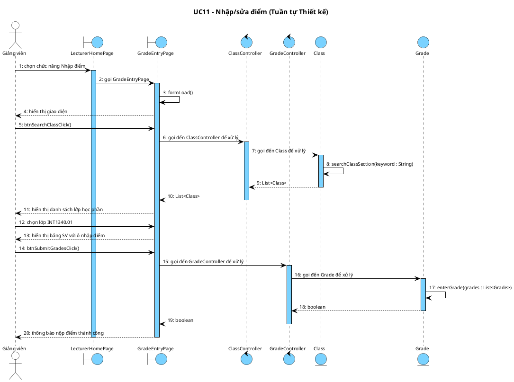

---

## IV. Cài đặt & Kiểm thử – Module 3

### 4a. Bảng test case

| TT | Module | Test case |
|----|--------|-----------|
| 1 | UC08 | Tạo QR thành công cho buổi học chưa có QR đang hoạt động |
| 2 | UC08 | Tạo QR thất bại khi buổi học đã có QR đang hoạt động |
| 3 | UC08 | Tắt QR thành công – SV chưa điểm danh bị ghi vắng tự động |
| 4 | UC09 | GV xem danh sách điểm danh theo buổi học thành công |
| 5 | UC09 | GV sửa trạng thái thủ công thành công (vắng → có mặt) |
| 6 | UC09 | GV sửa trạng thái trùng trạng thái cũ → cảnh báo "Trạng thái không thay đổi" |
| 7 | UC10 | SV xem danh sách lớp đã đăng ký kèm trạng thái điểm thành công |
| 8 | UC10 | SV xem chi tiết điểm theo kỳ học 2024-1 thành công |
| 9 | UC10 | SV xem học phần INT1305.02 chưa có điểm → hiển thị "Chưa có điểm" |
| 10 | UC11 | GV nhập điểm cuối kỳ và nộp thành công |
| 11 | UC11 | GV nhập điểm = 11 (ngoài [0, 10]) → lỗi validation inline |
| 12 | UC11 | GV sửa điểm ngoài thời gian cho phép → thông báo "Đã quá thời hạn sửa điểm" |

---

### 4b. Trạng thái CSDL trước khi test

```
tblSchedule
| scheduleId | classId | dayOfWeek | startTime | endTime | room  |
|------------|---------|-----------|-----------|---------|-------|
| 1          | 1       | Monday    | 07:30:00  | 09:00:00| A101  |
| 2          | 1       | Monday    | 07:30:00  | 09:00:00| A101  |

tblUser
| userId | fullName            | role     |
|--------|---------------------|----------|
| 1      | Nguyễn Bá Hùng      | STUDENT  |
| 2      | Trần Xuân Thành     | STUDENT  |
| 3      | Phạm Thị Thiên Hà   | STUDENT  |
| 4      | Nguyễn Văn Giảng    | LECTURER |

tblEnrollment
| enrollmentId | studentId | classId | status   |
|--------------|-----------|---------|----------|
| 1            | 1         | 1       | ENROLLED |
| 2            | 2         | 1       | ENROLLED |
| 3            | 3         | 1       | ENROLLED |

tblAttendance (trước TC01 – chưa có bản ghi nào cho scheduleId=1)
| attendanceId | scheduleId | studentId | sessionDate | status | method |
|--------------|------------|-----------|-------------|--------|--------|
| (trống)      |            |           |             |        |        |

tblGrade (trước TC10 – đã có điểm TX và GK, chưa có CK)
| gradeId | enrollmentId | type       | name        | score | maxScore | weight |
|---------|--------------|------------|-------------|-------|----------|--------|
| 1       | 1            | ASSIGNMENT | Thường xuyên| 8.5   | 10       | 20     |
| 2       | 1            | MIDTERM    | Giữa kỳ     | 7.0   | 10       | 30     |
| 3       | 2            | ASSIGNMENT | Thường xuyên| 9.0   | 10       | 20     |
| 4       | 2            | MIDTERM    | Giữa kỳ     | 8.5   | 10       | 30     |
| 5       | 3            | ASSIGNMENT | Thường xuyên| 9.5   | 10       | 20     |
| 6       | 3            | MIDTERM    | Giữa kỳ     | 9.0   | 10       | 30     |
```

---

### 4c. Kịch bản thực hiện chi tiết

#### TC01 – Tạo QR thành công (UC08)

| Kịch bản | Kết quả mong đợi |
|----------|-----------------|
| 1. GV đăng nhập với tài khoản giảng viên (userId=4) | Đăng nhập thành công, hiển thị giao diện chính |
| 2. GV chọn chức năng "Điểm danh" | Hiển thị `QRSessionPage` với ô tìm kiếm lớp |
| 3. GV nhập "INT1340" và nhấn Tìm | Hiển thị lớp INT1340.01 trong bảng kết quả |
| 4. GV chọn lớp INT1340.01, chọn buổi học scheduleId=1 | Giao diện hiển thị thông tin buổi học và nút "Tạo mã QR" |
| 5. GV nhấn "Tạo mã QR" | Hệ thống hiển thị mã QR điểm danh trên màn hình; bảng SV hiển thị trạng thái "Vắng" cho cả 3 SV |
| 6. GV nhấn "Tắt mã QR" | Thông báo "Đã đóng điểm danh – 0 có mặt, 3 vắng"; tblAttendance có 3 bản ghi mới với status=ABSENT |

#### TC10 – Nhập điểm thành công (UC11)

| Kịch bản | Kết quả mong đợi |
|----------|-----------------|
| 1. GV đăng nhập (userId=4) và chọn "Nhập điểm" | Hiển thị `GradeEntryPage` |
| 2. GV nhập "INT1340" và nhấn Tìm | Hiển thị lớp INT1340.01 với trạng thái "Đang nhập điểm" |
| 3. GV chọn lớp INT1340.01 | Bảng hiển thị 3 SV với điểm TX, GK đã có; cột CK để trống |
| 4. GV nhập: Hùng=8.0, Thành=9.0, Hà=9.5 | Cột Tổng kết tự tính: Hùng=7.8, Thành=8.65, Hà=9.25 |
| 5. GV nhấn "Xác nhận nộp điểm" | Thông báo "Nộp điểm thành công"; tblGrade có thêm 3 bản ghi FINAL |

---

### 4d. Trạng thái CSDL sau khi test

```
tblAttendance (sau TC01 – Tắt QR, 3 SV ghi vắng)
| attendanceId | scheduleId | studentId | sessionDate | status  | method |
|--------------|------------|-----------|-------------|---------|--------|
| 1            | 1          | 1         | 2026-06-09  | ABSENT  | QR     |
| 2            | 1          | 2         | 2026-06-09  | ABSENT  | QR     |
| 3            | 1          | 3         | 2026-06-09  | ABSENT  | QR     |

tblGrade (sau TC10 – thêm điểm cuối kỳ cho 3 SV)
| gradeId | enrollmentId | type       | name        | score | maxScore | weight |
|---------|--------------|------------|-------------|-------|----------|--------|
| 1       | 1            | ASSIGNMENT | Thường xuyên| 8.5   | 10       | 20     |
| 2       | 1            | MIDTERM    | Giữa kỳ     | 7.0   | 10       | 30     |
| 3       | 2            | ASSIGNMENT | Thường xuyên| 9.0   | 10       | 20     |
| 4       | 2            | MIDTERM    | Giữa kỳ     | 8.5   | 10       | 30     |
| 5       | 3            | ASSIGNMENT | Thường xuyên| 9.5   | 10       | 20     |
| 6       | 3            | MIDTERM    | Giữa kỳ     | 9.0   | 10       | 30     |
| 7       | 1            | FINAL      | Cuối kỳ     | 8.0   | 10       | 50     | ← mới
| 8       | 2            | FINAL      | Cuối kỳ     | 9.0   | 10       | 50     | ← mới
| 9       | 3            | FINAL      | Cuối kỳ     | 9.5   | 10       | 50     | ← mới

Điểm tổng kết tính runtime:
- Nguyễn Bá Hùng    (enrollmentId=1): 8.5×20% + 7.0×30% + 8.0×50% = 1.7 + 2.1 + 4.0 = 7.8
- Trần Xuân Thành   (enrollmentId=2): 9.0×20% + 8.5×30% + 9.0×50% = 1.8 + 2.55 + 4.5 = 8.85
- Phạm Thị Thiên Hà (enrollmentId=3): 9.5×20% + 9.0×30% + 9.5×50% = 1.9 + 2.7 + 4.75 = 9.35
```
